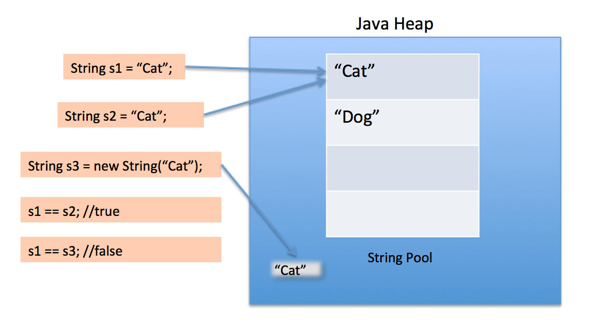

# String Pool

## String 생성 방법

`String` 에는 2가지 생성방법이 존재한다.
- `new` 연산자를 이용해서 만드는 방식
- 리터럴`""` 를 이용해 만드는 방식

```java
String newString1 = new String("Cat");
String newString2 = new String("Cat");
System.out.println(newString1 == newString2); // false

String literalString1 = "Cat";
String literalString2 = "Cat";
System.out.println(literalString1 == literalString2); // true
```

두 가지 방식으로 만든 `String` 은 서로 다른 차이를 보임을 알 수 있다.

참고로 `==` 연산은 객체끼리 사용하면 값을 비교하는게 아닌 같은 메모리를 참조하는지 비교하는 연산이다.
(만약 `String` 에서 실제값을 비교하고 싶다면 `equal()` 함수를 이용하면 된다.)



먼저 `String` 객체를 만들면 stack Memory 에 차곡차곡 쌓인다.(`newString1`, `newString2`, `literalString1`, `literalString1`)
그리고 stack Memory 에서 각 객체가 Heap Memory 를 가리키는데 `new` 연산과 리터럴은 여기서
차이를 보인다.

리터럴의 경우 `Heap` 영역의 `String constant pool` 에 있는 "Cat" 을 가리킨다. 그리고 해당
`String constant pool` 에서는 오직 하나의 "Cat" 만 가지고 리터럴 초기화된 "Cat" 은 모두 이 "Cat" 을
가리킨다. 그래서 리터럴로 초기화한 `System.out.println(literalString1 == literalString2);` 
가 `true` 의 결과를 반환한다.

`new` 의 경우 `Heap` 영역에 새로운 메모리를 참조한다. `String constant pool` 에 "Cat" 이 있어도
해당 "Cat" 을 참조하지않고 새로운 영역을 만들어버린다. 그래서 새로운 `new` 연산으로 "Cat"
을 계속 만든다면 계속 새로운 `Heap` 영역에 메모리를 할당받는다. 그렇기에
`System.out.println(newString1 == newString2);` 가 `false` 의 결과를 반환한다.

## String intern()

`String` 에는 `intern()` 이라는 함수가 있다. 이 함수는 `new` 방식으로 생성되어 `String constant pool` 에 존재하지 않은 `String` 객체가
`String constant pool` 에 **동일한 문자** 가 있다면 `String constant pool` 에 있는 문자를 참조하게 한다.

간단히 말하면 `new` 로 생성한것을 리터럴로 생성한것과 동일한 효과를 누리게 하는것이다.

```java
String newString1 = new String("Cat");
String literalString1 = "Cat";
System.out.println(newString1 == literalString1); // false

newString1 = newString1.intern();
System.out.println(newString1 == literalString1); // true
```

결과적으로 `equals()` 랑 동일한 기능을 보여주게되었는데 작동 방식자체는 다르니 알아두면 좋을것같다(`equals()` 는 단순히 문자가 같은지만
비교하고 참조위치를 옮겨주는것은 아니다)

`intern()` 을 사용하면 속도와 메모리적 측면에서 살짝 더 빠르다고는 하지만 큰 이점까지는 아니다. 필요한 상황이 있을때 사용하면 될것같다.

## 마무리

`new` 로 `String` 을 생성하면 계속 새로운 메모리를 사용하지만 리터럴로 만들면 같은 문자에 한해서 메모리를 절약할 수 있다.
어차피 대부분이 리터럴로 `String` 을 초기화하고 있을텐데 계속 그렇게 사용하면 된다. 특수한 경우가 아니라면 `new` 로 초기화할 일은 없다.

## Reference
[https://starkying.tistory.com/entry/what-is-java-string-pool](https://starkying.tistory.com/entry/what-is-java-string-pool)  
[https://doohong.github.io/2018/03/04/java-string-pool/](https://doohong.github.io/2018/03/04/java-string-pool/)  
[https://velog.io/@jeb1225/JAVA-String-Pool](https://velog.io/@jeb1225/JAVA-String-Pool)  

