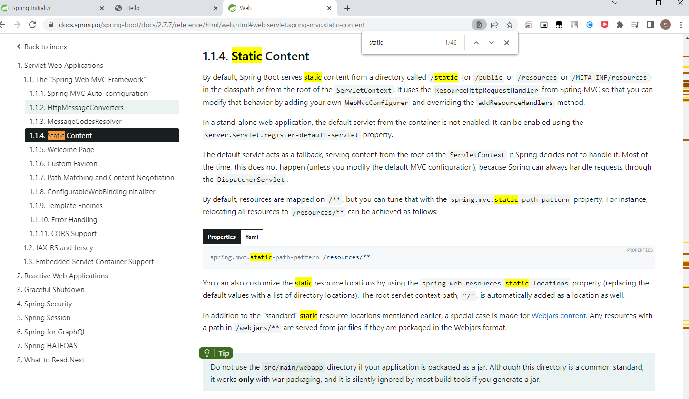
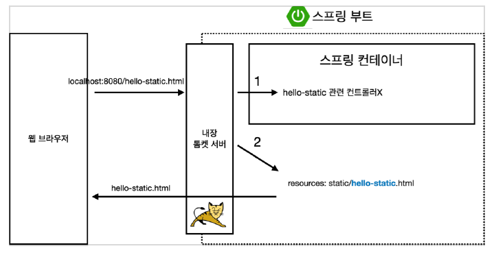
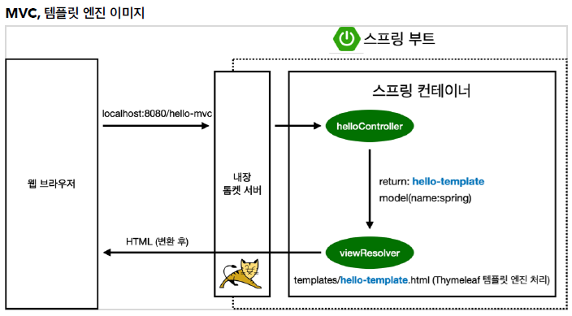
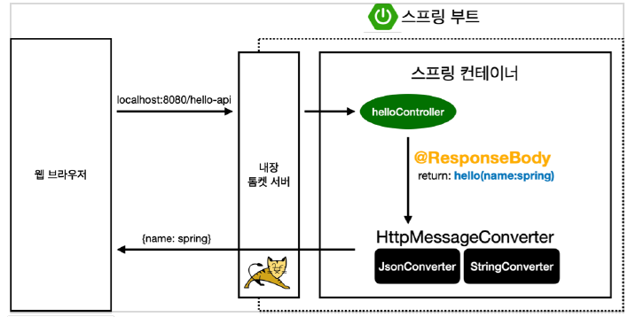

## 스프링기초

### 1. 정적 컨텐츠
서버에서 하는거없이 파일을 웹브로우저로 그대로 내림  
  
[http://spring.io](http://spring.io)  
잘모르는것은 spring.io 로 들어가서 검색해서 찾아보자. 검색해보면 스프링부트 서버의 정적컨텐츠는  
static 폴더에있는것을 띄운다

  
먼저 맵핑되는 controller 있는지 찾고 없으면, resources 에서 찾고 있으면 반환한다.

### 2. MVC와 템플릿 엔진
서버에서 프로그래밍해서 동적으로 HTML을 변경한뒤 웹브로우저로 내림  
  
맵핑되는 controller 메소드를 호출해서 메소드가 hello-template spring 에 넘겨주면  
viewResolver 가 hello-template.html 찾아서 연결해서 변환후 웹브라우저에 넘겨준다.

### 3. API
보통 Json 포맷 형식으로 클라이언트에게 데이터를 전달
  
@ResponseBody 가 붙어있으면 viewResolver 에 던지지 않는다. 
객체로 넘겨주면 HttpMessageConverter 가 동작 -> 단순 문자면 StringConverter 가 작동해서
그대로 문자를 던져준다. 객체이면 JsonConverter 가 동작해서 Json 포맷 형식으로 바꿔서 던져준다.

[참고자료](https://www.inflearn.com/course/%EC%8A%A4%ED%94%84%EB%A7%81-%EC%9E%85%EB%AC%B8-%EC%8A%A4%ED%94%84%EB%A7%81%EB%B6%80%ED%8A%B8)