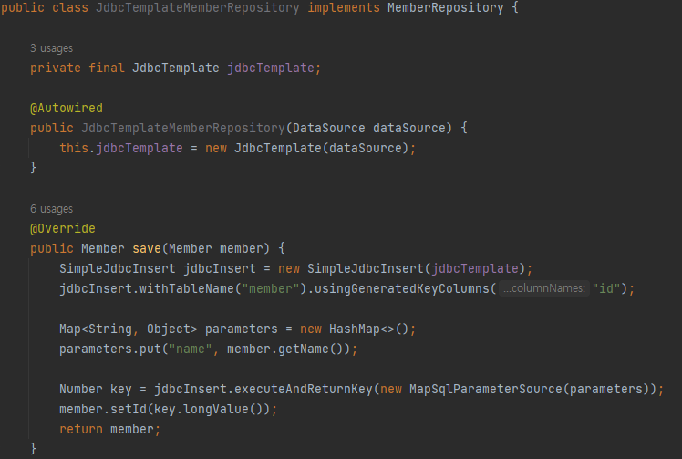

## 스프링 데이터베이스 기술

순수 JDBC -> 스프링 JDBC Template -> JPA -> 스프링 데이터 JPA

### 1. H2 데이터베이스 설치
용량이 작고 가벼우며 교육용으로 보통 설치한다. 설치버전에 주의하자(해당 교육에서는 1.4.200 을 사용한다)  
[설치링크](https://h2database.com/html/main.html)  

설치 후 cmd 로 설치한 H2 폴더로가서 bin 폴더 안에 h2.bat(윈도우의 경우)
를 실행해주면 아래 창이 뜬다.  
  
해당 창에서 연결을 한번 누르면 본인 컴퓨터 "홈" 폴더에 test.mv.db 파일이 생긴다.  

  
해당파일이 생겼으면 다음부터는 아래와같이 jdbc:h2:tcp://localhost/~/test 를 입력해서 접속한다.

  

### 2. 순수 JDBC

먼저 연결을 위한 설정을 해주어야 한다.  
**build.gradle**  
  
build.gradle 에 아래 내용 추가
```aidl
implementation 'org.springframework.boot:spring-boot-starter-jdbc'
runtimeOnly 'com.h2database:h2'
```

**src/main/resources/application.properties**  
  
application.properties 에 아래 내용 추가
```aidl
spring.datasource.url=jdbc:h2:tcp://localhost/~/test
spring.datasource.driver-class-name=org.h2.Driver
spring.datasource.username=sa
```

**repository/JdbcMemberRepository**  
  
순수 Jdbc 사용 방법, 작성해야할 코드가 많다.  
sql 코드작성, 예외처리, 그리고 마무리할때는 항상 자원을 해제해줘야 한다.


**service/SpringConfig**
  
스프링부트가 `application.properties` 를 보고 `DataSource` 를 생성해준다.
@Autowired 로 DI 해주고 사용할 수 있다. (사실 생성자가 하나만 있으면 @Autowired 생략이 가능하다)

기존의 코드 변경없이 `JdbcMemberRepository(dataSource)` 코드 한줄만 변경해주면
DB 와 연결이 된다. 이것이 객체지향.. spring의 장점..  
스프링의 DI 를 사용해 OCP(개방-폐쇄 원칙) 을 수행할 수 있다.


### 3. JDBC Template
JDBC API 에서 본 반복적인 코드를 대부분 제거해주지만, SQL 은 직접 작성해야한다.  


**repository/JdbcTemplateMemberRepository**
  
이전 순수 Jdbc 에서 중복되는 내용은 JdbcTemplate 이용(template 패턴사용) 해서 직접 코딩하지 않아도된다.
SQL문만 직접 작성해주면 되는데 `insert` 의 경우 자동으로 만들어주는 `SimpleJdbcInsert` 를 사용해서
작성하였다.


### 4. JPA
SQL 문조차 직접 코딩할 필요가 없다... 그리고 객체중심 설계로 패러다임을 전환할 수 있다.
세계적으로 JAP 가 압도적으로 많이 사용하고 국내에서도 많이 사용하는중


**build.gradle**  
  
`implementation 'org.springframework.boot:spring-boot-starter-data-jpa` 를 추가해준다.
참고로 해당 프레임워크에는 jdbc 도 포함하고 있다.

**src/main/resources/application.properties**  
  
application.properties 에 아래 내용 추가
```aidl
spring.jpa.show-sql=true // JAP 가 실행하는 sql 문 출력
spring.jpa.hibernate.ddl-auto=none // JAP 가 테이블까지 자동생성해주는 기능 사용안함
```

**domain/Member**  
  
객체와 DB를 자동으로 연결하고 SQL 문을 작성하게 하기위해서는 도메인을 인식시켜줘야한다.
그래서 @Entity 를 사용해 인식시킨다. 그리고 DB에서 기본키는 @Id 태그로 알려준다. 해당 DB에서는 기본키를
DB에서 자동으로 생성하기때문에 @GeneratedValue(startegy = GenerationType.IDENTITY) 태그를 사용해
알려준다.

**repository/JpaMemberRepository**  
  
JPA 에서는 모든 변경이 트랜잭션 안에서 수행되어야 하기때문에 @Transactional 태그가 있어야한다.

build.gradle 에서 data-jpa 프레임워크를 추가해놨기때문에 스프링에서 `EntityManager` 를 자동으로
만들어준다. 그러니 DI 만 해주면된다.  

Jpa 에서는 sql 이 아니라 jpql 를 사용하는데 테이블로 쿼리를 날리는게 아닌 객체(엔티티)를 대상으로 쿼리를 날린다.
기존 sql 은 맵핑을 해줘야하는데 그 과정이 필요없다!

**service/SpringConfig**
  
JPA 의 경우 `DataSource` 가 아닌 `EntityManager` 를 사용하기 때문에 수정해줘야 된다.


### 5. 스프링 데이터 JPA
코드가 이렇게까지 줄어든다고? 라는 생각이드는 미친 프레임워크

**repository/SpringDataJpaMemberRepository**  
  
repository 에 interface 로 오직 이것만 있으면 된다. 다른 구현코드는 필요없다..  

JpaRepository 에 save, findAll, findById 등 기본적인 CRUD 가 있어서 구현할 필요가없다.

하지만 findByName 은 기본적인것이 아니므로 제공하지않기에 오버라이딩 해주었다. 그런데 구현코드가 없는데?
**findBy** 가 있으면 자동으로 JPQL 로 `select m from Member m where m.name = ?` 쿼리를 작성한다.
인터페이스 이름만으로 자동으로 코드가 구현된다..


**service/SpringConfig**
  
생성자에서 스프링데이터 JPA 가 `SpringDataJpaMemberRepository` 를 찾아서 스프링 빈으로
자동 등록해준다.

실무에서는? JPA와 스프링데이터 JPA 를 기본적으로 사용하고, 복잡한 쿼리는 Querydsl 라이브러리를 사용한다.
이것도 안되면 네이티브쿼리(그냥 직접 쿼리 타이핑) 을 한다.

[참고자료](https://www.inflearn.com/course/%EC%8A%A4%ED%94%84%EB%A7%81-%EC%9E%85%EB%AC%B8-%EC%8A%A4%ED%94%84%EB%A7%81%EB%B6%80%ED%8A%B8)
