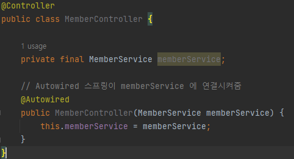
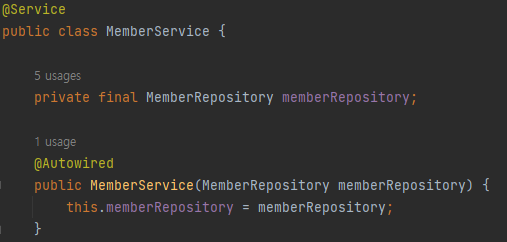
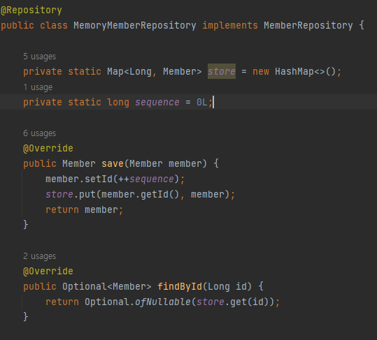
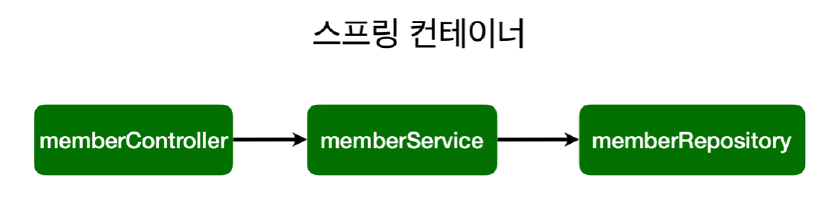
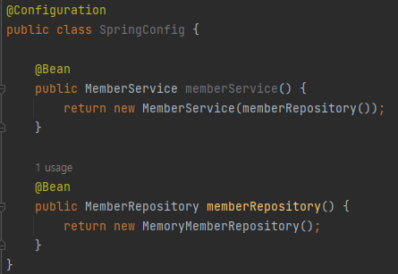

## 스프링 의존관계

### 의존관계 주입 방법
1. 컴포넌트(@Component) 스캔과 자동 의존관계 설정 ex) @Controller, @Service, @Repository 태그를 이용해 스프링 컨테이너에
등록하고, @AutoWired 로 의존성 주입(DI) 방식

**controller/MemberController.java**  
  
@Autowired 를 사용하면 MemberController 가 생성될때 스트링 빈에 등록되어 있는
MemberService 객체를 가져와서 넣어준다. 의존성주입(Dependency Injection)  

**service/MemberService.java**  
  
MemberService 는 MemberRepository 가 필요하기때문에, @Autowired 를 사용해 생성될때 @Service
로 등록하면서 스프링 컨테이너에있는 @Repository 등록된것을 가져와 넣는다.  

**repository/MemoryMemberRepository.java**  
  
MemoryMemberRepository 를 @Repository 를 등록해두면 MemberService 가 사용한다.

**의존관계**
  
참고 : 스프링은 스프링 컨테이너에 스프링 빈을 등록할때 싱글톤으로 등록. 싱글톤이 아니게 설정가능하지만 보통
쓰지 않는다.

**DI 방법** : 생성주입, 필드주입, Setter주입 (보통 생성주입을 사용)

**사용** : 정형화된 컨트롤, 서비스, 리포지토리는 컴포넌트 스캔 사용.

2. 자바 코드로 직접 스프링 빈 등록하기 : Controller 의 경우 컴포넌트스캔방식을 그대로 사용하나, service 와 repository 등록을 설정파일을 이용한다.

**SpringConfig.java**  
  
@Configuration 을 붙인 자바파일에 @Bean 을 이용해 service 와 repository 를 직접 등록한다.

**사용** : 상황에 따라 구현클래스를 변경해야하는 설정해야할시 스프링 빈 사용

[참고자료](https://www.inflearn.com/course/%EC%8A%A4%ED%94%84%EB%A7%81-%EC%9E%85%EB%AC%B8-%EC%8A%A4%ED%94%84%EB%A7%81%EB%B6%80%ED%8A%B8)