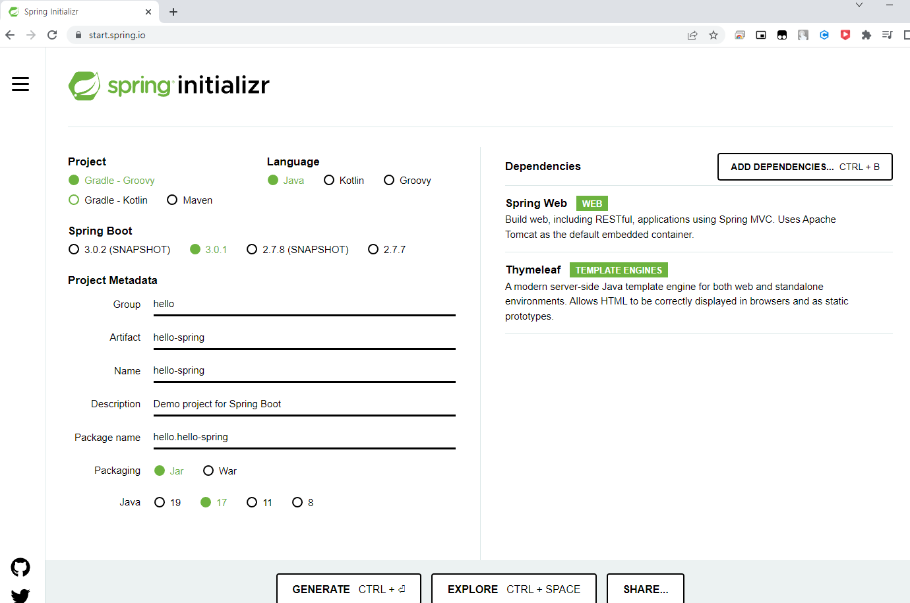
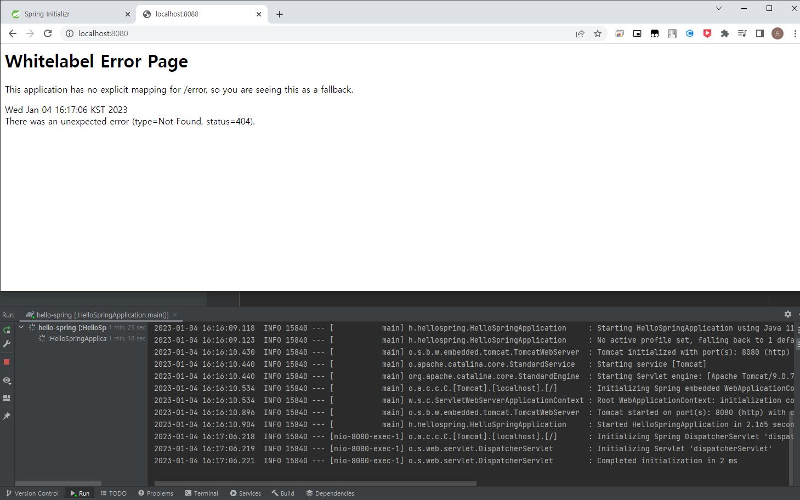
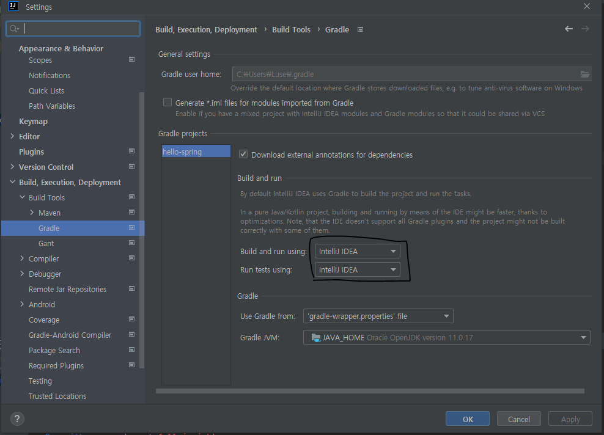

## 프로젝트 생성

### 1. 스프링 프로젝트 생성
[https://start.spring.io](https://start.spring.io)  
Project : 과거에는 Maven, 최근트렌드는 Gradle  
Spring Boot : SNAPSHOT(제작중), M1(정식버전아님), 해당 명칭없는걸로 선택  
Dependencies : 웹프로젝트(Spring Web), HTML엔진(Thymeleaf)  
  

프로젝트 빌드 오류  
[No matching variant of org.springframework.boot:spring-boot-gradle-plugin:3.0.1 was found. The consumer was configured to find a runtime of a library compatible with Java 11, packaged as a jar, and its dependencies declared externally, as well as attribute 'org.gradle.plugin.api-version' with value '7.5.1'](https://velog.io/@ogu1208/Error-%ED%94%84%EB%A1%9C%EC%A0%9D%ED%8A%B8-%EC%84%B8%ED%8C%85-%EC%98%A4%EB%A5%98)
SpringBoot 3.0.1 을 선택하고 JAVA 버전이 11일 경우 발생,
JAVA 버전이 11이라면 SpringBoot 를 2.7.7 로 선택해주자.

### 2. 스프링 프로젝트 실행
Intellij 에서 main 을 실행시키면  
[localhost:8080](http://localhost:8080) 으로 접속이 가능해진다.
  

### 3. 빌드 속도 향상
팁 : 빌드설정이 gradle 로 되어있는것을 Intellij IDEA 로 변경해주면 빌드 속도가 빨라진다.
  

### 4. 직접 빌드하고 실행하기
콘솔로 이동
1. ./gradlew build (윈도우는 ./gradlew.bat build)
2. cd build/libs
3. java -jar hello-spring-0.0.1-SNAPSHOT.jar
4. 실행 확인

서버에 배포할때는 jar 파일만 넣어서 실행한다

[참고자료](https://www.inflearn.com/course/%EC%8A%A4%ED%94%84%EB%A7%81-%EC%9E%85%EB%AC%B8-%EC%8A%A4%ED%94%84%EB%A7%81%EB%B6%80%ED%8A%B8)