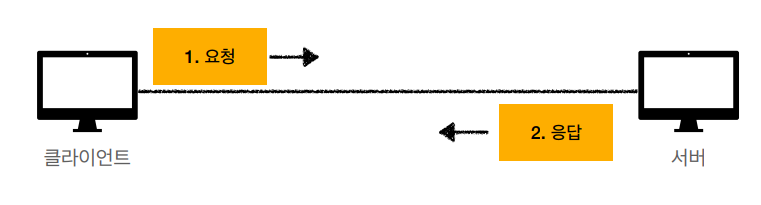
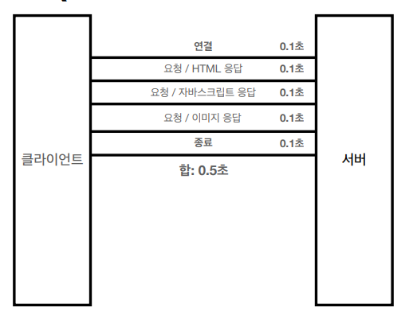
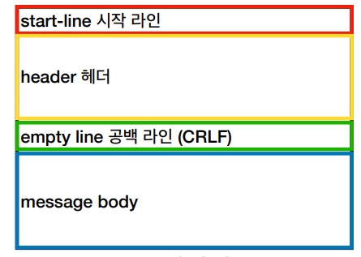
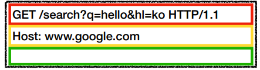
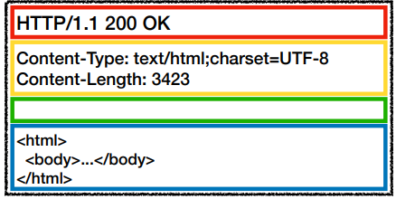

# HTTP 기본

대부분 데이터를(텍스트, 음성, 영상, 이미지, 서버간 데이터를 주고받을 때 등) HTTP 메시지를
이용해 전송한다. 

HTTP 1.1 : RFC7230~7325(2014) 스펙을 참고

특징
* 클라이언트 서버 구조 
* 무상태 프로토콜(스테이스리스), 비연결성 
* HTTP 메시지
* 단순함, 확장가능

## 프로토콜
TCP : HTTP/1.1, HTTP/2

UDP : HTTP/3

## 클라이언트 서버 구조
Request Response 구조
1. 클라이언트가 서버에 요청을 보내고, 응답을 대기
2. 서버가 요청에 대한 결과를 만들어서 응답


관심사 분리  
클라이언트 : ui, ux 그리는데 집중
서버 : 비즈니스 로직 처리

## 무상태 프로토콜
스테이스리스(Stateless)

스테이트풀(Stateful) : 서버가 클라이언트 상태를 보존 -> 서버가 변경되면 클라이언트 상태를
보존한 의미가없어진다.(아니면 변경된 서버에게 보존된 클라이언트 정보를 넘겨줘야한다)

스테이스리스(Stateless) : 서버가 클라이언트 상태를 보존하지 않음. 상태를 보존하지 않아도
되게 설계를 해야한다. 클라이언트가 요청시에 필요한 정보를 다 담아서 요청한다.
-> 갑작스러운 클라이언트의 대량요청도 그냥 대량 서버를 투입시켜 해결이 가능하다.

### Stateless 한계
모든 것을 무상태로 설계 할 수 없다. (ex : 로그인)
일반적으로 브라우저 쿠키와 서버세션 등을 이용해 상태유지

데이터를 보낼때 더 보내야한다.

## 비연결성
클라이언트와 서버의 연결을 계속 유지하지않는다(서버 자원을 많이 사용하게된다.)
하지만 연결이 필요없을 때 연결을 끊으면 자원을 필요할때만 사용할 수 있다.

### 비연결성 한계와 극복
TCP/IP 연결은 3 way handshake 를 해야되므로 시간이 걸린다. 

웹브라우저로 사이트 요청시 HTML 뿐만 아니라 자바스크립트, css, 이미지등도 다운해야하는데
이것도 하나 하나 연결 재연결 하다보면 비효율적이다.

지금은 HTTP 지속연결(Persistent Connection) 을 이용해 해결, HTTP/2 HTTP/3 에서 많이 발전

HTTP 지속연결 : 필요한것을 다 다운할 때까지 연결을 종료하지 않는다.


### 서버 개발자의 고통
같은 시간에 딱 맞추어 발생하는 대용량 트래픽(티켓팅, 수강신청 등)

스테이리스를 잘 분리해서 최대한 스테이스리스하게 설계해야 이런 문제를 잘 해결이 가능하다..

## HTTP 메세지
HTTP 는 요청메세지와 응답메세지 구조의 틀자체는 비슷하지만 일부 라인이 다르다.
요청메시지는 request-line, 응답메시지는 status-line 이다.

### HTTP 메시지 구조 (CRLF 필수임)



### HTTP 요청 메시지 구조



#### start-line(request-line)

|     | 전체                                                    | HTTP 메소드 | 요청대상                 | HTTP 버전      |
|-----|-------------------------------------------------------|----------|----------------------|--------------|
| 문법  | method SP(공백) request-target SP HTTP-version CRLF(엔터) | method   | request-target       | HTTP-version |
| 원문  | GET /search?q=hello&hl=ko HTTP/1.1                    | GET      | search?q=hello&hl=ko | HTTP/1.1     |

HTTP 메소드 : GEP, POST, PUT, DELETE

요청 대상 : 보통 절대경로를 사용한다. "/" 로 시작한다.

#### HTTP header

|     | 전체                                                | field-name | field-value 상태코드 |
|-----|---------------------------------------------------|------------|------------------|
| 문법  | field-name ":" OWS field-value OWS (OWS : 띄워쓰기허용) | field-name | field-value      |
| 원문  | Host: www.google.com                              | Host       | www.google.com   |

field-name 은 대소문자 구분하지 않음

### HTTP 응답 메시지 구조



#### status-line

|     | 전체                                                                                                                                            | HTTP 버전      | HTTP 상태코드   | 이유 문구         |
|-----|-----------------------------------------------------------------------------------------------------------------------------------------------|--------------|-------------|---------------|
| 문법  | HTTP-version SP status-code SP reason-phrase CRLF                                                                                             | HTTP-version | status-code | reason-phrase |
| 원문  | HTTP/1.1 200 OK </br>Content-Type: text/html;charset=UTF-8</br>Content-Length: 3423</br></br>\<html\> </br>\<body\>...\</body\></br>\</html\> | HTTP/1.1     | 200         | OK            |

HTTP 상태 코드 
* 200 : 성공
* 400 : 클라이언트 요청 오류
* 500 : 서버 내부 오류

이유 문구 : 사람이 이해하도록 상태코드에 대한 짧은 글

#### HTTP header

```
Content-Type: text/html;charset=UTF-8
Content-Length: 3423
```

HTTP 전송에 필요한 모든 부가정보가 있음(ex 압축/인증/캐시관리정보/메시지바디내용 등)

표준 헤더필드가 매우많다.. 임의의 헤더도 만들 수 있지만 그에따른 클라이언트와 서버 설계가필요

#### HTTP body
실제 전송할 데이터, byte 로 표현할 수 있는 모든 데이터 전송 가능

출처  
https://www.inflearn.com/course/http-%EC%9B%B9-%EB%84%A4%ED%8A%B8%EC%9B%8C%ED%81%AC/dashboard


