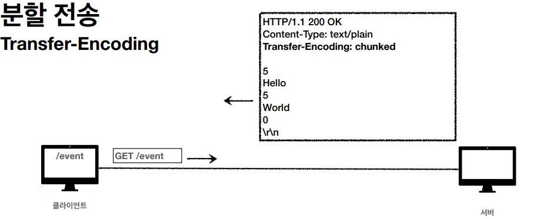

# HTTP 기본 헤더

HTTP 전송에 필요한 모든 부가정보

최근 HTTP BODY 스펙(RFC 7230)에서는 표현헤더와 표현데이터로 설명한다.
메세지본문으로 데이터를 전달하고 페이로드(payload) 라 불린다. 표현헤더는 표현데이터를
해석할 수 있는 정보를 제공한다(데이터유형, 데이터길이, 압축정보 등)

## 표현 헤더
| 표현헤더             | 설명            | 예시                                                    |
|------------------|---------------|-------------------------------------------------------|
| Content-Type     | 표현 데이터의 형식    | text/html; charset=UTF-8, application/json, image/png |
| Content-Encoding | 표현 데이터의 압축 방식 | gzip, deflate, identity                               |
| Content-Language | 표현 데이터의 자연 언어 | ko, en, en-US                                         |
| Content-Length   | 표현 데이터의 길이    |                                                       |

## 협상 헤더
클라이언트가 원하는 표현을 요청하면 최대한 원하는 표현데이터를 줌

| 협상 헤더           | 설명                    | 예시                                                                                |
|-----------------|-----------------------|-----------------------------------------------------------------------------------|
| Accept          | 클라이언트가 선호하는 미디어 타입 전달 | text/*, text/plain, text/plain;format=flowed, */*                                 |
| Accept-Encoding | 클라이언트가 선호하는 압축 인코딩    | gzip, deflate, identity                                                           |
| Accept-Language | 클라이언트가 선호하는 자연 언어     | ko-KR,ko;q=0.9,en-US;q=0.8,en;q=0.7                                               |
| Accept-Charset  | 클라이언트가 선호하는 문자 인코딩    |                                                                                   |

협상과 우선순위

1. Quality Values(q) 값 사용, 0~1 클수록 높은 우선순위, 생략하면 1
2. 구체적인 것이 우선한다 
3. 구체적인 것을 기준으로 미디어 타입을 맞춘다.

## 전송 방식

### 단순 전송
요청을 하면 응답을 준다. 기대값을 확실히 알기에 Content-Length 를 지정해서준다.

### 압축 전송
서버에서 압축해서 보내준다. Content-Encoding 헤더가 포함되어있다.

### 분할 전송
Transfer-Encoding 을 사용한다. Content-Length 헤더가 없다.
서버에서 분할해서 클라이언트에게 전송한다. 큰 파일을 보낼때 사용한다.

### 범위 전송
Content-Range 헤더를 사용한다. 필요한 범위만 클라이언트가 요청하면 서버가 해당부분을
보내준다.

## 일반 정보 헤더
| 일반 정보 헤더   | 설명                           | 사용                                         |
|------------|------------------------------|--------------------------------------------|
| Form       | 유저 에이전트의 이메일 정보              | 검색 엔지에서 주로 사용, 잘 사용 안함                     |
| Referer    | 이전 웹 페이지 주소                  | 유입경로 분석 가능, 많이 사용함                         |
| User-Agent | 유저 에이전트 애플리케이션 정보            | 클라이언트 애플리케이션 정보, 어떤 종류 브라우저에서 장애 발생하는 확인가능 |
| Server     | 요청을 처리하는 ORIGIN 서버의 소프트웨어 정보 | 마지막에 응답해주는 서버, apache 등                    |
| Date       | 메시지가 발생한 날짜와 시간              | 응답에서 사용                                    |

## 특별 정보 헤더
| 특별 정보 헤더    | 설명                               | 사용                                          |
|-------------|----------------------------------|---------------------------------------------|
| Host        | 요청한 호스트 정보(도메인)                  | 요청에서 사용, 필수! 하나의 서버가 여러 도메인을 처리할때           |
| Location    | 페이지 리다이렉션                        | 3xx 응답결과에 Location 위치로 리다이렉트 , 201 요청에의해 사용 |
| Allow       | 허용 가능한 HTTP 메서드                  | 405 헤더에 어떤 HTTP 메서드를 허용하는지 알려줌, 잘안씀         |
| Retry-After | 유저 에이전트가 다음 요청을 하기까지 기다려야 하는 시간  | 503 서비스가 언제까지 불능인지 알려줌                      |

Host : 서버에서 여러 도메인을 관리하고 있을때, 호스트로 어떤 도메인인지 알 수 있다.

## 인증 헤더
| 인증 헤더            | 설명                   | 사용                                                                                                   |
|------------------|----------------------|------------------------------------------------------------------------------------------------------|
| Authorization    | 클라이언트 인증 정보를 서버에 전달  | Authorization : Basicxxxxxxxxxxxx                                                                    |
| WWW-Authenticate | 리소스 접근시 필요한 인증 방법 정의 | WWW-Authenticate: Newauth realm="apps", type=1, <\br>title="Login to \"apps\"", Basic realm="simple" |

## 쿠키
Set-Cookie : 서버에서 클라이언트로 쿠키 전달

Cookie : 클라이언트가 서버에서 받은 쿠키를 저장하고, HTTP 요청시 서버로 전달

쿠키 사용 이유 : HTTP는 Stateless 프로토콜 이기때문에, 클라이언트와 서버가 요청과 응답을 주고받으면
연결이 끊어진다. 그러므로 로그인 하고 다른페이지를 가면 다시 로그인했던 정보가 없으므로 사용자 인식이
불가능하다(물론 Stateless 프로토콜 특성상 요청에 사용자 정보를 포함해 넘기면 되지만
개발 관점이든, 보안 관점이든 매우 좋지않다) 이것을 해결하기위해 쿠키를 사용!

유저가 로그인을 하면 서버는 Set-Cookie 헤더를 실어서 보내준다. 클라이언트에서 해당 헤더를
받으면 쿠키 저장소에 저장한다.

사용자가 다른페이지로 접근시(요청시), 쿠키 저장소를 먼저 확인한다음 Cookie 헤더에 해당 정보를
담아서 서버에게 요청한다.

사용처 : 로그인 세션 관리, 광고 정보 트래킹

웹 스토리지 : 서버에 전송하지 않고, 웹 브라우저 내부에 데이터를 저장

단점 : 쿠키 정보는 항상 서버에 전송되서 네트워크 트래픽이 추가된다. 쿠키와 웹스토리지에
주민번호같은 민감한 개인정보는 저장하면 안된다.

### set-cookie
* expires : 만료일이 되면 쿠키 삭제
* max-age : 초단위로 쿠키 삭제시간 설정

| set-cookie | 기능                                                | 사용                                            |
|------------|---------------------------------------------------|-----------------------------------------------|
| expires    | 만료일이 지나면 쿠키 삭제                                    | expires=Sat, 26-Dec-2020 04:39:21 GMT         |
| max-age    | 0이나 음수를 지정하면 쿠키삭제                                 | max-age=3600                                  |
| domain     | 명시한 문서 기준 도메인+서브 도메인 포함해서 쿠키 전송 생략시 현재 도메인만 쿠키 적용 | domain=example.org   (dev.example.org 쿠키접근 됨) |
| path       | 이 경로를 포함한 하위 경로 페이지만 쿠키 접근                        | path = / (일반적으로 루트패스로 지정)                     |
| secure     | https 인 경우만 전송, http 전송안함                         |                                               |
| httpOnly   | XSS 공격 방지를 위해 자바스크립트에서 접근 불가                      |                                               |
| sameSite   | XSRF 공격방지                                         |                                               |

세션 쿠키 : 만료 날짜 생략시 브라우저 종료시까지 유지

영속 쿠키 : 만료 날짜 입력시 해당 날자까지 유지

출처  
https://www.inflearn.com/course/http-%EC%9B%B9-%EB%84%A4%ED%8A%B8%EC%9B%8C%ED%81%AC/dashboard

