# HTTP 메서드

## API URI 설계

설계할때 가장 중요한것 **리소스** 식별!

ex) 회원조회, 회원등록, 회원수정이 리소스가 아니다. **회원** 자체가 리소스다.
회원등록, 수정, 조회 모든것을 배제하고 회원 리소스만 식별하고 맵핑한다.

URI 는 리소스만 식별, 리소스와 리소스 대상으로 하는 행위를 분리
* 리소스 : 회원
* 행위 : 조회, 등록, 삭제, 변경 -> http 메서드로 구분한다.

물론 리소스만 가지고 다 설계할 수 없어 동사형 uri 를 만들기도한다(컨트롤 URI) 
하지만 최대한 리소스만으로 설계하자.

잡지식 : 최근에는 리소스를 Representation 용어로 표현하기도 한다.

## HTTP 메서드
주요 메서드
* GET : 리소스 조회, 서버에 전달하고 싶은데이터는 query를 통해 전달, 메시지 바디
전다른 가능하나 거의 지원하는곳이 많지않아 사용안함

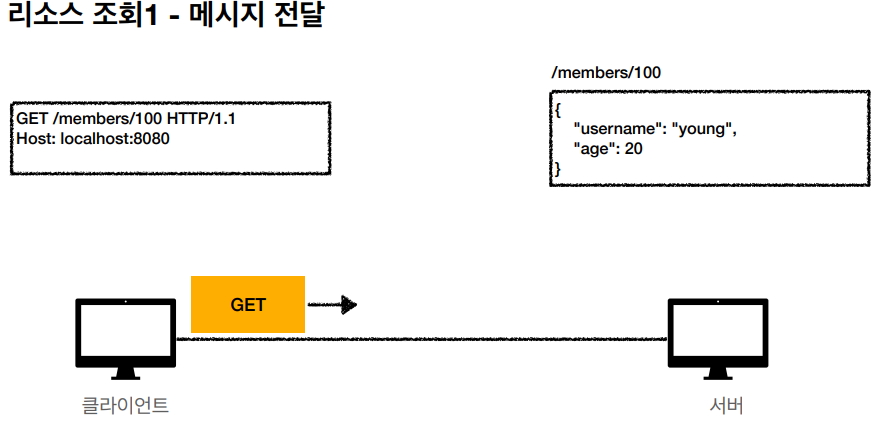

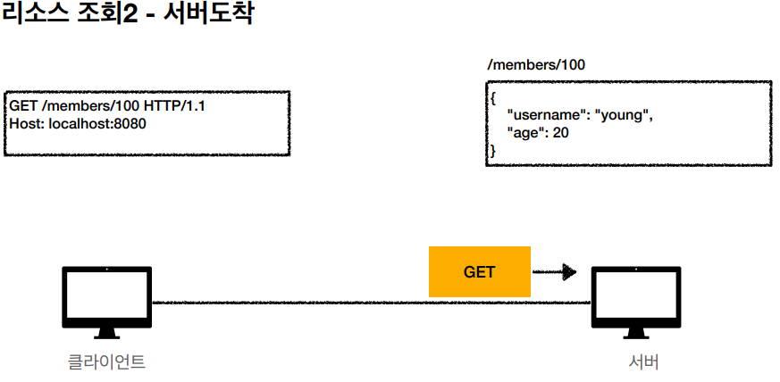

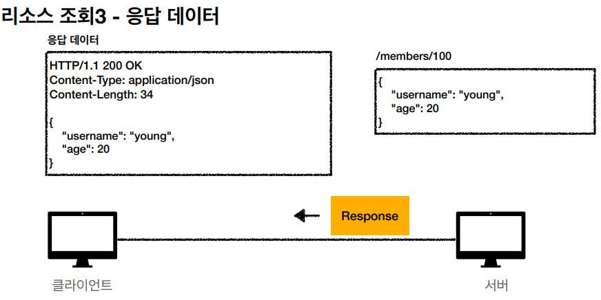

* POST : 요청 데이터 처리, 주로 등록에 사용, 메시지 바디를 통해 서버로 요청 데이터 전달
  스펙 : 대상 리소스의고유 한 의미 체계에 따라 요청에 포함 된 표현을 처리하도록 요청합니다.
  이 리소스 URI에 POST 요청이 오면 요청 데이터를 어떻게 처리할지 리소스마다 따로 정해야함(정해진 것이 없음)
  ex) 새 리소스 등록, 요청 데이터 처리, 다른 메서드에 처리하기 애매한 경우(조회를 할려는데 메세지바디 넣어서 보내고싶을때)
사실 포스트는 모든걸 할 수 있지만, GET 을 사용하면 캐싱이 되기에 목적에 맞게쓰자(POST로 캐싱할려면 어렵다)

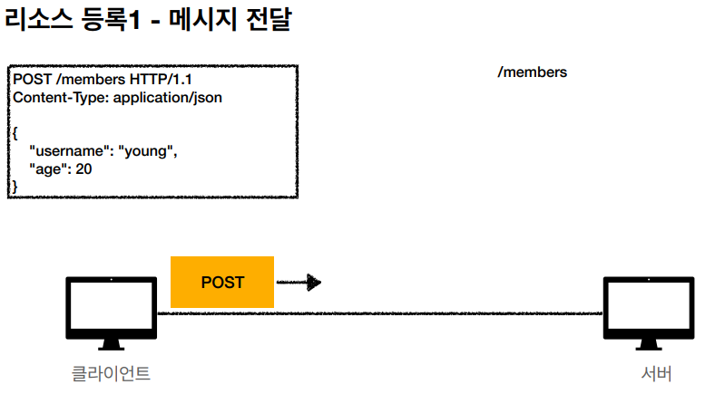

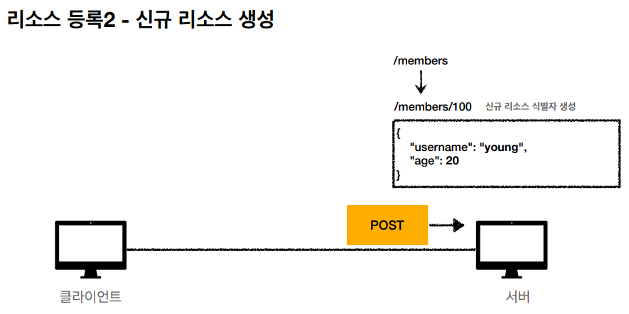

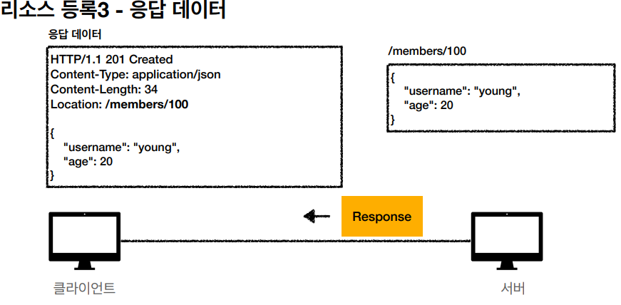

* PUT : 리소스를 완전히 대체, 해당 리소스가 없으면 생성, 클라이언트가 리소스의 위치를 알고 uri를 지정한다.

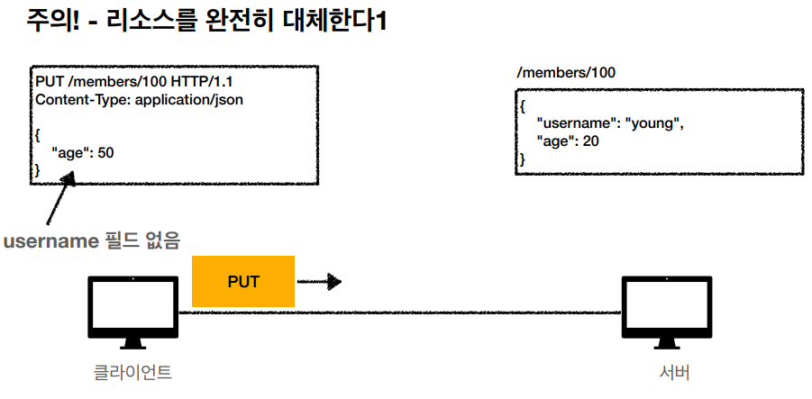

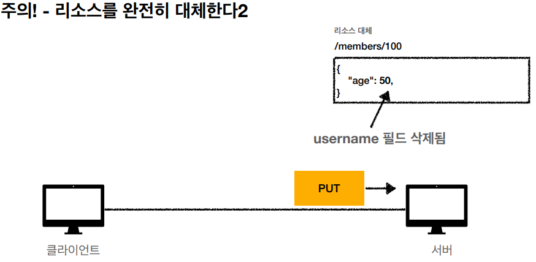

* PATCH : 리소스 부분 변경, PUT 은 부분 변경이 안되지만 PATCH 를 이용하면 부분 변경이 된다.

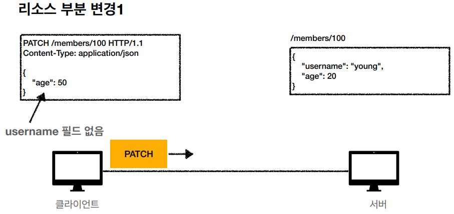

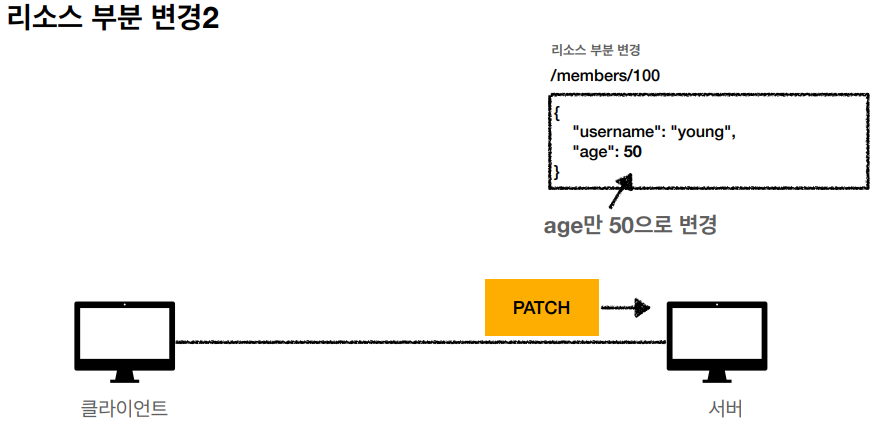

* DELETE : 리소스 삭제

기타 메서드
* HEAD : GET과 동일하지만 메시지 바디부분을 제외하고 상태줄과 헤더만 반환
* OPTIONS : 대상 리소스에 대한 통신가능옵션설명(CORS 사용)
* CONNECT, TRACE : 사용 거의 안함

## HTTP 메소드 속성

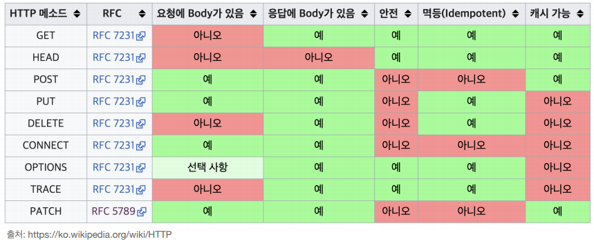

### 안전
호출해도 리소스가 변경이 없다.

### 멱등(Idempotent)
f(f(x)) = f(x) : 몇 번을 호출하든 결과가 똑같다.

활용 : 서버가 TIMEOUT 등 정상응답을 못했을때 재응답해도 멱등하다면 문제가 없다.
(하지만 멱등은 외부요인으로 중간에 리소스가 변경되는것 까지는 고려하지는 않는다.)

### 캐시가능
리소스를 캐시해서 사용해도 되는가?

실제로는 GET, HEAD 정도만 캐시로 사용(POST, PATCH 본문 내용과 캐시키를 고려해야 되는데, 구현이 쉽지 않음)

## 클라이언트에서 서버로 데이터 전송
데이터 전달 방식은 2가지가 있다.

#### 쿼리 파라미터를 통한 데이터 전송
쿼리스트링(키밸류) 이용 : GET, 정렬 필터(검색어)

#### 메시지 바디를 통한 데이터 전송
POST, PUT, PATCH

### 전송 종류

#### 정적 데이터 조회
이미지, 정적텍스트 문서 등

GET 사용해 조회한다.

uri 경로(리소스경로)만 주면 쿼리 파라미터 필요없이 조회가 가능하다.

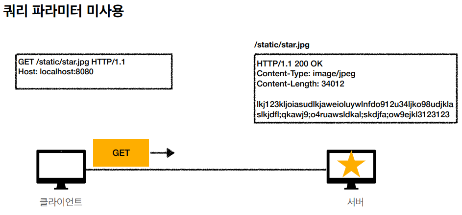

#### 동적 데이터 조회
검색, 게시판목록 정렬 필터, 조회 조건을 줄여주는 필터, 조회 결과를 정려하는 정렬 조건 등

GET 사용해 조회한다. 

쿼리 파라미터를 전달해서, 서버가 키밸류로 쿼리파리미터로 값을 꺼내 응답을 해준다.

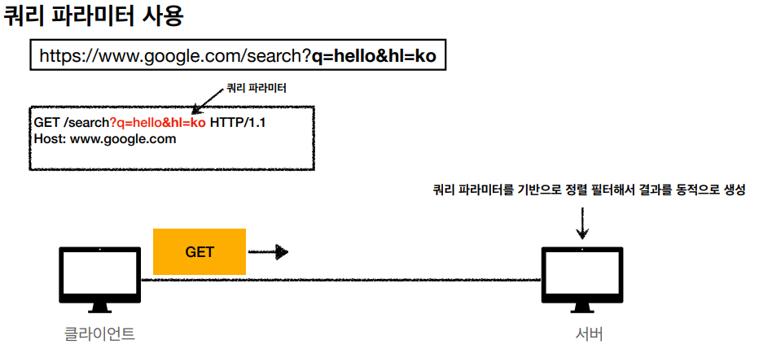

#### HTML Form 데이터 전송

POST 전송, GET 전송만 지원, GET 전송은 사용 하지 않는다.

기본적으로 Content-Type : application/x-www-form-urlencoded 사용한다. 해당
방식은 form 내용을 메시지 바디(키밸류, 쿼리파라미터형식)을 통해 전송하고 전송 데이터를
url encoding 처리한다.

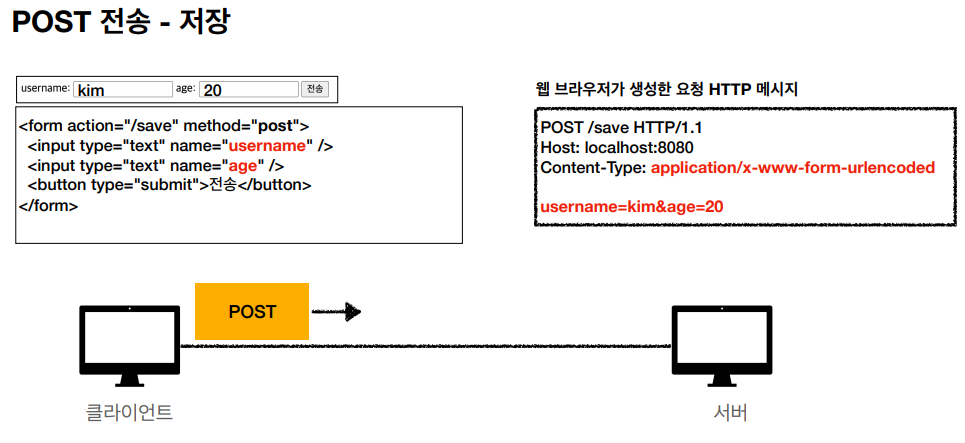

GET 으로도 사용가능하지만, GET 으로하면 외부에서 조작이 가능하니 보안상 금지다.

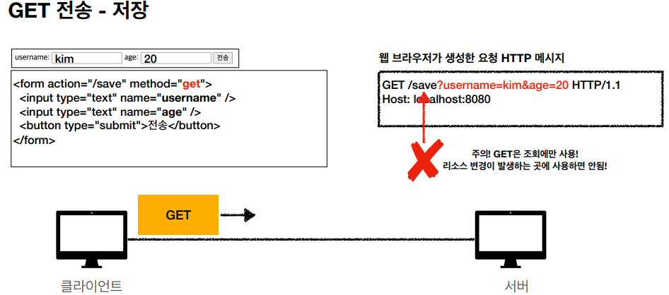

multipart/form-data : 여러 type 을 보낼때 ex)file 전송할 때

<img src="img/httpmethod16.PNG"

#### HTTP API 데이터 전송
서버 to 서버(백엔드 시스템 통신), 앱 클라이언트, 웹 클라이언트, AJAX(React, VueJs)

Content-Type : application/json 을 주로 사용

직접 형식대로 제작해서 보내준다.

## HTTP API 설계 예시

### POST/PUT

#### POST 기반 등록

| 목적    | 쿼리 파라미터       | HTTP 메소드         |
|-------|---------------|------------------|
| 회원 목록 | /members      | GET              |
| 회원 등록 | /members      | POST             |
| 회원 조회 | /members/{id} | GET              |
| 회원 수정 | /members/{id} | PATCH, PUT, POST |
| 회원 삭제 | /members/{id} | DELETE           |

POST 는 클라이언트가 등록될 리소스의 URI를 모른다. 서버가 새로 등록된 리소스 URI를 생성한다.

컬렉션 : 서버가 관리하는 리소스 디렉토리, 서버가 리소스의 URI를 생산하고 관리

#### PUT 기반 등록

| 목적       | 쿼리 파라미터           | HTTP 메소드 |
|----------|-------------------|----------|
| 파일 목록    | /files            | GET      |
| 파일 등록    | /files/{filename} | PUT      |
| 파일 조회    | /files/{filename} | GET      |
| 파일 삭제    | /files/{filename} | DELETE   |
| 파일 대량 등록 | /files            | POST     |

PUT 으로 파일을 등록하면 POST 를 임의의 기능으로 사용할 수 있다.

PUT 은 클라이언트 리소스 URI를 알고 있어야 한다. 클라이언트가 직접 리소스 URI를 지정한다.

스토어 : 클라이언트가 관리하는 리소스 저장소, 클라이언트가 리소스 URI를 알고 관리한다.

PUT 과 POST 의 차이 : POST를 사용해 등록하면 서버가 리소스 URI 를 넘겨준다. 하지만
PUT 은 등록될 리소스 URI 를 알고 있다.

대부분 POST 를 사용한다.

### HTML FORM
순수한 HTML FORM 은 GET, POST 만 사용 가능하다.

| 목적      | 쿼리 파라미터                           | HTTP 메소드 |
|---------|-----------------------------------|----------|
| 회원 목록   | /members                          | GET      |
| 회원 등록 폼 | /members/new                      | GET      |
| 회원 등록   | /members/new, /members            | POST     |
| 회원 조회   | /members/{id}                     | GET      |
| 회원 수정 폼 | /members/{id}/edit                | GET      |
| 회원 수정   | /members/{id}/edit, /members/{id} | POST     |
| 회원 삭제   | /members/{id}/delete              | POST     |

회원등록 할 때, 회원등록 폼으로 같은 경로를 맞추는것을 권장. 리소스가 바뀌면
서버에 문제가 생겼을때 경로가 바뀌어서 추가작업을 해줘야함.

HTML FORM 은 DELETE HTTP 메소드를 사용하지 못하므로 컨트롤 URI 를 사용해야 한다.
/new, /edit, /delete 모두 컨트롤 URI(동사) 이다. 최대한 HTTP 메소드를 쓰는게 좋지만
어쩔 수 없이 실무에서도 컨트롤 URI 를 많이 사용한다.

### URI 설계 개념
문서
* 단일 개념(파일 하나, 객체 인스턴스, 데이ㅓ베이스 row)
* 예) /members/100, /files/star.jpg

컬렉션
* 서버가 관리하는 리소스 디렉토리
* 서버가 리소스의 URI를 생성하고 관리
* 예) /members

스토어
* 클라이언트가 관리하는 자원 저장소
* 클라이언트가 리소스의 URI 를 알고 관리
* 예) /files

컨트롤러, 컨트롤 URI
* 문서, 컬렉션, 스토어로 해결하기 어려운 추가 프로세스 실행
* 동사를 직접 사용
* 예) /members/{id}/delete

출처  
https://www.inflearn.com/course/http-%EC%9B%B9-%EB%84%A4%ED%8A%B8%EC%9B%8C%ED%81%AC/dashboard
