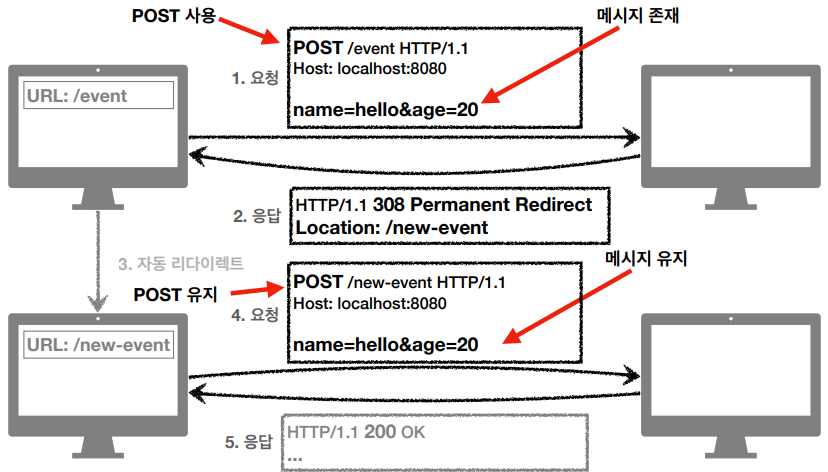

# HTTP 상태코드

클라이언트가 보낸 요청의 처리 상태를 **응답**에서 알려주는 기능

## 1xx 
informational : 요청이 수신되어 처리중, 거의 사용안함

## 2xx
Successful : 요청 정상 처리
* 200 OK 
* 201 Created : 클라이언트 요청으로 서버에서 리소스를 생성함.(ex) POST) 새로 생성된
리소스를 Location 헤더에 넣어준다.

* 202 Accepted : 요청이 접수되었으니 처리가 완료되지 않았음. (ex) 요청접수 후 1시간 뒤 실행)
* 204 No Content : 서버가 요청을 성공적으로 수행했지만, 응답 페이로드 본문에 보낼 데이터가 없음
예를 들어 웹문서 편집기에 저장버튼을 눌러도 그 결과로 응답해줄 내용이없다.

해당 코드는 개발팀마다 무엇을 사용할지 정한것을 사용한다. 보통 200만 쓰거나 201까지 쓰는 경우가 많다.

## 3xx
Redirection : 요청을 완료하려면 추가 행동이 필요

리다이렉션? 웹브라우저는 3xx 응답의 결과에 Location 헤더가 있으면, 클라이언트가 Location 위치로
서버에 재요청 해당 Location 으로 자동 이동(리다이렉트)

### 영구 리다이렉션 
특정 리소스의 URI가 영구적으로 이동, 원래의 URL 더 이상 사용안함 예) /members -> /users
* 301 Moved Permanently : 리다이렉트시 요청 메서드가 GET 으로 변하고, 본문이 제거 될 수 있음(거의 제거됨)

* 308 Permanent Redirect : 301 과 기능같음, 리다이렉트시 요청 메서드와 본문유지(처음
POST 내용을 유지함)

### 일시적 리다이렉션 
리소스 URI 가 일시적인 변경, 검색엔진에서 URL 바꾸면 안됨, PRG 예) 주문 완료 후 주문 내역 화면으로 이동
* 302 Found : 리다이렉트시 요청 메서드가 GET 으로 변하고, 본문이 제거될 수 있음(거의 제거됨)
* 307 Temporary Redirec : 302 와 기능은 같음. 리다이텍트시 요청 메소드와
본문 유지(요청 메서드를 변경하면 안된다.)
* 303 See Other : 302 와 기능은 같음, 리다이텍트시 요청 메서드가 GET 으로 무조건 변경

PRG : Post/Redirect/Get 클라이언트에서 중복주문을 방지하기 위한 패턴(물론 서버에서도 막는것이 기본이다)
POST 주문 후 새로고침해도 Get 으로 요청하게하면 문제가 없다.

POST로 주문후에 웹 브라우저를 새로고침하면? 새로고침한것도 POST 요청해 중복 주문이 됨
#### PRG 사용전

#### PRG 사용후

응답을 302, 303 으로 Location 정보를 준다. 리다이렉트로 해당 Location 정보를 GET 으로 보내게된다. 

### 특수 리다이렉션 
결과 대신 캐시를 사용

* 304 Not Modified : 캐시목적으로 사용, 클라이언트에게 리소스가 수정되지 않았음을 알려줌.
수정되지 않았으니 로컬 PC에 저장된 캐시를 재사용(리다이렉트) 한다. 따라서 응답에 body 가 없다.

## 4xx
Client Error : 오류 원인이 클라이언트, 예) 잘못된 문법 등으로 서버가 요청을 수행할 수 없음
* 400 Bad Request : 클라이언트가 잘못된 요청을 해서 서버가 요청을 처리할 수 없음.
* 401 Unauthorized : 클라이언트가 해당 리소스에 대한 인증이 필요함.
* 403 Forbidden : 서버가 요청을 이해했지만 승인을 거부함. 인증자격은 있지만 접근 권한이 불충분할 때
* 404 Not Found : 요청 리소스를 찾을 수 없음(해당 리소스가 서버에 없거나 숨기고싶을 때)

## 5xx
Server Error : 오류 원인이 서버, 서버가 정상 요청을 처리하지 못함
* 500 Internal Server Error : 서버 문제로 오류 발생, 대부분 500
* 503 Service Unavailable : 서버가 일시적으로 과부하 또는 예정된 작업으로 잠시 요청을 처리할 수 없음.
언제 복구되는지 예상시간 Retry-After 헤더 필드로 보낼 수 있음.

출처  
https://www.inflearn.com/course/http-%EC%9B%B9-%EB%84%A4%ED%8A%B8%EC%9B%8C%ED%81%AC/dashboard