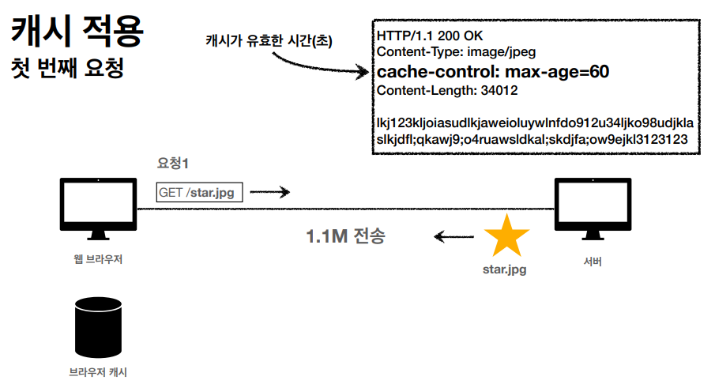
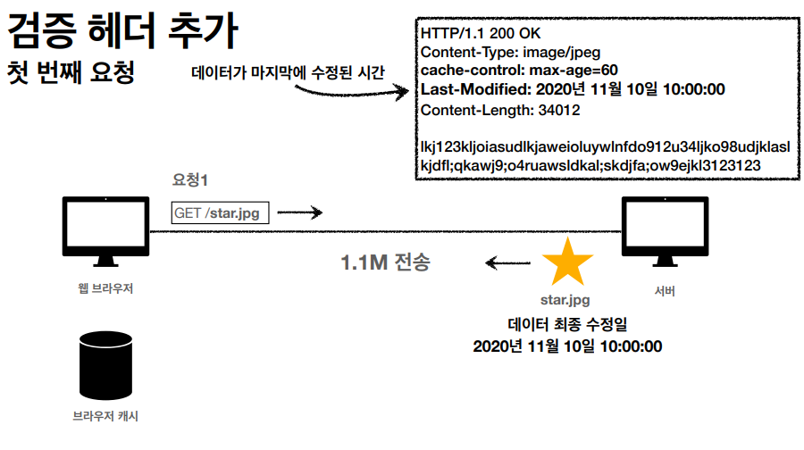
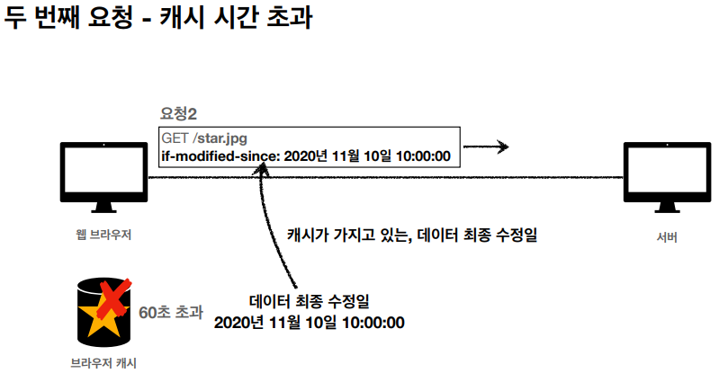
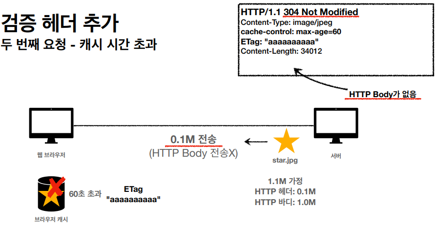
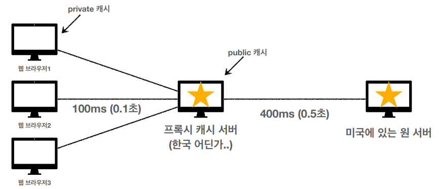
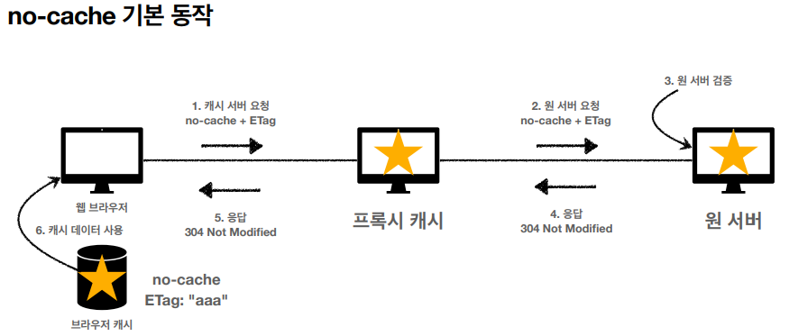
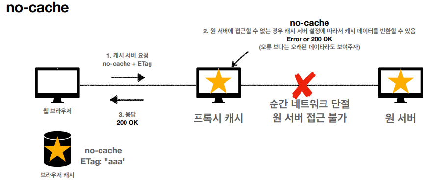
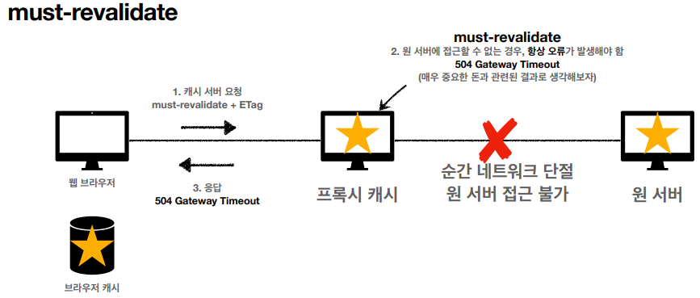

# HTTP 캐시헤더

캐시가 없으면 데이터가 변하지않았을 때 똑같은 요청에 대해 똑같은 응답을 반복해야 한다. 

캐시 기본 동작



캐시를 사용하면 응답결과를 캐시에 저장한다. 사용자가 재요청할시 캐시에 있다면
네트워크를 사용하지 않고 캐시에서 조회하여 사용한다. 

검증헤더와 조건부 요청 : 캐시 유효 시간이 초과했는데 서버에서 기존 데이터가 변경되지 않았다면, 다시 다운로드 받을 
필요가 없으므로 검증헤더로 확인한다



응답결과가 last-modified 검증 헤더 정보와 같이 저장된다.



캐시가 가지고 있는 데이터 최종 수정일인 if-modified-since 조건부 헤더를 포함해서 요청을 한다. 그러면 서버에서
데이터 최종 수정일을 비교해서 검증한다.



캐시정보가 최신이라고 검증되면, 304 Not Modified 로 body 부분을 버리고 전송한다(body 부분이 큰 용량을 차지하므로)

### 검증 헤더
캐시 데이터와 서버 데이터가 같은지 검증하는 데이터  
종류 : Last-Modified, ETag

### 조건부 요청 헤더
검증 헤더로 조건에 따른 분기 : 조건이 만족하면 200 OK, 만족하지 않으면 304 NOT Modified  
종류 : If-Modified-Since(Last-Modified 사용), If-None-Match(ETag 사용)

Last-Modified/ If-Modified-Since
* 데이터 미변경시 304 Not Modified, 헤더 데이터만 전송
* 데이터 변경시 200 OK, 모든 데이터 전송
* 단점 : 날짜 기반으로 수정을 판단해서 실제 데이터가 같아도 날짜가 다르면 다름으로 판단함.

ETag/ If-None-Match
* 캐시용 데이터에 임의의 고유한 버전 이름을 달아둠
* 데이터가 변경되면 이 이름을 바꾸어 변경(Hash 를 다시 생성함)
* 단순하게 ETag 만 서버에 보내서 같으면 유지, 다르면 다시 받음. 
* 캐시 제어 로직을 서버에서 완전히 관리(클라이언트는 태그값만 제공함, 어떻게 제어하는지모름)

### 프록시
프록시 캐시 서버를 이용해 원 서버 통신 보다 빠르게!



최초의 유저는 느리지만 한번 다운 받으면 두번째 유저부터는 빨라진다. public 캐시는
공용으로 사용하는것, private 캐시는 내 로컬이나 브라우저에 저장되는것

### 캐시 제어 헤더
| 캐시 제어 헤더                       | 설명                                                |
|--------------------------------|---------------------------------------------------|
| Cache-Control: max-age         | 캐시 유효시간, 초 단위                                     | 
| Cache-Control: no-cache        | 데이터는 캐시해도 되지만, 항상 조건부요청을 해서 origin 서버에 검증하고 사용    |
| Cache-Control: no-store        | 데이터에 민감한 정보가 있으므로 저장하면 안됨(메모리에서만 써라)              |
| Cache-Control: must-revalidate | 캐시 만료후 최초 조회시 원 서버에 검증해야함                         |
| Pragma : no-cache              | HTTP 1.0 하위호환, 사용안함                               |
| Expires                        | 캐시만료일을 정확한 날짜 지정(초 단위X) Cache-Control: max-age 권장 |
| Cache-Control: public          | 응답이 public 캐시에 저장되어도 됨                            |
| Cache-Control: private         | 응답이 해당 사용자만 위한것(기본값)                              |
| Cache-Control: s-maxage        | 프록시 캐시에만 적용되는 max-age                             |
| Age:60                         | 오리진서버에서 응답후 프록시 캐시내에 머문 시간                        |

### 캐시 무효화
캐시 안써도 웹브라우저가 알아서 캐시할 수 도 있음
   
```
Cache-Control: no-cache, no-store, must-revalidate
Pragma: no-cache // 혹시 모를 HTTP 1.0 하위호환
```
헤더를 넣어주어야 캐시 무효화를 할 수 있다.

#### no-cache, must-revalidate




순간 네트워크 단절시 옛날 데이터를 보여주기위해 프록시서버가 응답을 해 줄 수 있다
그것을 막기위해 must-revalidate 를 사용한다.



출처  
https://www.inflearn.com/course/http-%EC%9B%B9-%EB%84%A4%ED%8A%B8%EC%9B%8C%ED%81%AC/dashboard