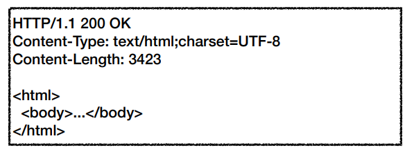

# Uri

## Uri?
Uniform Resource Identifier

Uniform : 자원(Resource)을 식별하는 방법

Resource : URI로 식별할 수 있는 **모든 것**

Identifier : 다른 항복과 구분하는데 필요한 정보 

URI = URL(Resource Locator) + URN(Resource Name)  

URN : 리소스가 있는 위치를 지정  
URN : 리소스에 이름을 부여해 찾는것인데, 사용하기 힘드니 거의 사용 안한다. (보편화가 안되어있다)

### URL 문법

|      | 전체                                                        | 프로토콜   | 호스트명            | 포트 번호   | 패스      | 쿼리 파라미터       |
|------|-----------------------------------------------------------|--------|-----------------|---------|---------|---------------|
| 문법   | scheme://[userinfo@]host[:port][/path][?query][#fragment] | scheme | [userinfo@]host | [:port] | [/path] | [?query]      |
| 실세사용 | https://www.google.com:443/search?q=hello&hl=ko           | https  | www.google.com  | 443     | /search | q=hello&hl=ko |

프로토콜 : 자원에 접근할 방식 http, https, ftp
* https 는 http에 보안이 적용된것

[userinfo@] : url에 사용자의 정보를 포함해서 인증해야할때, 거의 사용안함

host : 호스트명이다. 도메인명이나 IP 주소 직접 입력가능

Port : 일반적으로 생략, 특정서버에 접근시 사용

path : 리소스 경로, 계층적구조(/home/file1.jpg -> home 에서 file1.jpg 처럼 계층적으로 구성)

query : key=value 형태, ?로 시작하고 &로 추가한다.
웹서버에서 제공하는 파라미터형태, 문자형태여서 query parameter, query string 이라 부른다.

fragment : html 내부 북마크 등에 사용, 서버에 전송되는 정보가 아님.

## 웹브라우저 요청 흐름

1. DNS 조회 -> IP 주소와 포트정보를 얻음
2. HTTP 요청메시지 생성 (HTTP 요청 메시지 예시 : GET /search?q=hello&hl=ko HTTP/1.1 Host: www.google.com)
3. 요청 패킷(TCP/IP 패킷으로 감싼다) 만들어서 서버에 전송
4. 서버(수신측)은 (TCP/IP) 패킷을 제거하고 HTTP 메시지를 얻는다.
5. 서버에서 응답메시지를 생성하고 송신측(클라이언트)에게 보낸다.

HTTP 응답 메시지 예시  

6. 클라이언트에서 TCP/IP 패킷을 제거하고, HTTP 메시지를 웹브라우저 HTML 렌더링을 해서 화면에 보여준다.

출처  
https://www.inflearn.com/course/http-%EC%9B%B9-%EB%84%A4%ED%8A%B8%EC%9B%8C%ED%81%AC/dashboard

