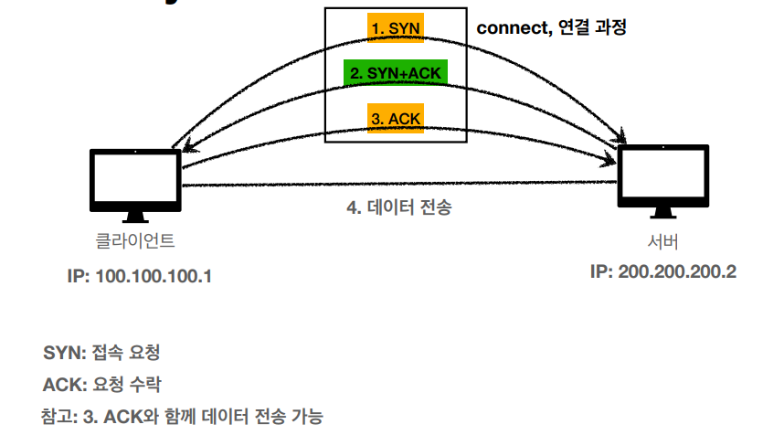

# 네트워크
HTTP 에 필요한 간단한 네트워크 지식을 정리, 딥하게 들어가지 않습니다!

## IP 프로토콜
패킷(Packet) 단위로 지정한 IP 주소에 데이터를 전달한다.

### 한계

비연결성 : 패킷 소실, 연결이 안되도 보내짐.
비신뢰성 : 패킷 순서 보장이 안됨, 큰 파일의 경우 쪼개서 보낼시
각각 다른 노드를 타고가서 순서대로 도착하지 않을 수 있음.
프로그램 구분이 안됨 : 같은 IP를 들어오는 패킷이 구분이 안되
이게 게임 패킷인지 유튜브 패킷인지 구분불가

## TCP/UDP

애플리케이션 - http, ftp  
전송계층 - tcp, udp  
인터넷계층 - ip  
네트워크 인터페이스 계층 - LAN 드라이버

데이터가 가공되는 가정

데이터를 보낼때 각 계층에서 가공해서 내려간다. (기존 데이터에 각 계층에 따라 정보가 추가된다는 뜻이다.)
가공방식은 프로토콜에 따라 다르며, 자세히 공부할려면
정말 방대학 지식이 요구된다..

데이터를 받을때는 반대로 한 계층씩 벗겨가며
원본 데이터를 얻는다.

### TCP/IP
전송 제어 프로토콜

(참고로 패킷 정보는 저것 말고도 더 많다, 중요한것만 표시한것)

연결지향 : TCP 3 way handshake 이용해 연결된 상태이어야 보낼 수 있다.
참고로 **가상 연결** 이다. (논리적으로 연결된상태, 물리적으로 랜선같은걸로 연결된게 아니다.)

데이터 전달 보증 : 데이터가 누락 되지 않게 보낸다. 데이터를 보내면 수신측에에서
데이터를 받았다는 메세지를 보내준다.

순서 보장 : 패킷 순서가 보장 된다. 패킷 순서가 잘못보내지면
수신측에서 재전송을 요청한다.

### UDP
IP 프로토콜과 거의 같다. PORT, 체크섬만 추가됬다.
PORT 추가로 같은 IP내 프로세스를 구분해, 
어떤 프로그램인지 구분이 가능해졌다. 체크섬은 간단한 데이터 검증이다.

TCP처럼 데이터 신뢰성은 없지만 검증과정이 없기에 매우 빠르다.

## PORT
같은 IP내 프로세스를 구분하는 정보

0 ~ 65535 할당가능
* 0 ~ 1023 : 잘 알려진 포트, 사용안하는걸 권장
* FTP - 20, 21
* TELNET - 23
* HTTP - 80
* HTTPS - 443

## DNS
도메인네임시스템 : IP 주소를 도메인명으로 변경한다.(ex : google.com)

IP 는 기억하기힘들고, 변경이 일어날 수 도 있으니 DNS 를 이용해 접근한다.

출처  
https://www.inflearn.com/course/http-%EC%9B%B9-%EB%84%A4%ED%8A%B8%EC%9B%8C%ED%81%AC/dashboard
