## 작성 계기

프로젝트를 하던 도중 일대다 관계에서 fetch join 을 쓰다가 원치않은 결과를 가져왔었다. 이는 fetch join 과
영속화에 대해 이해가 부족했기해 발생한 문제였다. 그래서 fetch join 과 join 의 차이, fetch join 을 사용할 떄 일관성에 관한 주의점,
left fetch join 일관성에 대해 적어보았다.

## fetch join VS join

JPQL 에는 `fetch join` 이라는게 있다. 그렇다면 `join` 과의 차이점은 무엇일까?
- `fetch join` 은 조회하는 주체와, join 하는 대상을 영속화 시킨다.
- `join` 은 조회하는 주체만 영속화시키고, join 하는 대상은 영속화 시키지 않는다.

다음과 같은 관계를가진 엔티티들로 설명을 하겠다.

```
User 엔티티 : UserQuestion 엔티티 = 1 : N
```

#### User
```java
@Entity
@Getter
@NoArgsConstructor(access = AccessLevel.PROTECTED)
public class User {

    @Id
    @GeneratedValue
    @Column(name = "user_id")
    private Long id;

    @NotNull
    private String name;
}
```

#### UserQuestion
```java
@Entity
@Getter
@NoArgsConstructor(access = AccessLevel.PROTECTED)
public class UserQuestion {

    @Id
    @GeneratedValue
    @Column(name = "user_question_id")
    private Long id;

    @ManyToOne(fetch = FetchType.LAZY)
    @JoinColumn(name = "user_id")
    private User user;
    
    private int score;
}
```

`fetch join` 을 사용하면 다음과 같은 쿼리가 날라간다.

```java
public class UserRepository {
    
    public User findByParentType(String id, ParentType parentType) {

        return result = em.createQuery("select u from User u" +
                        " join fetch u.userQuestions uq", User.class)
                .getSingleResult();
    }
}
```

```sql
    select
        user0_.user_id as user_id2_2_0_,
        userquesti1_.user_question_id as user_que1_4_1_,
        user0_.name as name3_2_0_,
        userquesti1_.score as score4_4_1_,
        userquesti1_.user_id as user_id7_4_1_,
        userquesti1_.user_id as user_id7_4_0__,
        userquesti1_.user_question_id as user_que1_4_0__ 
    from
        user user0_ 
    inner join
        user_question userquesti1_ 
            on user0_.user_id=userquesti1_.user_id
```

`join` 을 이용해서 User 를 조회하면 다음과 같은 쿼리가 나간다.

```java
public class UserRepository {
    
    public User findByParentType(String id, ParentType parentType) {

        return result = em.createQuery("select u from User u" +
                        " join u.userQuestions uq", User.class)
                .getSingleResult();
    }
}
```

```sql
    select
        user0_.user_id as user_id2_2_,
        user0_.name as name3_2_,
    from
        user user0_ 
    inner join
        user_question userquesti1_ 
            on user0_.user_id=userquesti1_.user_id
```


차이가 보이는가? 
`fetch join` 을 사용해서 User 엔티티를 조회하면 User 의 필드와 UserQuestion 의 필드 모두 select 해서 가져온다.
반면에 `join` 을 사용해서 User 엔티티를 조회하면 User 의 필드만 select 해서 가져온다.

그렇기에 `join` 은 조회의 주체 User 만 영속화 시킬 수 있고 join 하는 조회의 대상 UserQuestion 에 대해 값은 애초에 가져오질 않았으니 
UserQuestion 은 영속화 시키지 않는다. User 에 대한 정보만 가져왔기때문에 추후에 UserQuestion 에 대한 값을 가져올려고 할때
적절한 처리를 하지않으면, User 가 가진 UserQuestion 의 개수만큼 쿼리를 날려서 UserQuestion 을 가져오게된다. 바로 N+1 문제다.

이렇게만 보면 `join` 을 쓸일이 없는것 같다. 그런데 이런 경우가 있다. **컬렉션에 조건이 걸리지만 컬렉션에 대한 데이터는 필요없는 
경우**다.

```java
public class UserRepository {
    
    public User findByParentType(String id, ParentType parentType) {

        return result = em.createQuery("select distinct u from User u" +
                        " join u.userQuestions uq" +
                        " where uq.score >= 70", User.class)
                .getSingleResult();
    }
}
```

이런식으로 User 와 조인된 userQuestion 의 score 가 70점 이상인 경우인 데이터만 가져오는 쿼리다. 참고로
쿼리에 `distinct` 가 들어갔는데, 이는 Db의 join 특성상 특정 User 에 대해 UserQuestion 개수 만큼 조회가 되기때문에
User 가 뻥튀기되는것을 막기위해 있어야한다. 해당 내용에 대해 쓸려면 길어지니 여기까지만 적겠다.

어쨋든 단순히 `join` 으로 가져왔기에 User 엔티티만 가져오고, userQuestion 엔티티는 가져오지 않는다.
당연히 userQuestion 에 대해 조회를 하면 1+N 문제가 발생한다. 
그러니 여기서 `join` 은 **userQuestion 을 조회할 필요가 없을때만 사용**해야 한다.

근데 그럴거면 `fetch join` 사용해도 상관없지 않냐는 의문이 들 수 있다. 
어차피 `join` 으로 가져온거, userQuestion 조회하면 1+N 문제 터질거, 처음부터 `fetch join` 으로 가져오면 될거 아닌가?

```java
public class UserRepository {
    
    public User findByParentType(String id, ParentType parentType) {

        return result = em.createQuery("select distinct u from User u" +
                        " join fetch u.userQuestions uq" +
                        " where uq.score >= 70", User.class)
                .getSingleResult();
    }
}
```

이런식으로 말이다. 이렇게 조회하면 한번에 User 엔티티와 UserQuestion 엔티티를 가져올거라고 짐작할 수 있다.
하지만 이렇게 가져오면 큰 문제가 발생하는데 바로 `fetch join` 의 일관성 문제다!

## fetch join 의 일관성

`fetch join` 을 하면 주체가 되는 엔티티(User) 와 join 의 대상이 되는 엔티티(UserQuestion) 에 대한 모든 필드를
select 해서 가져오는 이유가 무엇이라고 생각하는가? 바로 DB 와 엔티티사이에 일관성을 지키기 위해서다.



DB 에 User 1번에 대해 3개의 UserQuestion 데이터가 있다고 해보자. 

```java
public class UserRepository {
    
    public User findByParentType(String id, ParentType parentType) {

        return result = em.createQuery("select distinct u from User u" +
                        " join fetch u.userQuestions uq" +
                        " where uq.score >= 70", User.class)
                .getSingleResult();
    }
}
```

해당 jpql 을 날리게 되면 user_id =1 인 User 와, UserQuestion 의 70점 
이상인 user_question_id = 1, user_question_id = 2 만 가져온다.

여기서 문제는 user_id = 1 에 대해 영속화하는데, 해당 User 엔티티의 UserQuestion 은
user_question_id = 1, user_question_id = 2 만 영속화가 된다. 이렇게 되면 user_id = 1 의 User 엔티티에 대해
userQuestion 에 대해서 영속상태와 DB 에서의 일관성이 깨져버린다. 이게 어떤 말이냐면 다음과 같은 쿼리를 실행해보면 알 수 있다.

```java
public class UserRepository {

    public User findByParentType(String id, ParentType parentType) {

        User user1 = em.createQuery("select distinct u from User u" +
                        " join fetch u.userQuestions uq" +
                        " where uq.score >= 70", User.class)
                .getSingleResult();

        User user2 = em.createQuery("select distinct u from User u" +
                        " join fetch u.userQuestions uq", User.class)
                .getSingleResult();
        
        return user2;
    }
}
```

이전의 쿼리를 보내는 코드에서 조건없이 User 엔티티를 요청하는 쿼리를 날렸다. 그러면 user2 에는
user_id = 1 인 User 엔티티와, user_question_id = 1, user_question_id = 2, user_question_id = 3 인 UserQuestion 엔티티를
가져오는것고 user2 에 저장할것을 예상할것이다. 
하지만 실제로는 user_id = 1 인 User 엔티티와, user_question_id = 1, user_question_id = 2 인 UserQuestion 엔티티가 user2 에
저장되어 있다. 사실 당연한 이야기다. 이전에 user1에서 user_id = 1 인 User 엔티티가 영속되어있다. 그래서 다음에 user_id = 1 인
User 에 대해 DB 에서 조회를 해도 영속화된 엔티티가 우선으로 저장되기 때문에 DB 에서 가져온값은 버리게 된다.

이렇게 `fetch join` 의 일관성이 깨지면 추후에 의도하지 못했던 결과를 초래할 수 있다. 그래서 `fetch join` 을 사용할때는
컬렉션에 조건을 걸어서 가져오지 않는것을 권장한다. 일관성이 깨진체로 가져와서 수정과 삭제, 삽입을 한다면 그로인해 일어날
문제는 어마무시하다..

애초에 왜 hibernate 에서 막지않냐는 말도 있었다. 하지만 오직 **조회** 만 하는 경우에는 큰 문제가 되지 않는다.(물론 위와같이
잘 모르고 사용해 의도와 벗어난 결과를 받을 순 있다) 실무에서도 일관성을 해치지 않는 **조회** 만 하는경우에는
성능최적화를 위해 사용하기도 한다.

## left fetch join

보통 join 의 되는 대상이 없어도 주체가 있으면 가져오기 위해 left outer join 을 사용하는 경우가 많다.
그리고 fetch join 도 `left join fetch` 를 사용해 left outer join 효과를 누릴 수 있다.
하지만 `left join fetch` 도 일관성을 해칠 수 있는데 다음과 같은 경우다.



```java
public class UserRepository {
    
    public User findByParentType(String id, ParentType parentType) {

        return result = em.createQuery("select uq from UserQuestion uq" +
                        " left join fetch uq.user u", User.class)
                .getSingleResult();
    }
}
```

아까는 User 를 주체로 join 을 걸었지만 이번에는 UserQuestion 을 주체로 join 대상으로 User 를 걸었다.
여기서 `left join fetch` 를 사용함으로써 user_question_id = 4 인 UserQuestion 는 User 에 대해 null 값을 가진채로 가져온다.
user_question_id = 4 인 UserQuestion 은 DB 에서 user_id = 2 를 외래키로 가지고 있는데 영속 상태는 null 이 되니
일관성이 맞지않게 된다. 이러헤 `left join fetch` 를 사용할때도 일관성을 해칠 수 있으니 주의하자.

## 결론

Entity 를 DB 에서 조회할때는 항상 일관성을 생각하고 쿼리를 짜야된다는것을 알았다. 물론
단순 조회하는 경우에는 큰 문제가 발생하지 않겠지만(물론 의도와는 다른 답이 나올 순 있다), 수정/삭제/삽입이 있다면
복구하기 힘든 큰 문제가 발생할 수 있다. 그러니 fetch join 을 사용할때 꼭 일관성을 지키자.
이번 fetch join 을 공부하면서 ORM 에 대해 한발짝 더 깊은 이해를 할 수 있어서 좋은 시간이었다.

## Reference

[https://www.inflearn.com/questions/59632/fetch-join-%EA%B4%80%EB%A0%A8-%EC%A7%88%EB%AC%B8-%EB%93%9C%EB%A6%BD%EB%8B%88%EB%8B%A4](https://www.inflearn.com/questions/59632/fetch-join-%EA%B4%80%EB%A0%A8-%EC%A7%88%EB%AC%B8-%EB%93%9C%EB%A6%BD%EB%8B%88%EB%8B%A4)  
[https://www.inflearn.com/questions/15876/fetch-join-%EC%8B%9C-%EB%B3%84%EC%B9%AD%EA%B4%80%EB%A0%A8-%EC%A7%88%EB%AC%B8%EC%9E%85%EB%8B%88%EB%8B%A4](https://www.inflearn.com/questions/15876/fetch-join-%EC%8B%9C-%EB%B3%84%EC%B9%AD%EA%B4%80%EB%A0%A8-%EC%A7%88%EB%AC%B8%EC%9E%85%EB%8B%88%EB%8B%A4)  
[https://stir.tistory.com/288](https://stir.tistory.com/288)  
[https://velog.io/@heoseungyeon/Fetch-Join-vs-%EC%9D%BC%EB%B0%98-Joinfeat.DTO](https://velog.io/@heoseungyeon/Fetch-Join-vs-%EC%9D%BC%EB%B0%98-Joinfeat.DTO)  

