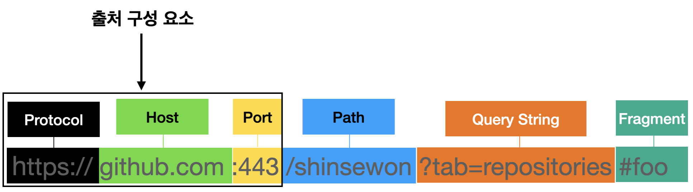
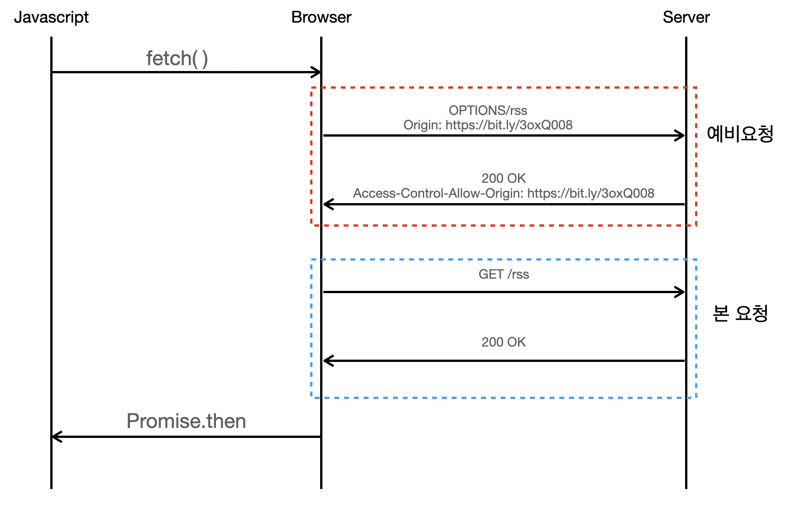
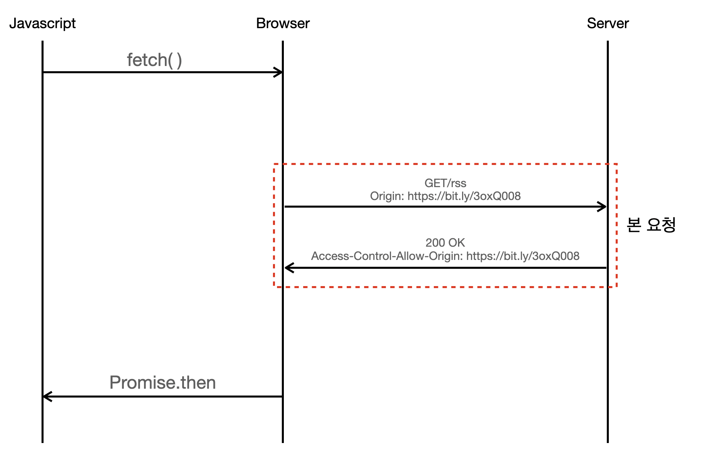

## 작성 계기

스프링으로 처음으로 백엔드 프로젝트를 하다가 프론트한테 CORS 에러가 발생해서 api 통신이 안된다고 연락이 왔다.
내가 혼자서 서버에 스웨거로 api 를 테스트했을때는 문제없었기에 프론트문제인줄 알았다. 하지만 문제를 찾아보니
백엔드에서 처리해줘야 하는 문제였고, 프론트와 벡엔드가 api 를 이용해 통신한다면 무조건 직면할 수 밖에 없는 문제였다.
그래서 이에대해 작성하고 다음 프로젝트를 할때도 이를 보고 참고할려고 한다.

## CORS 발생 이유

```
Access to fetch at ‘https://my-parents.day’ from origin ‘http://localhost:3000’ has been blocked by CORS policy:
No ‘Access-Control-Allow-Origin’ header is present on the requested resource. 
If an opaque response serves your needs, set the request’s mode to ‘no-cors’ 
to fetch the resource with CORS disabled.
```

CORS(Cross-Origin Resource Sharing) 는 한국어로 교차 출처 리소스 공유로, 출처가 다른 두 곳에서 데이터를 주고 받을려고
하다보면 일어난다. 왜 이런 귀찮은 정책이 있냐고 하면... 당연히 보안때문이다. 모든 출처가 허용된다면 해커의 공격에 취약하기 때문에
보안상 필요한 정책이라고 한다.

### Origin(출처)



URL 은 위 그림과 같이 표현이 가능하다. Origin 은 그 중에서 Protocol(Scheme), Host name, Port 를 말한다. Port 의 경우 따로 표시하지않는다면
http 는 80, https 는 443 으로 기본값으로 들어가 개발자가 아니라면 포트번호를 보는일은 별로 없었을거다. 어쨋든,
Scheme, Host name, Port 이 3개중 **한 개 이상이 다르다면** CORS 에러를 발생시킨다. 

만약 여기블로그 기준 `https://jinhoon227.github.io` 으로 예제를 들어보겠다. 이 URL 에서
Scheme 은 `https`, domain 은 `jinoon227.github.io`, port 는 https 이기때문에 `443` 이다.
```
http://jinhoon227.github.io     // ❌ scheme 이 http 와 https 로 다름
https://hoon.jinhoon227.github.io     // ❌ host 가 hoon.jinhoon227.github.io 와 jinhoon227.github.io 로 다름
https://kauth.com     // ❌ host 가 kauth.com 와 jinhoon227.github.io 로 다름
https://jinhoon227.github.io:443     // ⭕️ https 는 포트가 기본으로 443으로 포트 번호가 같음
https://jinhoon227.github.io:8080     // ? 포트번호는 다르나 포트의 경우 브라우저 정책마다 판단 기준이 다름
```

마지막 예시를 보면 포트번호가 다르지만 될 수 도있고 안될 수 도있다. 브라우저마다 Origin 에 Port 번호를 포함하는지는
정책이 다르기 때문이다. 예를들어 인터넷익스플로어는 정책에 포함하지만 구글크롬은 포함하지 않는다.

## CORS 발생 상황


프론트와 백엔드에서 CORS 가 발생한다면 다음과 같이 이루어진다. 프론트에서 리소스를 요청하면, 서버에서 요청한 리소스를 반환해준다.
그리고나서 브라우저는 반환된 리소스가 CORS 정책을 잘지켰는지 확인하고 잘지키지 않았다면 버려버린다. 그래서 서버에서는
정상적으로 반환을 했지만 프론트단에서는 값의 확인이 불가능한 것이다.

## CORS 확인 방법

```
Origin : https://jinhoon227.github.io
```

웹에서 다른 Origin 에게 리소스를 요청할때, 브라우저는 `Origin` 헤더에 출처를 담아서 보낸다. 
그리고 서버에서는 응답할때 `Access-Control-Allow-Origin` 헤더에 리소스를 접근하는 것이 허용된 출처라는걸 표시해서 보낸다.
마지막으로 브라우저가 보냈던 `Origin` 헤더값과 응답에 있는 `Access-Control-Allow-Origin` 헤더의 값을 비교해서
CORS 정책에 위배하는 응답인지 아닌지 확인한다.

## CORS 동작 방식

아까 CORS 가 발생하는 상황을 그림으로 간략하게 보여줬지만, 실제로는 3가지 방법이 존재한다. Preflight Request, Simple Request,
Credentialed Request 로 3가지 시나리오가 존재하는데, 시나리오마다 CORS 확인 방식이 달라진다. 해당 요청에 대해 간략하게만
소개를 하겠다.

### Preflight Request



본 요청 전에 예비 요청으로 CORS 를 확인하는 시나리오다. 본 요청전에 예비요청으로 안전한 요청인지 확인하는 것이다. 보통 **개발을 하다보면 
Preflight Request 를 주로 사용**하게된다.

리소스 요청시 예비요청을 하게되는데, 이때 `OPTION` 메소드로, 헤더에
Origin 을 담아서 보낸다. 그러면 서버는 `Access-Control-Allow-Origin` 헤더를 담아 응답을 해준다. 그리고 브라우저는
요청헤더의 `Origin` 과 응답헤더의 `Access-Control-Allow-Origin` 을 비교해 CORS 를 확인한다. 

### Simple Request



본 요청에서 CORS 를 확인하는 시나리오다. 본 요청에서 이전에 말했던 CORS 확인 과정을 거친다.
Simple Request 는 사용메소드나 헤더, Content-Type 에 제약사항이 있어 잘 쓰이지 않는다.

### Credentialed Request


credentialed 인증정보를 추가한 시나리오다. 리소스를 요청할때 `credentials: include` 옵션을 사용할시 발생한다. 해당 옵션
사용시 요청에는 쿠키정보를 담아서 보낸다. 그리고 응답헤더에 `Access-Control-Allow-Origin : *` 이 사용이 불가능하다.
`Access-Control-Allow-Origin : *` 는 모든 Origin 에게 허용하겠다는 뜻인데 이를 사용이 불가능하고 명시적인 URL 
(예를 들면 https://jinhoon227.github.io 같이 명시적으로 기입해야한다.) 를 적어줘야한다. 
그리고 응답헤더에 `Access-Control-Allow-Credentials:true` 도 추가되어야 하는 제약사항들이 있다.

## 해결 방법 - Frontend

해결 방법을 정리하자면, 서버측에서 응답헤더에 `Access-Control-Allow-Origin` 를 넣어주면 되는 이야기다.
그래서 보통 백엔드에서 해결한다. 하지만 프론트에서 해결방법이 없지는 않다. 만약 본인이 프론트이고 서버가 외부업체라
그저 빌릴뿐이고 협업이 안된다면 어쩔 수 없이 프론트에서 해결해야할 것이다. 그럴 경우 프록시 서버를 사용해 우회하거나,
직접 프록시 서버를 구축하면 된다. 프론트와 외부업체 사이에 프록시 서버를 두고, 서버가 프록시 서버로 응답을 해주면 
프록시 서버는 응답에다가 `Access-Control-Allow-Origin` 헤더를 추가해서 프론트로 반환하면 된다. 
이런 프록시서버를 통해 우회하는 방법을 간편하기위해 **Webpack dev server** 이용해서 해결한다고한다.

## 해결 방법 - Backend Spring

Spring 에서 해결방법은 롬복, 전역클래스 그리고 Spring Security 를 사용해서 해결하는 방법이 있다.

### @CrossOrigin

```java
@CrossOrigin(originPatterns = "http://localhost:3000")
@RestController
public class UserApi {

    @CrossOrigin(originPatterns = "*")
    @GetMapping("/api/v1/user/name")
    public Result<String> findUserName() {
        String currentUserId = SecurityUtil.getCurrentUserId();
        String userName = userService.findUserName(currentUserId);
        return new Result<>(Result.CODE_SUCCESS, Result.MESSAGE_OK, userName);
    }
}
```

간단하게 롬복을 **클래스**에 붙이거나, **메소드에** 붙여서 응답헤더에 `Access-Control-Allow-Origin` 를 넣어줄 수 있다.
하지만 클래스가 많아지만 관리하기 힘들어져서 글로벌로 관리하는 방법도 있다.

### Global class

```java
@Configuration
public class WebConfig implements WebMvcConfigurer {

    private static final String CORS_URL_PATTERN = "/**";
    private static final String CORS_URL = "*";
    private static final String CORS_METHOD = "*";

    @Override
    public void addCorsMappings(CorsRegistry registry) {
        registry.addMapping(CORS_URL_PATTERN)
                .allowedOrigins(CORS_URL)
                .allowedMethods(CORS_METHOD);
    }
}
```

다음은 전역클래스로 CORS 설정을 해준다. 이를 설정하면 모든 응답헤더에 `Access-Control-Allow-Origin` 를 넣어줄 수 있다.

`.addMapping` 은 URL패턴을 의미한다(예를 들면 https://jinhoon227.github.io/posts 에서 URL패턴은 posts 를 말한다) 보통
모든 URL 패턴을 허용하기위해 `/**` 를 사용한다.

`.allowedOrigins` 은 허용해줄 Origin 을 적는곳이다. 모두 허용할려면 `*` 을 기입하면 된다. 하지만 보안상 허용해줄 
Origin 만 적는게 좋다. 예를 들면 `.allowedOrigins(https://jinhoon227.github.io, https://localhost:8080)` 이렇게
적어줄 수 있다.

`.allowedMethods` 은 허용해줄 메소드를 말한다. 예를 들면 `GET, POST, PATCH` 등을 적어줄 수 있다.

이외에도 여러가지 설정함수가 있으며 필요할 때 찾아서 사용하면 된다.

### Spring Security

```java
@Configuration
@EnableWebSecurity
public class SecurityConfig extends WebSecurityConfigurerAdapter {
    
    @Override
    protected void configure(HttpSecurity http) throws Exception {
        http
            // ...
            .cors(); // CORS Configuration
    }

    @Bean
    public CorsConfigurationSource corsConfigurationSource() {
        CorsConfiguration configuration = new CorsConfiguration();

        configuration.addAllOriginPatterns("*"); 
        configuration.addAllowedHeader("*");
        configuration.addAllowedMethod("*");
        configuration.setAllowCredentials(true);

        UrlBasedCorsConfigurationSource source = new UrlBasedCorsConfigurationSource();
        source.registerCorsConfiguration("/**", configuration);
        return source;
    }
}
```

만약 인증문제로 SpringSecurity 를 사용해야 한다면 SpringSecurity 에서도 cors 설정을 해주어야 한다.
SpringSecurity 를 사용하면 Spring MVC 에 도달하기 전에 SpringSecurity 에서 작업을 먼저 수행하기때문에,
이전에 나온 2가지방법으로 CORS 설정이 적용되지 않는다. SpringSecurity 에서 Spring MVC 의 CORS 설정을 막아버리기 때문이다.

그렇기에 SpringSecurity 를 사용한다면 `configure` 메소드에 `.cors()` 를 추가해주어야 한다. 그리고 `corsConfigurationSource()`
를 통해 설정을 해준다. 만약 전역클래스를 사용하는 2번째 방법 WebMvcConfigurer 를 사용한 구현체가 존재한다면
`corsConfigurationSource()` 를 추가로 정의하지 않아도 자동으로 2번째 방법때 설정한것으로 등록이 된다. 
중요한것은 SpringSecurity 를 사용한다면 `configure` 메소드에 `.cors()` 를 추가해주어야 한다는것이다.

참고로 주의할점은 `setAllowCredentials(true)` 일시 Origin 은 `*` 을 사용할 수 없다고했다.
그래서 `addAllOrigin("*")` 은 사용할 수 없으며 그 대신 `addAllOriginPatterns("*")` 사용을 할 수 있다.

## Reference

[https://velog.io/@shin6403/CORS%EB%9E%80-%EB%AC%B4%EC%97%87%EC%9D%BC%EA%B9%8C](https://velog.io/@shin6403/CORS%EB%9E%80-%EB%AC%B4%EC%97%87%EC%9D%BC%EA%B9%8C)  
[https://gowoonsori.com/error/springsecurity-cors/](https://gowoonsori.com/error/springsecurity-cors/)  
[https://emgc.tistory.com/131](https://emgc.tistory.com/131)  
[https://evan-moon.github.io/2020/05/21/about-cors/](https://evan-moon.github.io/2020/05/21/about-cors/)  
[https://runa-nam.tistory.com/70](https://runa-nam.tistory.com/70)  
[https://steady-coding.tistory.com/616](https://steady-coding.tistory.com/616)  
[https://dev-pengun.tistory.com/entry/Spring-Boot-CORS-설정하기](https://dev-pengun.tistory.com/entry/Spring-Boot-CORS-%EC%84%A4%EC%A0%95%ED%95%98%EA%B8%B0)  