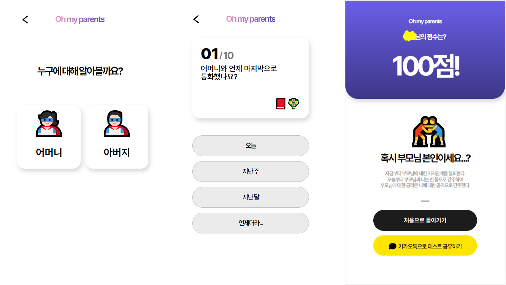

## 프로젝트 소개

```
Oh-My-Parents 줄여서 OMT 프로젝트!
```

프로젝트 링크 : [https://my-parents.day/](https://my-parents.day/) 

4월 27일 부터 5월 8일 까지 해커톤 느낌으로 단기 프로젝트를 진행했다. 5월 8일 어버이날 기념으로 부모님께
안부를 물어볼 수 있도록 도와주는 프로젝트다. 구체적으로는 부모님에 관한 질문이 주어지고 사용자는 답변을 한다.
사용자는 답변을 완료하면 링크를 부모님에게 보내준다. 그러면 부모님이 채점을하고 자식은 점수를 확인할 수 있다.
평소에 부모님에 대해 얼마나 알고있는지 확인할 수 있으며 어버이날에 부모님과의 대화의 물꼬를 터주는
역할을 하자는 취지에서 만들게 되었다.



## 역할

OMP 프로젝트는 Frontend 2명, Backend 2명, 디자이너 1명으로 총 5명이서 만든 프로젝트다.
나는 Backend 를 담당했다. 다른 Backend 팀원은 로그인 관련(JWT토큰, Kakao 로그인) 을 담당했고
나는 로그인을 제외한 전반적인 로직들을 개발했다. 해당 프로젝트를 진행하면서 여러가지 문제를 직면했었다.

### 스프링 CORS 설정

스프링에서의 CORS 설정 : [https://jinhoon227.github.io/posts/%EC%8A%A4%ED%94%84%EB%A7%81CORS/](https://jinhoon227.github.io/posts/%EC%8A%A4%ED%94%84%EB%A7%81CORS/)

프론트와 백엔드가 api 로 통신을하다보면 무조건 만나게 되는 CORS 문제다. 사실 CORS 의 해결은 간단히 코드 몇줄을
추가하면 해결되지만 실제로 공부해보니 CORS 발생 이유, CORS 발생 과정 등 깊이있게 알 수 있었다. 그리고
SpringSecurity 를 사용할 경우 추가로 CORS 설정을 해주어야 한다.

### 스프링 예외처리 전략

스프링에서의 예외처리 전략 : [https://jinhoon227.github.io/posts/%EC%8A%A4%ED%94%84%EB%A7%81%EC%98%88%EC%99%B8%EC%B2%98%EB%A6%AC/](https://jinhoon227.github.io/posts/%EC%8A%A4%ED%94%84%EB%A7%81%EC%98%88%EC%99%B8%EC%B2%98%EB%A6%AC/)

평소에 `try ~ catch` 로 예외처리를 했었는데 스프링에서는 `@ExceptionHandler` 를 이용해서 예외처리하는게 있었다.
어노테이션을 이용한 예외처리가 가독성도 좋고, 성능상에도 `BasicErrorController` 를 거치지 않기에 더 좋았다.
그리고 예외는 크게 2가지로 디스페처 서블리 예외와 필터 예외가 있는것을 배웠다.

### 스프링 fetch join 의 일관성

스프링 fetch join 일관성 : [https://jinhoon227.github.io/posts/%EC%8A%A4%ED%94%84%EB%A7%81fetchjoin/](https://jinhoon227.github.io/posts/%EC%8A%A4%ED%94%84%EB%A7%81fetchjoin/)

1+N 문제를 해결하기위해 fetch join 을 사용했었는데, fetch join 을 사용할때 DB 와 영속되는엔티티의 일관성을
지키는게 중요하다는것을 배웠다. 일관성을 지키지 않으면 나중에 큰 문제가 발생할 수 있으니 항상 조심하자.

## 아쉬웠던점

```java
    private void createUserQuestionWithChildAnswer(ParentType parentType, List<UserChildAnswer> userChildAnswers, User user, List<Question> questions, List<UserQuestion> userQuestions) {
        // UserQuestion 생성
        for (UserChildAnswer userChildAnswer : userChildAnswers) {
            Question question = QuestionMatchedNumber(questions, userChildAnswer);

            userQuestions.add(UserQuestion.createUserQuestion(userChildAnswer.getAnswer(), parentType, question, user));
        }
    }
```

```j
User - UserQuestion - Question
 1   -  N       N   -    1
```

1:N 관계에서 N 쪽인 UserQuestion 에 대해 insert 및 update 할일이 있었다. 반복문으로 N쪽 엔티티인
UserQuestion 하나 하나 insert 또는 update 를 해주었다. 그런데 이렇게하면 한번 한번 할때마다
insert 또는 update 쿼리가 날라갔다. 당시 배포하기 바빴기에 이를 수정하지 않았다.
왜냐하면 userQuestion 개수가 최대 10개로 고정적이어서 성능상 크게 문제가 되지않는다고 판단해 우선순위를 미뤘다.

하지만 나중에 서비스가 커져 userQuestion 의 개수가 100개, 1000개 그 이상 늘어난다면 리팩토링이 필요하다고
판단된다. 그래서 insert 와 update 를 모아서 한번에 처리하는것을 찾아볼려고 한다.

## 좋았던점

### 예외처리 전략 수립

첫번째로는 스프링에서 예외처리 전략을 수립할 수 있었던 점이다. 비즈니스 로직에 예외처리 코드가 `try ~ catch` 들어가면
가독성이 떨어졌다. 그래서 `@ContrllerAdvice` 와 `@ExceptionHandler` 를 이용해 글로벌로 예외처리를 할 수 있었다.
그리고 특정 엔티티를 위한 예외를 `enum` 으로 만들어 편하게 관리할 수 있었다.

```java
@Getter
public enum UserExceptionGroup {

    USER_NULL("400", "U001", "유저가 없습니다."),
    USER_SCORE_NULL("400", "U002", "아직 채점이 완료되지 않은 상태입니다."),
    USER_QUESTION_INVALID_SAVE("400", "U003", "저장된 질문의 순서와 전달받은 질문의 순서가 올바르지 않습니다."),
    USER_QUESTION_NULL("400", "U004", "저장된 질문에 대한 답변이 없습니다.");
    
    private final String status;
    private final String userErrorCode;
    private final String desc;

    UserExceptionGroup(String status, String userErrorCode, String desc) {
        this.status = status;
        this.userErrorCode = userErrorCode;
        this.desc = desc;
    }
}
```

`enum` 으로 예외를 한곳에 모아 관리하니 엄청 편했다. 필요한 예외가 있다면 여기서 추가만 하면된다.

### enum 활용기

아까 예외들을 `enum` 으로 모아 관리를 했었는데, 사실 그 전에 `enum` 을 사용할때 영감을 받은것이다.
OMP 프로젝트는 질문이 고정되어 있고 백엔드에서 질문을 저장한다.

```java
@Getter
public enum QuestionGroup {

    PARENT_CALL_WHEN("%s와 언제 마지막으로 통화했나요?", 1L, QuestionType.SELECT, ChoiceGroup.TODAY, ChoiceGroup.LAST_WEEK, ChoiceGroup.LAST_MONTH, ChoiceGroup.WHEN_WHEN),
    PARENT_AGE("%s의 올해 연세를 알고 있나요?", 2L, QuestionType.DROPDOWN, ChoiceGroup.NOTHING),
    PARENT_FAVORITE_FOOD("%s가 가장 좋아하는 음식이 무엇인가요?", 3L, QuestionType.WORD, ChoiceGroup.NOTHING),
    PARENT_FAVORITE_SONG("%s가 최근에 빠져있는 음악은 무엇인가요?", 4L, QuestionType.WORD, ChoiceGroup.NOTHING),
    PARENT_FAVORITE_MY_MEMORY("%s가 가장 기억에 남으셨을만한 나와의 기억이 무엇일까요?", 5L, QuestionType.SENTENCE, ChoiceGroup.NOTHING),
    PARENT_HOBBY("%s가 최근에 빠져있는 취미가 무엇인가요?", 6L, QuestionType.WORD, ChoiceGroup.NOTHING),
    PARENT_DREAM("%s의 현재 가장 이루고픈 소원은 무엇일까요?", 7L, QuestionType.SENTENCE, ChoiceGroup.NOTHING),
    PARENT_CELEBRITY("%s와 닮은 연예인은 누구인가요?", 8L, QuestionType.WORD, ChoiceGroup.NOTHING),
    PARENT_WEDDING_ANNIVERSARY("올해는 부모님의 몇 번째 결혼기념일인가요?", 9L, QuestionType.DROPDOWN, ChoiceGroup.NOTHING),
    PARENT_THINK_ME("%s가 생각하는 현재 나의 모습은 어떨까요?", 10L, QuestionType.SENTENCE, ChoiceGroup.NOTHING);

    private final String message;
    private final Long order;
    private final QuestionType questionType;
    private final List<ChoiceGroup> choiceGroups;

    QuestionGroup(String message, Long order, QuestionType questionType, ChoiceGroup... choiceGroups) {
        this.message = message;
        this.order = order;
        this.questionType = questionType;
        this.choiceGroups = List.of(choiceGroups);
    }
}

@Getter
public enum ChoiceGroup {
    TODAY(1,"오늘"),
    LAST_WEEK(2, "지난 주"),
    LAST_MONTH(3, "지난 달"),
    WHEN_WHEN(4, "언제더라..."),
    NOTHING(1000, "이 값은 볼수없다!");

    private final int number;
    private final String answer;

    ChoiceGroup(int number, String answer) {
        this.number = number;
        this.answer = answer;
    }
}
```

QuestionGroup 에서 기본 질문을 저장하는것 까지는 좋았다. 그런데 일부 질문에는
객관식으로 객관식에 대한 보기도 같이 저장해야되는데 enum 에서 어떻게 추가해야할지 고민이었다.
계속 찾아보다가 `ChoiceGroup... choiceGroups` 으로 가변적으로 ChoiceGroup 개수를 받게해서, 
원하는 객관식보기를 원하는만큼 추가할 수 있게 만들었다.


## 회고

5월 8일까지 만들어야된다는 데드라인이 있었기에 바쁘게 개발을 했다. 그래서 성능을 중점으로 두지않고
완성을 목표로 하게되었다. 그래서 이렇게 회고를 하며 내가 무엇을 놓쳤고, 무엇을 배웠는지
확인하는 시간이 필요하다고 느꼈다. 이번 프로젝트에서 배웠던점을 다음 프로젝트에서 적용시켜 성장하는
개발자가 되고자 한다!