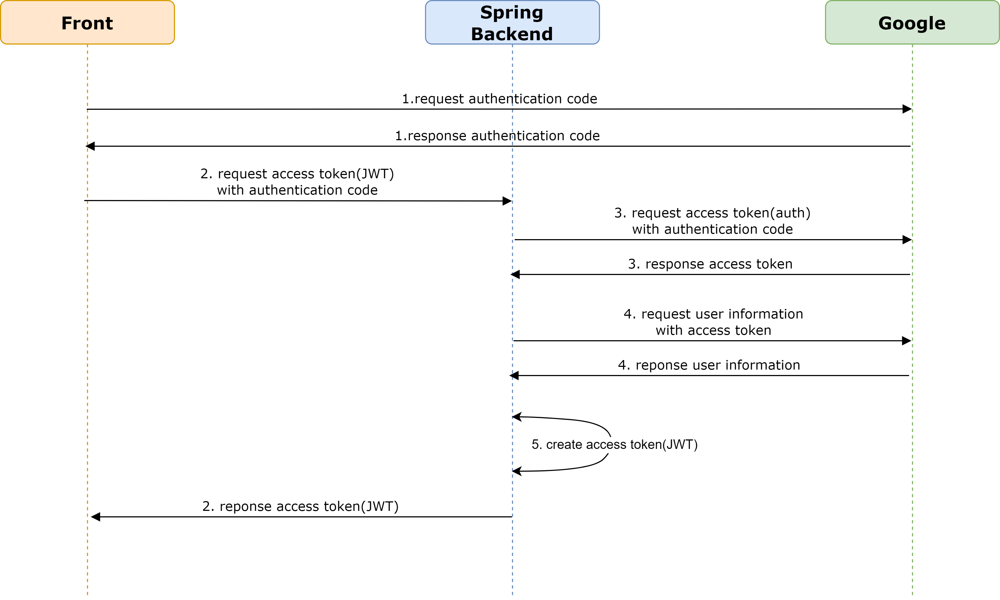
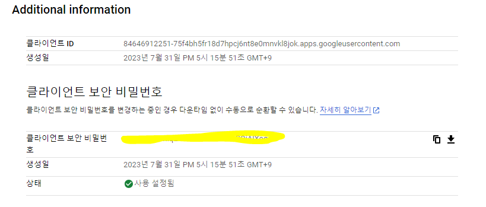
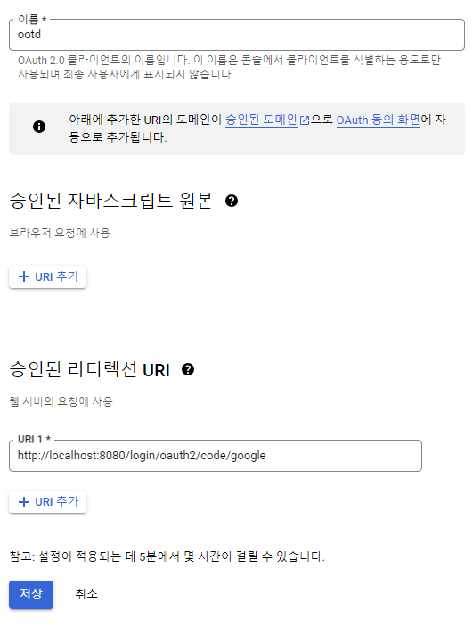
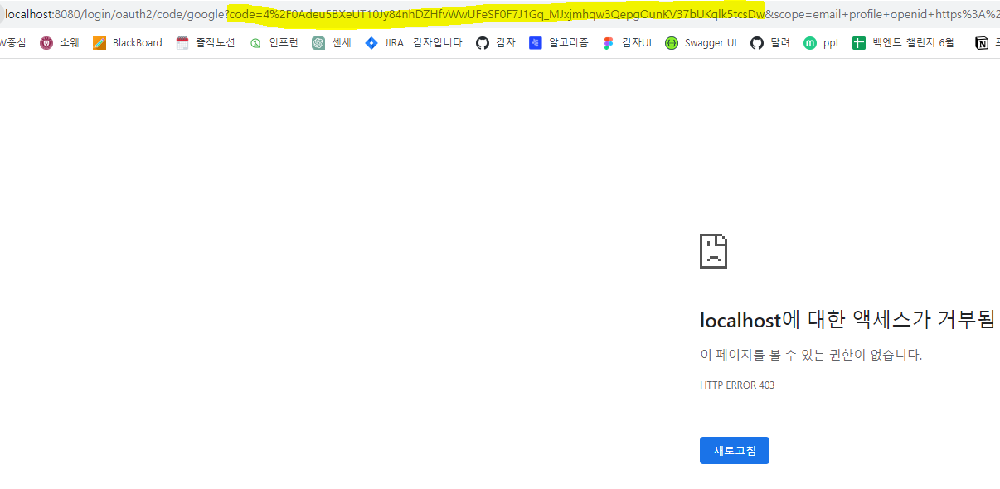
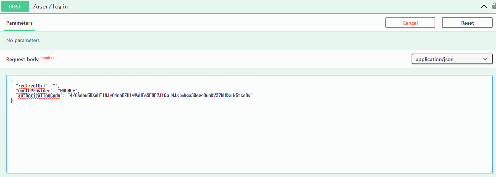
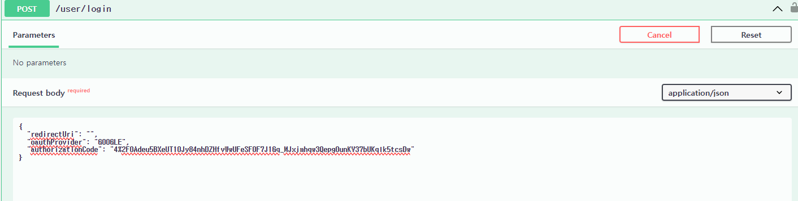
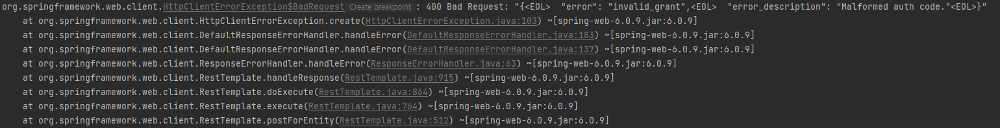

## 작성계기

프로젝트 개발중에 소셜로그인(OAuth) 이용해 로그인서비스를 진행해야 했다. 그 중에
구글을 이용해 개발하는것을 담당했는데 Spring Security 이용한 개발방법과,
Api 를 이용해 개발하는방법이 있어 헷갈렸었다.
그래서 정리삼아 이글을 작성해본다. (프론트가 따로 있기에 Api 를 이용해서 개발한다!)

## 요구사항

개발 요구사항은 다음과 같다.

1. 구글로그인(OAuth) + JWT 를 이용해 로그인 서비스를 한다.
2. 프론트에서 Authentication Code 를 백엔드에 주면 백엔드는 유저정보를 가져온다.
3. 백엔드에서 최종적으로 JWT 토큰을 발급해서 프론트에게 알려준다.

## 동작 과정



### request authentication code

우리 프로젝트에서는 프론트가 구글에 authentication code 를 요청한다. 

```html
https://accounts.google.com/o/oauth2/v2/auth?response_type=code
&redirect_uri="redirect_uri"
&client_id="client_id"
&scope="scpoe"
```

프론트에서는 위와같은 uri 로 구글에 요청을 하게된다, **redirect uri** 는 구글에서 authentication code 를 반환할 uri 이다.
**client_id** 는 구글 oauth 를 사용하기위해 [Google API 및 서비스](https://console.cloud.google.com/apis/dashboard?project=ootdv1)
에서 등록된 id 를 적는다. client_id 를 발급하는 과정은 생략하도록 하겠다.(구글에 검색하면 여러 블로그가 나옵니다!)



등록을 하고 나면 클라이언트 ID, 클라이언트 비밀번호를 주는데 클라이언트 ID 를 적어주면된다. 



그리고 승인된 리다이렉션 URI 에 아까 말한 redirect uri 를 적어줘야 된다. 사진에서는 백엔드서버 리다이렉션 URI 만 적혀있는데, 
현재 1번 과정에서는 프론트에 리다이렉션 해줄거니까 프론트 리다이렉션 URI 를 적어줘야 한다.

**scope** 는 사용자의 어떤 정보를 요청할지 적는것이다. 예를 들어 사용자의 이메일, 이름을 알고싶다면
`&scope=openid https://www.googleapis.com/auth/userinfo.email https://www.googleapis.com/auth/userinfo.profile` 를
추가 적으면된다. 원하는 정보에따라 적어야할 uri 가 다른데 이는 [여기서](https://developers.google.com/identity/protocols/oauth2/scopes?hl=ko) 확인하면 된다.

이렇게 **redirect_uri, client_id, scope** 를 다 적어서 보내면 구글에서 **authentication code** 를 발급해준다. 참고로 이 코드는
일회용이다!

### request access token

백엔드에서는 authentication code 를 프론트에서 넘겨받는다. 백엔드에서는 구글에 authentication code 를 주고 access token 을 받는다.
```html
https://oauth2.googleapis.com/token?grant_type=authorization_code
&code="authentication code"
&client_id="client id"
&client_secret="client_secret"
&redirect_uri="redirect_uri"
```

**code** 는 프론트에서 넘겨받은 authentication code 를 넣어준다. **client_id, client_secret** 는 1에서 등록해서 받았던
클라이언트 ID, 클라이언트 비밀번호를 넣어준다. **redirect_uri** 에는 구글에서 access token 을 반환할 uri 이다.
아까는 프론트에 반환해주었지만 여기에서는 백엔드에서 받을것이므로 다른 uri 이다. 스프링이면 보통
`http://localhost:8080/login/oauth2/code/google` 를 사용한다. (스프링이면 보통 이 주소로 받는것 같다 하지만 원한다면
다른 uri 를 사용해도 상관없다.) 당연히 이 uri 는 승인된 리디렉션 URI 에 등록해놔야 된다.

최종적으로 구글에서는 access token 을 백엔드에서 준다. 해당토큰을 만료될때까지 사용이 가능하다.

### request user information

백엔드에서 access token 이 있으니 이 토큰을 이용하여 구글에게 사용자 정보를 요청한다.

> https://www.googleapis.com/oauth2/v2/userinfo

해당 uri 의 헤더에 access token 을 실어서 보내면 구글은 유저정보를 반환해준다.
백엔드에서는 이 정보를 이용해 DB 와 비교하여 회원가입을 하거나 로그인을 하면 된다.

### create access token

우리 프로젝트는 자체적으로 JWT 토큰을 발급하여 유저 로그인을 관리한다. 그래서 JWT 를 이용해 access token 과 refresh token 을 발급해준다.
위에서 나왔던 access token 은 구글인증위해 사용했던 access token 이다. JWT 를 이용해 발급한 access token 과 다른 access token 이다.

최종적으로 프론트에게 JWT 를 이용한 access token, refresh token 을 보내준다.

### 참고

그림에서의 1\~5 번 과정에서 어디까지 프론트가 맡을지, 백엔드가 맡을지 프로젝트마다 달라질 수 있다.
1\~5번 과정 모두 백엔드에서 맡을 수 도 있고, 1\~2과정을 프론트가 맡고 3\~5 과정을 백엔드에서 맡을 수 도 있다.
얼마만큼 프론트와 백엔드가 담당하냐에따라 **redirect uri** 가 달라진다.

## 코드

```java
@Component
@RequiredArgsConstructor
public class GoogleOAuthUtils {

    @Value("${spring.security.oauth2.client.registration.google.client-id}")
    private String GOOGLE_SNS_CLIENT_ID;

    @Value("${spring.security.oauth2.client.registration.google.redirect_uri}")
    private String GOOGLE_SNS_CALLBACK_URL;

    @Value("${spring.security.oauth2.client.registration.google.client-secret}")
    private String GOOGLE_SNS_CLIENT_SECRET;

    private final ObjectMapper objectMapper;

    private ResponseEntity<String> requestTokenByAuthorizationCode(String authorizationCode) {
        String url = "https://oauth2.googleapis.com/token"; // Google Token Request URL
        RestTemplate restTemplate = new RestTemplate();
        Map<String, Object> params = new HashMap<>();
        params.put("code", authorizationCode);
        params.put("client_id", GOOGLE_SNS_CLIENT_ID);
        params.put("client_secret", GOOGLE_SNS_CLIENT_SECRET);
        params.put("redirect_uri", GOOGLE_SNS_CALLBACK_URL);
        params.put("grant_type", "authorization_code");

        ResponseEntity<String> response = restTemplate.postForEntity(url, params, String.class);
        if (!response.getStatusCode().is2xxSuccessful()) {
            throw new CustomException(ErrorCode.GOOGLE_LOGIN_ERROR);
        }
        return response;
    }

    private String getAccessToken(ResponseEntity<String> response) {
        try {
            return objectMapper.readValue(response.getBody(), GoogleOauthToken.class).getAccessToken();
        } catch (JsonProcessingException e) {
            throw new CustomException(ErrorCode.GOOGLE_LOGIN_ERROR);
        }
    }

    private GoogleAccessTokenInfoRes requestMemberInfo(String accessToken) {
        String url = "https://www.googleapis.com/oauth2/v2/userinfo"; // Google UserInfo Request URL
        RestTemplate restTemplate = new RestTemplate();
        HttpHeaders headers = new HttpHeaders();
        HttpEntity<MultiValueMap<String, String>> request = new HttpEntity<>(headers);
        headers.setBearerAuth(accessToken);

        ResponseEntity<String> response = restTemplate.exchange(url, HttpMethod.GET, request, String.class);
        try {
            if (!response.getStatusCode().is2xxSuccessful()) {
                throw new CustomException(ErrorCode.GOOGLE_LOGIN_ERROR);
            }
            return objectMapper.readValue(response.getBody(), GoogleAccessTokenInfoRes.class);

        } catch (JsonProcessingException e) {
            throw new CustomException(ErrorCode.GOOGLE_LOGIN_ERROR);
        }
    }
    
    public String getSocialIdBy(String authenticationCode) {
        String accessToken = getAccessToken(requestTokenByAuthorizationCode(authenticationCode));
        return requestMemberInfo(accessToken).getId();
    }
}
```

`@Value` 를 이용해 값을 맵핑한것은 깃허브에 그대로 client-secret 이 노출되면 안되므로 따로 관리하기위해 `@Value` 로 맵핑해두었다.

`getSocaialIdBy` 함수만 public 으로 열어놔서 다른 서비스에서 authentication code 를 주면 해당 사용자의 고유 id 를 반환해준다.
그 서비스에서는 고유 id가 db에 있다면 로그인, 없다면 회원가입을 진행한다.

`requestTokenByAuthorizationCode` 함수에서 authentication code 를 받으면 구글과 api 통신을 통해 access token 을 받는 역할을 한다.(3번과정)
하지만 구글에서는 `ResponseEntity<String>` 자료형으로 반환해주므로 `objectMapper.readValue` 이용해 원하는 값들로 맵핑한뒤 access token 만 얻어오는것을 `getAccessToken`
함수가 수행한다.

`requestMemberInfo` 에서는 access token 을 넘겨주면 이를 구글과 api 통신을 통해 user 정보를 가져온다.(4번 과정) 이것도 마찬가지로
`ResponseEntity<String>` 자료형으로 반환해주므로 `objectMapper.readValue` 이용해 원하는 값들로 맵핑해준다.

맵핑해주는 클래스는 다음과 같다.
```java
@AllArgsConstructor
@Data
@JsonNaming(PropertyNamingStrategies.SnakeCaseStrategy.class) // 구글에서는 스네이크케이스(access_token) 으로 반환해주므로 카멜케이스(accessToken) 으로 맵핑해주도록 추가한롬복
public class GoogleOauthToken {

    private String accessToken;

    private int expiresIn;

    private String scope;

    private String tokenType;

    private String idToken;
}

@Data
@AllArgsConstructor
public class GoogleAccessTokenInfoRes {

    public String id;

    public String email;

    public Boolean verifiedEmail;

    public String name;

    public String givenName;

    public String familyName;

    public String picture;

    public String locale;
}
```

1번과정은 프론트가 수행하며, 2번과정은 컨트롤러에서 받아서 처리하므로 따로 코드를 첨부하지 않았다. 5번 과정은 JWT 에 대한것으로 나중에
글을 작성할 생각이다.

## 테스트

테스트하기 위해 로그인 로직을 작성하고 user/login 컨트롤러를 작성해 테스트를 해봤다.

테스트 할려면 1번과정을 프론트에서 authentication code 를 받아야 하는데 프론트와 연결아직못해 자체적으로 테스트하기위해 링크를 직접 만들어서
authentication code 를 받아왔다.

```html
https://accounts.google.com/o/oauth2/v2/auth?response_type=code
&redirect_uri=http://localhost:8080/login/oauth2/code/google
&client_id=84646912251-75f4bh5fr18d7hpcj6nt8e0mnvkl8jok.apps.googleusercontent.com
&scope=openid https://www.googleapis.com/auth/userinfo.email https://www.googleapis.com/auth/userinfo.profile
```

해당 링크를 보내고 계정으로 로그인을 하면 code 가 발급된다.



그럼 형광색으로 색칠한부분이 authentication code 이다.

> code=4%2F0Adeu5BXeUT10Jy84nhDZHfvWwUFeSF0F7J1Gq_MJxjmhqw3QepgOunKV37bUKqlk5tcsDw

이 코드를 이용해 로그인/회원가입을 수행할 수 있었다.



## Trouble shooting





> code=4%2F0Adeu5BXeUT10Jy84nhDZHfvWwUFeSF0F7J1Gq_MJxjmhqw3QepgOunKV37bUKqlk5tcsDw

authentication code 를 보내보니 Malformed auth code 에러가 발생했다. 구글링해도 답을 못찾아서 당황스러웠었지만,
형식이 안맞다고 떠서 code 에 잘못된게 있는지 분석했었다. 좀 더 찾아보니 html uri encoding 문제 였는데 `/` -> `%2F`
로 바뀌는것이다. 그래서 `4/0Adeu5BXeUT10Jy84nhDZHfvWwUFeSF0F7J1Gq_MJxjmhqw3QepgOunKV37bUKqlk5tcsDw` 를 적어주어
문제를 해결할 수 있었다. 생으로 코드를 복붙해서 테스트하다보니 발생한 문제여서 검색해도 결과가 없었던것 같다.

## 후기

처음 OAuth 로그인을 접해보는것이라 혼란이 많았다. 인증과정에서의 access token 과 JWT 에서 발급하는 access token 을
혼동하기도 했고, 1\~2번 과정을 백엔드가 다하냐, 1번만 프론트가 하냐, 1\~2번을 프론트가 하냐에 따라 개발할게 살짝 달라서 혼동하기도 했다.
다음은 JWT 토큰 발급에대해 분석해서 글을 작성해보려고 한다. 

## Reference

[https://chb2005.tistory.com/182](https://chb2005.tistory.com/182)  
[https://jyitstory.tistory.com/148](https://jyitstory.tistory.com/148)  
[https://wildeveloperetrain.tistory.com/252](https://wildeveloperetrain.tistory.com/252)  
[https://ksh-coding.tistory.com/58](https://ksh-coding.tistory.com/58)  
[https://europani.github.io/spring/2022/01/15/036-oauth2-jwt.html#h-usercontrollern](https://europani.github.io/spring/2022/01/15/036-oauth2-jwt.html#h-usercontrollern)