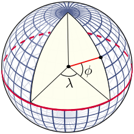
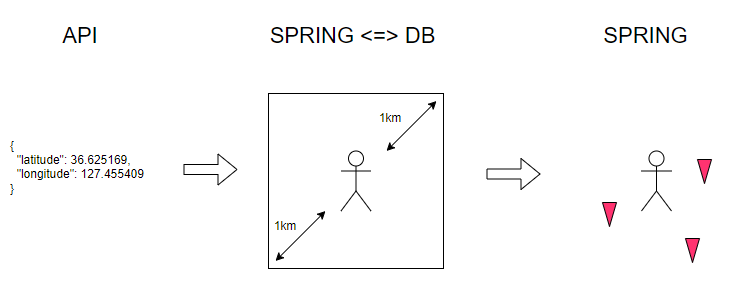

## 개발 계기

사용자 위치를 기반으로 주변 가게를 탐색하는 비즈니스 로직을 개발하고 있었다.
프론트단에서 카카오맵 API 를 이용해서 사용자의 위도경도 찾으면 서버로 보내준다.
그럼 나는 받은 위도, 경도를 기준으로 특정거리내에 있는 가게를 DB 에서 가져와야 한다.

## 개발 환경

- Spring 2.7.9
- JPA
- MySQL 8.0

## 위도와 경도



그림에서 위도(φ)와 경도(λ)를 나타냈다. 위도(Latitude) 와 경도(Longitude) 를 이용하면 어떤 지역이든 나타낼 수 있다.
위도와 경도는 하나의 각도로 위도의 범위는 -90°(남위 90°) ~ 90°(북위 90°), 경도의 범위는 -180°(서경 180°) ~ 180°(동경 180°) 인데
지구의 크기는 매우크다. 그래서 보통 최소 소수점 6자리까지 값을 넘겨주는데 소수점 단위 따른 값은 다음과같다.

- 소수점 첫째 자리 최대 : 11.1 km
- 소수점 둘째 자리 최대 : 1.1 km
- 소수점 셋째 자리 최대 : 110 m
- 소수점 넷째 자리 최대 : 11 m
- 소수점 다섯째 자리 최대 : 1.1 m
- 소수점 여섯째 자리 최대 : 0.11 m

물론 정확한 수치는 아니고 대략적인 길이가 이렇구나 정도의 감만 잡으라고 적었다.

위도와 경도를 이용해 거리를 계산할려면 주의점이 있다. 위도 1° 당 거리는 일정하지만, 경도 1° 당 거리는 일정하지 않는다!
이유는 적도를 기준으로 하여 위아래로 이동할 경우 원주가 감소하기 때문이다. 그래서 하버사인 공식(Haversine Formula) 을
이용해서 거리를 구한다. 여기서는 개발을 위해 작성하는 글이므로 공식에 대한 설명은 생략하겠다.

## 알고리즘



1. Controller 에서 API 로 위도와 경도 값을 받습니다. 여기서 위도와 경도는 현재 사용자 위치를 의미한다.
2. Service 에서 현재 위도와 경도 기반으로 1km 떨어진 북동쪽과 남서쪽 좌표 2개를 추출합니다. 그리고 
Repository 에서 DB 로부터
추출한 좌표 범위 내(한 변이 √2 인 정사각형)에서의 가게정보를 가져온다
3. DB 에서 가져온 가게들을 Service 에서 새로운 기준으로 정렬한다.

여기서 주의점은 "좌표 범위 내(한 변이 √2 인 정사각형)에서의 가게정보를 가져온다" 이다. 사용자 위치로부터 "원" 이 아니라
"정사각형" 영역을 가져온다. 그러니 사용자로 부터 정확히 1km 떨어진 거리를 가져오는게 아니다. 그러니 정확한 거리를
원한다면 Service 에 추가로 필터링 하는 로직을 작성해야 된다. 여기서는 정확한 거리를 필요로 하는게 아닌 대략 거리가 1km 면
상관없어서 추가로 필터링 해주는 로직은 없다.

### Entity

```java
@Entity
@Getter
@NoArgsConstructor(access = AccessLevel.PROTECTED)
public class Store {
    
    ...

    @Column(columnDefinition = "GEOMETRY")
    private Point location;
    
    ...
}
```

엔티티 코드를 적은 이유는 위도 경도 저장을 위한 함수로 `Point` 라는 자료형을 사용한다.
처음 개발할때는 `Location` 이라는 위도 경도 정보만 포함하는 클래스를 만들어 썼었는데 조사를 해보니 MySQL 에 공간좌표계 지원
자료형으로 `Point` 가 있었다. MySQL 의 `Point` 자료형을 쓰면 MySQL 이 지원하는 공간좌표계 함수도 사용할 수 있다.

MySQL 의 공간좌표계를 쓰지않고 직접 계산하는 코드를 넣을거라면 단순히 `Location` 클래스를 제작해 사용해도 무방하다.
하지만 MySQL 의 공간좌표계 함수를 이용하는게 성능면에서 대부분 좋다.

어쨋든 `Point` 자료형을 이용하면 추가로 설정도 해야한다.
Entity 와 MySQL 에 `Point` 자료형을 맵핑하기 위해서다.

#### build.gradle

```groovy
	// 위도 경도 자료형 POINT 에 대한 MySql - Spring 연동 라이브러리 : 하이버네이트버전이랑 맞춰주어야함
	implementation 'org.hibernate:hibernate-spatial:5.6.15.Final'
```

#### application.yml

```yaml
spring:
  datasource:
    ...
  jpa:
    ...
    database-platform: org.hibernate.spatial.dialect.mysql.MySQL56InnoDBSpatialDialect # 위도 경도 계산을 위해 추가
```

build.gradle 과 application.yml 에 추가 설정이 필요하다. 당연히 이런 의존성추가 할때는 버전을 꼭 확인해보자.


### Service

```java
    public List<Store> findStoresListByLocation(Location location, int offset, int limit) {

        Location northeast = StoreMapDistance.aroundCustomerNortheastDot(location);
        Location southwest = StoreMapDistance.aroundCustomerSouthwestDot(location);

        List<Store> stores = storeRepository.findByLocationWithList(northeast, southwest, offset, limit);
        sortStoresByDistance(stores, location);

        return stores;
    }

    /**
     * 사용자 위치 기준으로 가장 가까운순으로 정렬합니다.
     */
    private void sortStoresByDistance(List<Store> stores, Location location) {

        stores.sort((o1, o2) -> (int) (StoreMapDistance.calculateDistance(location, o1) - StoreMapDistance.calculateDistance(location, o2)));
    }
```

`StoreMapDistance.aroundCustomerNortheastDot(location)` 에서 북동쪽 좌표를 추출하고
`StoreMapDistance.aroundCustomerSouthwestDot(location)` 에서 남서쪽 좌표를 추출한다.

추출한 좌표를 `storeRepository` 로 넘겨주면 해당 범위에 해당하는 가게를 가져온다.
가져온 가게를 `sortStoresByDistance` 를 이용해 재정렬한다. 현재 `sortStoresByDistance` 함수는 사용자 위치 기준으로 가장
가까운 순서로 정렬해준다. 필요한 정렬 기준이 있다면 목적에 맞게 만들어 쓰면 된다.

### StoreMapDistance

```java
public class StoreMapDistance {

    // 탐색 거리 (km 단위)
    private static final double SEARCH_DISTANCE = 1.0;

    /**
     * 기준 지점에서 최대 반경이 되는 북동쪽 좌표를 반환합니다.
     */
    public static Location aroundCustomerNortheastDot(Location customerLocation) {

        double nowLatitude = customerLocation.getLatitude(); // 현재 위도 = y 좌표
        double nowLongitude = customerLocation.getLongitude(); // 현재 경도 = x 좌표

        return GeometryUtil.calculateByDirection(nowLatitude, nowLongitude, SEARCH_DISTANCE, Direction.NORTHEAST.getBearing());
    }

    /**
     * 기준 지점에서 최대 거리가 되는 남서쪽 좌표를 반환합니다.
     */
    public static Location aroundCustomerSouthwestDot(Location customerLocation) {

        double nowLatitude = customerLocation.getLatitude(); // 현재 위도 = y 좌표
        double nowLongitude = customerLocation.getLongitude(); // 현재 경도 = x 좌표

        return GeometryUtil.calculateByDirection(nowLatitude, nowLongitude, SEARCH_DISTANCE, Direction.SOUTHWEST.getBearing());
    }

    public static double calculateDistance(Location customerLocation, Store store) {

        double nowLatitude = customerLocation.getLatitude(); // 현재 위도 = y 좌표
        double nowLongitude = customerLocation.getLongitude(); // 현재 경도 = x 좌표

        double storeLatitude = store.getLocation().getY(); // 현재 위도 = y 좌표
        double storeLongitude = store.getLocation().getX(); // 현재 경도 = x 좌표

        return GeometryUtil.calculateDistance(nowLatitude, nowLongitude, storeLatitude, storeLongitude);
    }
}
```

`StoreMapDistacne` 함수는 거리를 계산하는 함수들을 모아놓았다.
- `aroundCustomerNortheastDot` : 사용자 위치기준 북동쪽 좌표 반환
- `aroundCustomerSouthwestDot` : 사용자 위치기준 남서쪽 좌표 반환
- `calculateDistance` : 두 좌표의 거리를 계산

`calculateDistance` 함수는 `Service` 에서 `sortStoresByDistance` 에 사용된다. 사용자 위치와 가게의 위치의 거리를
계산해주는 함수이다.

### Location

```java
@Getter
public class Location {

    private final double latitude;
    private final double longitude;

    public Location(double latitude, double longitude) {
        this.latitude = latitude;
        this.longitude = longitude;
    }
}
```

Entity 에서는 `Point` 자료형을 썼는데 `StoreMapDistance` 에서는 `Location` 클래스를 쓴다. 그 이유는 다음과 같다.
- 스프링은 Jackson 라이브러리를 사용해 Controller 에서 클래스를 보낼때 Json 으로 맵핑을 해준다.
그런데 `Point` 자료형은 Jackson 라이브러리가 인식이 불가능해 `Location` 클래스로 변환해서 보내줘야한다.
- Controller 에서 주고받기위해 `Location` 클래스를 쓰는것은 알았다. 그런데 왜 `Point` 자료형으로 안바꾸고
그대로 `Location` 을 쓰는지 의문을 가질 수 있다. 이 부분은 개개인마다 생각이 다를것같은데 나같은 경우는
`StoreMapDistance` 에서 필요한것은 오직 위도와 경도 값 뿐이다. 그래서 `Location` 클래스를 사용해 필요한 값만 전달하였다.

### GeometryUtil

```java
public class GeometryUtil {

    private static final double EARTH_RADIUS = 6371.01;

    public static Location calculateByDirection(Double baseLatitude, Double baseLongitude,
                                                Double distance, Double bearing) {
        Double radianLatitude = toRadian(baseLatitude);
        Double radianLongitude = toRadian(baseLongitude);
        Double radianAngle = toRadian(bearing);
        Double distanceRadius = distance / EARTH_RADIUS;

        Double latitude = Math.asin(sin(radianLatitude) * cos(distanceRadius) +
                cos(radianLatitude) * sin(distanceRadius) * cos(radianAngle));
        Double longitude = radianLongitude + Math.atan2(sin(radianAngle) * sin(distanceRadius) *
                cos(radianLatitude), cos(distanceRadius) - sin(radianLatitude) * sin(latitude));

        longitude = normalizeLongitude(longitude);
        return new Location(toDegree(latitude), toDegree(longitude));
    }

    public static double calculateDistance(Double lat1, Double lon1, Double lat2, Double lon2) {
        double dLat = toRadian(lat2 - lat1);
        double dLon = toRadian(lon2 - lon1);

        double a = sin(dLat / 2) * sin(dLat / 2) + Math.cos(toRadian(lat1)) * cos(toRadian(lat2)) * sin(dLon / 2) * sin(dLon / 2);
        double b = 2 * Math.atan2(Math.sqrt(a), Math.sqrt(1 - a));
        return EARTH_RADIUS * b * 1000; //m
    }

    private static Double toRadian(Double coordinate) {
        return coordinate * Math.PI / 180.0;
    }

    private static Double toDegree(Double coordinate) {
        return coordinate * 180.0 / Math.PI;
    }

    private static Double sin(Double coordinate) {
        return Math.sin(coordinate);
    }

    private static Double cos(Double coordinate) {
        return Math.cos(coordinate);
    }

    private static Double normalizeLongitude(Double longitude) {
        return (longitude + 540) % 360 - 180;
    }
}
```

`GeometryUtil` 클래스는 실제로 계산을 해주는 함수들을 모아놓았다. 계산식은 하버사인 공식(Haversine Formula) 을 이용한다.
- `calculateByDirection` : 위도, 경도, 거리, 방향이 주어지면 해당 위경도 기준으로 방향과 거리만큼 떨어진 좌표를 계산해준다.
이 함수를 이용해 북동쪽과 남서쪽 좌표를 계산할 수 있다.
- `calculateDistance` : 두 개의 위도와 경도가 들어오면 거리를 계산해준다.

### Repository

```java
public List<Store> findByLocation(Location northeast, Location southwest) {

        // NativeQuery 로 보내기위해 북동쪽, 남서쪽 거리를 String 으로 반환 (x y, x y) 좌표로 보내며 x 가 Longitude, y 가 Latitude 입니다.
        String pointFormat = String.format(
                "'LINESTRING(%f %f, %f %f)'",
                northeast.getLongitude(), northeast.getLatitude(), southwest.getLongitude(), southwest.getLatitude()
        );

        Query query = em.createNativeQuery("SELECT * "
                        + "FROM store AS s "
                        + "WHERE MBRCONTAINS(ST_LINESTRINGFROMTEXT(" + pointFormat + "), s.location)", Store.class)
                .setMaxResults(10);


        return query.getResultList();
    }
```

Repository 에서는 북동쪽과 남서쪽 좌표를 받으면 좌표에 해당하는 정사각형 범위내는 가게의 정보를 가져오는 쿼리를 DB에 날려준다. 
여기에서 사용하는것이 MySQL 의 `MBRCONTAINS` 이다.

Spring JPA 의 장점중 하나는 JPQL 이라고 생각한다. 하지만 안타깝게도 JPQL 에서는 `MBRCONTAINS` 를 지원하지 않는다.
그래서 native Query 를 이용해서 쿼리를 날렸다.

참고로 JPQL 이 `MBRCONTAINS` 를 지원하지 않지만 다른 공간좌표계 함수 `ST_CONTAINS` 를 지원한다. `ST_CONTAINS` 의 경우
`MBRCONTAINS` 보다 더 정밀한 거리계산을 해서 가져온다. 하지만 그 대신 연산속도가 더 느리다는 단점이 있다.

## 정리

현재 알고리즘 플로우는 DB 에서 전체적으로 범위에 해당하는 가게를 가져온 뒤에 다시 스프링에서 정렬한 뒤 사용한다.
여기서 Service 와 DB 가 맡은 역할은 다음과 같다.
- Service 에서 북동쪽, 남서쪽 좌표계산 그리고 정렬
- DB 에서 정사각형 범위내에 해당하는 가게 탐색

여기서 의문점이 들 수 있다. 

#### 북동쪽, 남서쪽 계산할 필요없이 DB 에서 바로 거리에 해당하는 가게를 뽑고 정렬해서 가져오면 되지않나?

그렇게 하면 Service 의 코드도 대폭 감소되고 좋지 않나? 라는 생각이 들 수 있다.
그렇게 하지않는 데에는 2가지 이유가 있었다.

첫째, DB 에도 물론 사용자 위치 기반으로 거리를 계산해주는 함수가 있다. 그런데 이런 함수의 경우 연산이
많이 들어간다. 그런데 만약 DB 에서 가게의 데이터 수가 10만개를 넘어가면, DB 에서는 10만번 복잡한 계산을 거쳐야 한다.
하지만 북동쪽좌표와 남서쪽좌표의 정사각형 영역에 들어가는지에 대한 계산의 경우 이에비해 매우 간단한 계산이다.

복잡한계산 10만번 보다는 간단한 계산10만번 + Service 에서 복잡한 계산 50번이 더 낫다고 판단했다. 사실 정확한 성능테스트를
해보지않아 추측에 불과하지만, 가게 데이터가 많아지면 많아질 수 록 후자가 더 성능이 좋을것이다.

둘째, 사실 첫째 이유보다는 두번째 이유가 더 크다. DB 에서 정렬해서 들고오면, Repository 에 비즈니스로직이 담기게 된다.
만약 정렬기준이 가까운 순이 아니라, 멀어지는 순으로 바뀐다면? 그러면 Repository 에 쿼리를 날리는 부분을 수정해야된다. 아니면
Repository 에 새로운 함수를 작성하고, Service 에서 호출하는 함수를 변경해야 한다.
정렬 기준이 변경될때마다 Repository 에 변화가 생기는것보다 Service 에 비즈니스 로직 두어 Service 만 변경되는것이
맞다고 판단했다.

혹시 더 좋은 의견이 있다면 댓글로 남겨주시면 감사하겠습니다.


## Reference

[https://ko.wikipedia.org/wiki/%EC%9C%84%EB%8F%84](https://ko.wikipedia.org/wiki/%EC%9C%84%EB%8F%84)
[https://webinformation.tistory.com/55](https://webinformation.tistory.com/55)
[https://purumae.tistory.com/198](https://purumae.tistory.com/198)
[https://se-jung-h.tistory.com/entry/자바intelij-좌표위도경도로-실제-거리-구하기](https://se-jung-h.tistory.com/entry/자바intelij-좌표위도경도로-실제-거리-구하기)
[https://wildeveloperetrain.tistory.com/171](https://wildeveloperetrain.tistory.com/171)
[https://momentjin.tistory.com/136](https://momentjin.tistory.com/136)
[https://velog.io/@hwsa1004/Spring-위치-기반-서비스-구현하기](https://velog.io/@hwsa1004/Spring-위치-기반-서비스-구현하기)
[https://wooody92.github.io/project/JPA와-MySQL로-위치-데이터-다루기/](https://wooody92.github.io/project/JPA와-MySQL로-위치-데이터-다루기/)
[https://velog.io/@hssarah/Spring-JPA-MySql-위치-정보위도-경도-저장-및-Json으로-응답](https://velog.io/@hssarah/Spring-JPA-MySql-위치-정보위도-경도-저장-및-Json으로-응답)
