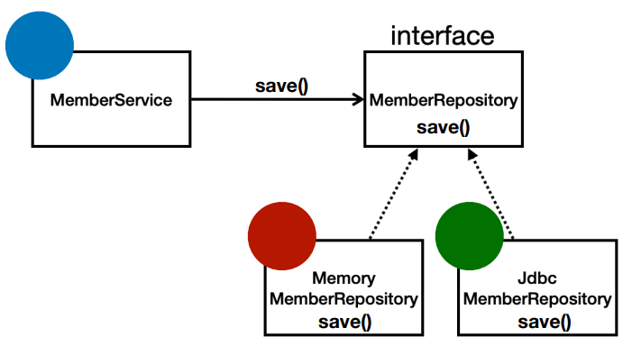
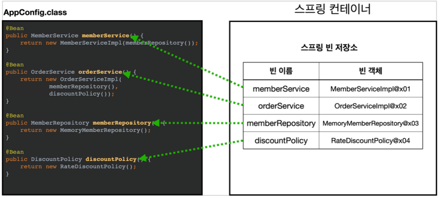
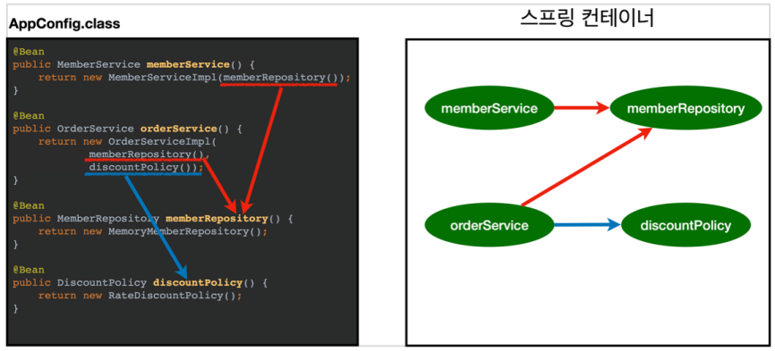
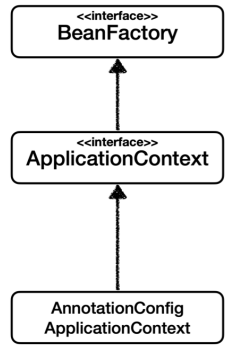
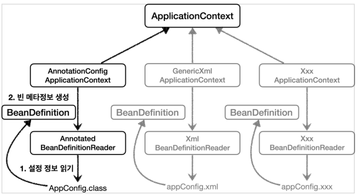
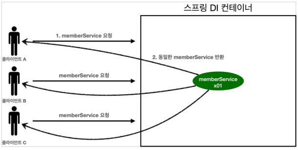
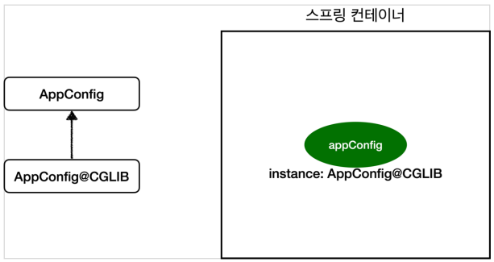
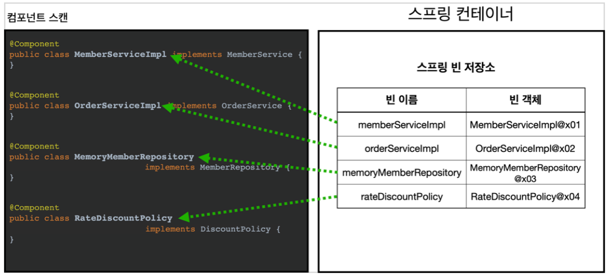

# 객체지향 다형성

객체는 메시지를 주고받고 데이터를 처리한다, 유연하고 변경에 용이하다.

다형성 : 자바에서는 역할(interface) 과 구현(인터페이스 구현 클래스, 구현 객체), 역할을 사용하는 클라이언트로 나뉜다. 
구현부분이 변경되어도 클라이언트와 역할은 변경하지 않고 그대로 수행할 수 있어야 한다.
즉, 클라이언트는 내부구조를 몰라도, 내부구조가 바뀌어도, 클라이언트는 똑같이 역할을 수행할 수 있다.
구현되는 부분은 클라이언트에게 영향을 주지 않고 무한히 확장이 가능하다! 구현 되는 부분은
유연하고 변경에 용이해야 한다.

- 클라이언트는 역할만 알고있으면 된다.
- 클라이언트는 구현 대상의 내부 구조를 모른다.
- 클라이언트는 구현 대상의 내부 구조가 변경되도 영향이 없다.
- 클라이언트는 구현 대상 자체를 변경해도 영향을 받지 않는다.

## 자바에서의 다형성



- 클라이언트 : MemberService
- 역할 : MemberRepository
- 구현 : MemoryMemberRepository, JdbcMemberRepository

`MemberService` 가 `MemberRepository` 를 호출할때, `MemberRepository` 는
`MemoryMemberRepository` 가 될 수도 있고, `JdbcMemberRepository` 가 될 수도 있다.

역할(interface)를 구현한 객체 인스턴스를 실행시점에 유연하게 변경할 수 있다! 변경하는데 클라이언트를
변경할 필요는 없다! 그만큼 `interface` 의 설계가 중요하다, `interface` 가 변경되면 클라이언트, 구현객체도
변경된다.

## 스프링에서 다형성

스프링은 다형성 극대화해서 이용할 수 있게 도와준다. 제어의역전(IoC), 의존관계 주입(DI) 다형성을
활용해 역할과 구현을 편리하게 다룰 수 있도록 지원한다.

## SOLID
| 원칙                                                         | 설명                                                                                                                                         |
|------------------------------------------------------------|--------------------------------------------------------------------------------------------------------------------------------------------|
| SRP<br/>(Single Responsibility Principle)<br/>단일 책임 원칙     | 한 클래스는 하나의 책임만 가져야 한다. 하지만 하나의 책임이라는게 클 수 도 있고, 작을 수 도 있고, 문맥과 상황에 따라 다르게 해석된다. SRP 를 잘 지킨다는 것은 변경이 있을때, 변경에 따른 파급효과가 적을 수록 원칙을 잘 지킨것이다.   |
| OCP<br/>(Open Closed principle)<br/> 개방-폐쇄 원칙              | 소프트웨어 요소는 확장에 열려있으나 변경에 닫혀있다. 이 원칙을 지키기위해 IoC, DI 를 사용한다.                                                                                  |
| LSP<br/>(Liskov Substitution Principle)<br/> 리스코프 치환 원칙    | 상위타입의 객체를 하위 타입의 객체로 치환해도 상위타입을 사용하는 프로그램은 정상적으로 동작해야 한다. 즉 자식객체를 참조하는 부모객체는, 부모객체가 가진 역할도 정상적으로 수행이 가능해야 한다. 대표적인 예제로 직사각형/정사각형이 있다.      |
| ISP<br/>(Interface Segregation Principle)<br/> 인터페이스 분리 원칙 | 클라이언트는 자신이 사용하는 메소드에만 의존해야 한다. 특정 클라이언트 위한 인터페이스 여러 개가 범용 인터페이스 하나보다 낫다. 너무 범용적인 인터페이스를 만들면 인터페이스 변경이 많이 일어날 수 있다. 적당한 크기의 인터페이스를 만들어야 한다. |
| DIP<br/>(Dependency Inversion Principle)<br/> 의존관계 역전 원칙   | 프로그래머는 추상화에 의존해야지, 구체화에 의존하면 안된다. 클라이언트가 구현을 알면안되고, 역할만 알아야 한다. 이 원칙을 지키기 위해 IoC 와 DI 를 사용한다.                                              |

- SRP(Single Responsibility Principle) 단일 책임 원칙 : 한 클래스는 하나의 책임만 가져야 한다.
하지만 하나의 책임이라는게 클 수 도 있고, 작을 수 도 있고, 문맥과 상황에 따라 다르다.
SRP 를 잘 따른다는 것은 변경이 있을때, 변경에 따른 파급효과가 적을 수록 원칙을 잘 지킨것이다.
- OCP(Open Closed principle) 개방-폐쇄 원칙 : 소프트웨어 요소는 확장에 열려있으나 변경에 닫혀있다.
다형성을 활용한것 -> 구현코드가 확장되도 클라이언트 코드는 변경되지 않는다. 라고 생각했지만
실제로는 클라이언트 코드가 바뀐다(`MemoryMemberRepository` 에서 `JdbcMemberRepository`
변경할려면 어찌됬든 한줄 변경이 필요하다.) 해결할려면
객체를 생성하고, 연관관계를 맺어주는 별도의 조립, 설정자가 필요한데 이걸 스프링 컨테이너에서 지원한다.
- LSP(Liskov Substitution Principle) 리스코프 치환 원칙 : 객체 프로그램의 정확성을
깨트리지 않으면서 하위 타입의 인스턴스로 바꿀 수 있어야 한다. 구현 코드는 역할에 맞게 구현되어야
한다. 엑셀은 앞으로가기위해 만들어진 역할인데, 뒤로가게 구현하면 잘못된 것이다.
- ISP(Interface Segregation Principle) 인터페이스 분리 원칙 : 특정 클라이언트 위한
인터페이스 여러 개가 범용 인터페이스 하나보다 낫다. 너무 범용적인 인터페이스를 만들면
인터페이스 변경이 많이 일어날 수 있다. 적당한 크기의 인터페이스를 만들어야 한다.
- DIP(Dependency Inversion Principle) 의존관계 역전 원칙 : 프로그래머는 추상화에
의존해야지, 구체화에 의존하면 안된다. 클라이언트가 구현을 알면안되고, 역할만
알아야 한다. (다형성에서 클라이언트가 구현코드를 선택하니 DIP를 어기고있다..!)

다형성만으로 OCP 랑 DIP 가 지켜지지 않는다.. 설정파일을 만들어서 해결하는 방법이 있다.
생성자를 통해 설정파일에서 인터페이스가 누가될지 결정(설정파일에서 어떤 클래스가 될지
결정 -> DI(의존성주입), 생성자를 이용하면 생성자DI) 하면 된다. 이걸 스프링에서
알아서 해준다.

제어의역전(IoC) : 구현객체가 스스로 흐름을 제어하는게 아닌, 프로그램은
오직 본인로직만 실행하며, 프로그램의 제어의흐름은 외부에서 가져간다.

프레임워크와 라이브러리의 차이 : 프레임워크에서 실행권은 프레임워크가 가진다(제어의역전)
하지만 라이브러리는 프로그램내에서 실행이 된다.

동적인 객체 인스턴스관계 : 인터페이스를 가진객체가 어떤 구현객체를 받는지 모르는 객체,
실행시점(런타임) 시점에 외부에서 구현객체를 생성하고 클라이언트에 전달해서 클라이언트와
서버의 실제 의존관계가 연결되는것을 DI 라고한다.
의존관계주입(DI, Dependency Injection)

IoC 컨테이너, DI 컨테이너 : 객체를 생성하고 관리하면서 의존관계를 연결해 주는 어떤것, 주로 DI 컨테이너라고 부른다.


## 스프링에서 SOLID

스프링은 DI(Dependency Injection), DI 컨네이터를 활용해서 OCP, DIP 를 지킬수 있다.

`@Bean` 으로 등록해주면 해당 객체를 스프링 컨테이너에서 관리를 해준다.
컨테이너에서 `applicationContext.getBean()` 을 이용해 꺼내올 수 있다.

## 스프링 컨테이너

```java
// 스프링 컨테이너 생성
ApplicationContext applicationContext = new AnnotationConfigApplicationContext(AppConfig.class);
```

#### AppConfig.java
```java
import java.beans.BeanProperty;

@Configuration
public class AppConfig {

    @Bean
    public MemberService memberService() {
        return new MemberServiceImpl(memberRepository());
    }

    @Bean
    public OrderService orderService() {
        return new OrderServiceImpl(
                memberRepository(),
                discountPolicy());
    }

    @Bean
    public MemberRepository memberRepository() {
        return new MemoryMemberRepository();
    }

    @Bean
    public DiscountPolicy discountPolicy() {
        return new RateDiscountPolicy();
    }
}
```
스프링 컨테이너를 생성하려면 구성 정보를 지정해주어야 하는데 여기서는 `AppConfig.class` 를 여기서 구성정보로 가진다.
스프링 컨테이너를 생성하면, 스프링 컨테이너는 스프링 Bean 저장소를 가진다. 스프링 빈 저장소는 빈 이름에 키값, 빈 객체를 밸류값으로 가진다.  
빈 이름은 보통 메소드 이름을 사용하고, 빈 객체에는 해당 메소드의 리턴값이 등록된다.



스프링 컨테이너는 스프링 빈 생성을 완료하면, 스프링 컨테이너는 구성정보를 보고 스프링 빈에게 의존관계를 주입해준다.
그런데 현재 구성정보는 생성자 의존관계 주입으로, 생성자를 호출하는순간 의존관계 주입이 한번에 처리된다.



#### 빈 이름 주의점
빈 이름이 키 값으로 저장되기 때문에 빈 이름은 중복되면 안된다! 중복으로 저장시 덮어쓰거나 무시되서 오류가 발생하다.
어쩔 수 없이 중복이 된다면 빈 이름을 직접 부여해서 회피가 가능하다.

#### 빈 타입 조회 주의점
타입으로 조회시 상속타입을 조회할때 주의해야한다. 부모타입을 조회하면 자식타입 모두를 조회한다!!! 그래서 최고
부모 객체인 `Object` 타입(코드로 따로 상속안해도 모든 클래스가 기본으로 상속되어있다)으로 조회하면
모든 스프링 빈을 조회한다.

### BeanFactory



BeanFactory : 스프링 컨테이너 최상위 인터페이스, 스프링 빈을 관리하고 조회하는 역할 담당한다.
`getBean()` 등 메소드를 제공한다.

ApplicationContext : `BeanFactory` 상속받아서 기능 제공하는데, 빈 관리, 조회뿐만 아닌
수많은 부가기능을 지원한다.
- 메세지소스 활용한 국제화 기능 `MessageSource` : 언어에 대한 지원 
- 환경변수 `EnvironmentCapable` : 로컬환경, 개발환경, 운영환경 등을 구분해서 처리
- 애플리케이션 이벤트 `ApplicationEventPublisher` : 이벤트 발행, 구독 모델 편리하게 지원
- 편리한 리소스 조회 `ResourceLoader` : 파일, 클래스패스, 외부 등에서 리소스 편리하게 조회

BeanFactory 와 ApplicationContext 를 스프링 컨테이너라고 부른다. 대부분 BeanFactory
를 직접사용하지 않고 ApplicationContext 를 사용한다.

### BeanDefinition



예전에는 스프링 컨테이너를 만들때 구성정보를 XML 을 이용해서 만들었다. 그런데 지금은 자바코드를 이용해
구성정보를 만들어도 스프링 컨테이너를 만들 수 있다. 바로 `BeanDefinitionReader` 가 자바코드나 XML 을 읽어서 `BeanDefinition` 을 만들고
스프링 컨테이너는 `BeanDefinition` 을 보고 의존관계를 주입하기 때문에 가능한일이다.
`BeanDefinition` 을 빈 설정 메타정보라 하고 `@Bean`, `<bean>` 하나당 
각각 하나씩 메타정보가 생성된다. `BeanDefinition` 이 인터페이스이고
스프링컨테이너는 인터페이스(추상화)에 의존하게해 역할과 구현을 분리한것이다.

## 싱글톤 컨테이너
실제 웹애플리케이션 서비스에서 고객이 요청하는 하는 만큼 객체를 만들게 되면
큰 문제가 발생한다. 고객이 한명이 아니고 여러명이기때문에 똑같은 객체를 수없이
많이 만들 수 있다. JVM 메모리에 계속 객체를 생성해서 올리다보면 메모리 초과가 날 수 있다.



싱글톤패턴을 활용해 객체는 하나만 생성하게하고 공유하도록 설계하면 메모리에는 오직 하나의 객체만 존재하게 된다..
그렇지만 싱글톤패턴은 유연성이 매우 떨어져서 단점이 엄청 많아 안티패턴으로 불린다.

그런데 스프링컨테이너는 이런 싱글톤패턴의 단점을 해결하고, 객체 인스터스를 싱글톤으로
관리한다. 스프링 컨테이너는 싱글톤 컨네이너 역할을 하고, 싱글톤 객체를 생성하고
관리하는 기능을 싱글톤 레지스트리라고 한다.

#### 싱글톤 방식의 주의점

싱글톤 방식으로 인해 문제가 발생할 수 있다. 실무에서도 몇년에 한번씩 보인다!

특정 클라이언트가 값을 변경할 수 있는 필드가 있으면 안된다. 공유하는 객체이기 때문에 변경하면 공유하고있는 모두가 바뀌게 된다.
그래서 읽기만 가능하게 해야 하고 객체의 상태를 유지하지 않는 무상태(stateless) 로 설계해야한다. 
필드 대신에 자바에서 공유하지 않는 지역변수, 파라미터, ThreadLocal 을 사용해야한다.

### @Configuration



구성파일(`AppConfig.class`) 에 `@Configuration` 어노테이션을 달아주면 스프링에서 CGLIB 기술을 이용해 새로운 객체를 생성한다.
새로운 객체를 안만들고 순수 클래스에서는 스프링의 하고싶은대로 빈을 관리할 수  없기때문이다. 원본 클래스를 상속받아 새로운 클래스를 만들고
그 클래스를 스프링 빈에 등록한 것이다. 이렇게 스프링이 만든 객체를 이용해서 싱글톤을 유지 할 수 있다. (예를 들어 구성정보에서
`memberRepository()` 메소드가 3번 호출된다면, 자바 순수코드로써는 조작이 불가능해 싱글톤 유지가 안되지만 스프링 만든 임의의 객체는
조작을해서 싱글톤 유지가 가능하다.)

`@Configuration` 을 사용하지 않고 `@Bean` 만 사용하면 스프링이 CGLIB 기술을 이용해 새로운 객체를 생성하지 않아 계속 새로운
빈을 만들게 되고 싱글톤유지가 되지 않는다.

## 컴포넌트 스캔

`@ComponentScan` 을 구성정보(`AppConfig.class`)에 달아서 사용한다. 이렇게하면 구성정보 내에서 메소드를 `@Bean` 으로 등록할 필요가없다!
대신 `@Bean` 으로 등록해야할 클래스에 스캔 대상이 되도록 `@Component` 를 붙여주고 생성자 주입을 한다면 생성자 메소드에
`@Autowired` 를 달아준다. 그러면 알아서 스프링 빈으로 등록해준다.

```java
@Configuration
@ComponentScan
public class AutoAppConfig {

}
```

`@ComponentScan` 은 `@Component` 가 붙은 모든 **클래스**를 스프링 빈으로 등록한다.
등록 이름은 클래스에서 맨앞글자를 소문자로 바꿔서 저장한다. 이름을 지정하고 싶으면 `@Component("myname")` 으로 지정할 수 있다.



생성자로 `@Autowired` 가 지정되어있으면 스프링컨테이너가 지정된 곳에 스프링 빈을 찾아서 주입하는데,
기본적인 조회 전략은 같은 타입의 빈을 찾아서 주입한다.

#### 스캔 위치 지정
`backPackages` 를 활용해 컴포넌트 스캔 시작위치를 지정해 필요한 위치부터 탐색을 할 수 있게할 수 있는데
잘 사용하지 않는다. 스프링 부트 권장방법은 구성정보 클래스의 위치를 프로젝트 최상단에 두는것이다.

`@SpringBootApplication` 를 보면 프로젝트 시작 루트위치에 있는데, `@SpringBootApplication` 는 `@ComponentScan` 을 가지고있다.

`@ComponetScan` 대상
- `@Compnent` 
- `@Service` : 특별한 기능없다. 그냥 개발자 인식용이다.
- `@Repository` : 스프링 데이터 접근계층으로 인식한다. 데이터계층의 예외를 스프링 예외로 변환해준다.
- `@Controller` : 스프링 MVC 컨트롤러로 인식한다.
- `@Configuration` : 스프링 설정 정보로 인식하고, 스프링 빈이 싱글톤을 유지하도록 추가 처리를 한다.
사실 전부다 `@Component` 를 상속받고 있다.

실제로 `@Component` 같은 어노테이션은 상속기능이 없다. 그래서 이것을 인식해주는것은 자바의 기능이
아닌 스프링 지원 기능이다!

## 중복 등록과 충돌

컴포넌트 스캔에서 같은 빈 이름을 등록시 충돌이 발생하는데 두 가지 상황이 있다.
- 자동 빈 등록 + 자동 빈 등록 : 오류`ConflictingBeanDefinitionException`가 발생한다.
- 수동 빈 등록 + 자동 빈 등록 : `@Component` 이용한 빈 등록과 `@Bean` 이용한 빈 등록시
충돌 오류를 발생시켜 주지 않는다. 대신 수동 빈이 우선으로 덮어쓰기 해준다.(자동 빈을 오버라이딩)
하지만 개발자가 의도한게 아닐 수 도 있다. 그래서 `SpringBoot` 기본 설정에서는 에러를 띄워준다!
물론 설정값에서 오버라이딩 허용해서 수동빈이 덮어쓰기가능하게 해줄 수 있다.

충돌을 하는데 원치 않는 충돌이 발생할 때가 있다.
```java
@Component
public class FixDiscountPolicy implements DiscountPolicy {}
```

```java
@Component
public class RateDiscountPolicy implements DiscountPolicy {}
```

```java
@Autowired
private DiscountPolicy discountPolicy
```

이렇게 하면 충돌이 발생한다. 상위타입이 같아서 발생하는 문제이다. 물론 하위타입으로
지정해주면 문제는 해결되지만 이러면 DIP를 위배하면서 유연성이 떨어진다.

### 필드 명을 빈 이름으로 변경

```java
@Autowired
private DiscountPolicy rateDiscountPolicy
```

이렇게 필드명을 바꿔주면 된다. 타입매칭 시도시에 여러 빈이 존재하면 필드명 매칭을 하기
때문이다.

### @Qualifier

```java
@Component
@Qualifier("mainDiscountPolicy")
public class RateDiscountPolicy implements DiscountPolicy {}
```

```java
@Component
@Qualifier("fixDiscountPolicy")
public class FixDiscountPolicy implements DiscountPolicy {}
```

```java
@Autowired
public OrderServiceImpl(MemberRepository memberRepository,
 @Qualifier("mainDiscountPolicy") DiscountPolicy
discountPolicy) {
    this.memberRepository = memberRepository;
    this.discountPolicy = discountPolicy;
}
```

이렇게 `@Qualifier` 를 이용해 구분해서 매칭을 시킬 수 있다. 실제 필드명이 바뀐게
아니다.

### @Primary

`@Primary` 를 사용하면 `@Primary` 가 붙은 빈을 우선으로 적용한다.


## 생성자 주입 방법

당연한 이야기지만 주입되는 대상은 스프링 컨테이너가 관리하는 스프링 빈이어야 가능하다!

### 생성자 주입
생성시 딱 한번 주입해주는 것! 한번 초기화 해주면 그 이후에 불변이기에 가장 좋다.
생성자가 딱 1개만 있으면 `@Autowired` 생략해도 단 알아서 자동주입된다.
보통 생성자 주입을 선택한다.

### 수정자 주입
`setter` 를 이용해서 주입한다. 선택, 변경 가능성이 있는 경우 사용하는 의존관계 주입방법 이다.

### 필드 주입
필드에 `@Autowired` 를 붙여주는 방법, 굉장히 간단하다. `private` 타입이도 상관없다.
하지만 외부에서 변경이 불가능해서 안티패턴으로 쓰인다. 외부 변경이 불가능해 테스트도
할 수 없기 때문이다. 테스트 코드에서는 사용해도 된다. 어차피 어플리케이션과 상관없고
외부접근할일도 거의 없기 때문이다.

### 일반 메서드 주입
일반메서드 위에 `@Autowired` 를 적는다. 한번에 여러 필드 주입이 가능하지만
보통 사용하지 않는다.

## Optional

주입할 스프링 빈이 없어도 동작해야 될 때가 있다.
`@Autowired` 를 했는데 해당 객체가 스프링 빈이 아니면 오류를 발생시켜 진행이 안된다. 이것을
해결하기 위해 옵션처리를 이용한다.

### @Autowired(required = false)
```java
@Autowired(required = false)
public void setNoBean1(Member member) {
    System.out.println("setNoBean1 = " + member);
}
```
여기서 `Member` 가 스프링 빈에 없어도, `required = false` 로 설정해 오류는 발생하지 않는다.
하지만 메소드 자체가 호출되지 않는것이다.

### @Nullable
```java
@Autowired
public void setNoBean2(@Nullable Member member) {
    System.out.println("setNoBean2 = " + member);
}
```
메소드 호출이 되고 스프링 빈에 `Member` 가 등록되지 않았다면 값이 `null` 로 들어온다.

### Optional<>
```java
@Autowired(required = false)
public void setNoBean3(Optional<Member> member) {
    System.out.println("setNoBean3 = " + member);
}
```
메소드 호출은 되고 스프링 빈에 `Member` 가 등록되지 않았다면 값이 `Optional.empty` 로 들어온다.

## 빈 생명주기 콜백

데이터베이스 커넥션 풀, 네트워크 소켓 애플리케이션 시작시점에 필요한 연결을 해두고 
연결 종료 시점에 연결을 모두 종료하는 작업을 할려면 객체의 초기화와 종료작업이 팔요하다.

스프링 빈 라이프 사이클
- 생성자 주입 : 객체 생성 + 의존관계 주입 동시
- 필드, 세터 주입 : 객체 생성 -> 의존관계 주입

스프링 빈에서 객체를 생성하고, 의존관계 주입이 끝나야 필요한 데이터를 사용할 수 있다.
초기화 작업은 의존관계 주입이 모두 완료되고 난 다음에 호출해야하는데, 개발자는 
그 시점을 스프링 콜백메서드를 통해 알 수 있다. 스프링컨테이너가 종료되기 직전에
소멸 콜백도 받아 안전하게 종료작업을 할 수 도 있다.

#### 스프링 빈 이벤트 라이프 사이클(싱글톤에서)
스프링 컨테이너 생성 -> 스프링 빈 생성 -> 의존관계 주입 -> 초기화 콜백(의존관계
주입 끝남을 알림) -> 사용 -> 소멸 전 콜백(빈이 소멸되기 직전에 호출) -> 스프링 종료

참고 : 객체의 생성과 초기화는 분리해야 된다! 객체를 생성하는것은 메모리에 할당하는
큰 책임을가지고, 초기화도 외부 커넥션을 연결하는 큰 책임을 가지기에 서로 분리하는게 좋다.
단순한 초기화가 아니라면 메소드로 분리해서 하자.

스프링 콜백 방법
- 인터페이스
- 초기화메서도, 종료메서드
- 어노테이션

### 인터페이스

```java
// 등록할려는 클래스에다가 상속받아야함
// 초기화 콜백
interface InitializingBean {
    void afterPropertiesSet();
}

// 소멸 콜백
interface DisposableBean {
    void destroy();
}
```

#### 단점
- 스프링 전용 인터페이스, 코드가 스프링 전용 인터페이스에 의존해야함
- 메서드 이름 변경이 불가능
- 수정 불가 외부 라이브러리(Api 등)에 적용할 수 없음
- 요즘 아무도 안씀

### 메서드

```java
// 등록할려는 클래스에 해당 메소드 넣어줌
public void init() {
    
}

public void close() {
    
}

// 생성하는 메소드에 주석 달아줌
@Bean(initMethod = "init", destroyMethod = "close")
public NetworkClient networkClient() {
    
}
```

#### 장점
- 메소드 이름이 자유로움
- 스프링 빈이 스프링 코드에 의존하지 않음
- 코드가 아니라 설정 정보를 사용하기 때문에 수정 불가 외부 라이브러리에도 사용 가능

#### 특징
- `@Bean` 으로 등록시 `destroyMethod` 에서 기본값이 `"(inferred)"` 로 되어있는데
`close` 나 `shutdown` 이 있으면 알아서 찾아서 호출해준다. (대부분 외부라이브러리가
저걸로 종료 메서드로 쓰기때문), 사용하기 싫으면 공백으로 초기화해주자.

### 어노테이션

```java
// 등록할려는 클래스에 해당 메소드 넣어줌
@PostConstruct
public void init() {
    
}

@PreDestroy
public void close() {
    
}
```

#### 장점
- 스프링이 아니라 javax 지원이기 때문에 스프링 컨테이너가 아니어도 된다.
- 다 이거 쓴다.

#### 단점
- 외부라이브러리 적용하지 못한다! 외부라이브러리에 쓰고싶으면 메서드로 해야된다.


## 빈 스코프

스프링 빈은 컨테이너 시작과 함께 생성되서 스프링 컨테이너가 종료될때 까지 유지된다.
근데 이것은 기본적으로 스프링 빈이 싱글톤 스코프로 생성되기 때문이다.

스프링은 싱글톤 스코프외에도 다양한 스코프를 지원한다.
- 프로토타입 : 스프링 컨테이너는 프로토타입 빈의 생성과 의존관계 주입까지만 관여하고,
더는 관리하지 않는 매우 짧은 범위의 스코프이다. 그래서 종료메서드 호출이 안된다.
- 웹 관련 스코프 : request, session, application

### 프로토타입 빈

클라이언트가 프로토타입 빈 요청시 그 때 빈을 생성하고 DI 를 해주고 반환해준다.
그 다음 스프링 컨테이너에서는 관리하지 않는다. 재요청시 또 새로 만들고 반환한다.

스프링 컨테이너는 프로타입 빈 생성, 의존관계주입, 초기화까지만 처리. 그 이후 종료하는
것은 클라이언트가 알아서 해야한다. 그래서 `@PreDestroy` 작동 안한다.

프로토타입 빈을 싱글톤 빈과 함께 사용하면?  
싱글톤 빈 내부에서 프로토타입 빈을 생존자 의존관계를 주입받아서 사용하면, 해당 프로토타입 빈이
새로 생성되는게 아니기 떄문에 값이 유지된다. 생성시점에 프로토타입 빈이 주입된것이기 때문에
로직새로 호출해도 프로토타입을 새로 만드는게 아닌 그대로 있는걸 쓰는것이기에
의도했던 프로토타입 빈의 사용이 아닐 수 있으니 주의하자.

프로토타입 빈을 호출시마다 새로 만들고싶다면, 생존자 의존관계주입을 하면 안되고
다른 방식을 사용하면 되긴한다. 의존관계주입이 아닌 직접 필요한 의존관계 찾는 방법
Dependency Lookup(DL) 이 있는데, `@ObjectFactory`, `@ObjectProvider` 를 사용하는게 좋다.

### 웹 스코프

- request : HTTP 요청 하나가 들어오고 나갈 때 까지 유지되는 스코프, 각각의 HTTP 요청마다
별도의 빈 인스턴스가 생성되고 관리한다.
- session : HTTP Session 과 동일한 생명주기
- application : 서블릿 컨텍스트와 동일한 생명주기

request 는 HTTP 요청이 있어야 스코프가 생기는데, 싱글톤 빈 안에있으면 생성할 수 가없다.
생성할때 HTTP 요청이 없었기 때문, 그럼 request 의 경우 지연시켜야 되는데
`@ObjectFactory`, `@ObjectProvider` 사용해야 한다.

