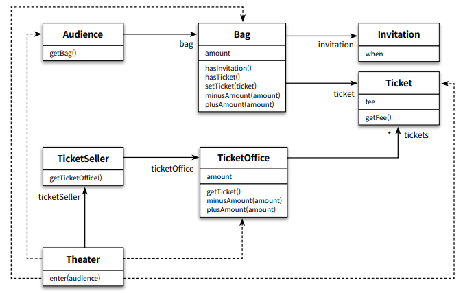
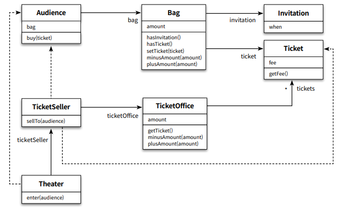

## 객체지향 Chap1

본 글은 오브젝트(조영호) 를 읽고 정리한 글입니다. 객체지향이 무엇인가? 에 대해
자세히 알고싶어서 책을 읽고 기억하기 위해 기록한다. 이번 글에서는 Chapter1- 객체, 설계를
읽고 객체지향 답게 개발하는게 무엇이지, 그리고 제 나름대로 스프링에서 어떻게 적용할지에 대해 정리해보았다.

## 의존성이 높은 코드

이 책은 코드를 예시로 들어 설명을 해준다. 구현해야할 코드는 다음과 같았다.

1. 극장(Theater)에서는 공연을 한다.
2. 이벤트로 이벤트에 당첨된 사람(Audience)들은 초대장(Invitation)을 가지고가면 무료로 표(Ticket)를 받으며, 그렇지 않은 사람(Audience)들은 표(Ticket)를 구매해서 본다.
3. 사람(Audience)들은 가방(Bag)을 들고다니며, 가방(Bag)에 초대장(Invitation)을 들고다닌다.
4. 극장(Theater)입장전 사람(Audience)들은 판매원(TicketSeller)을 거친다.
5. 판매원(TicketSeller)은 초대장(Invitation)또는 돈을 이용해 매표소(TicketOffice)에서 표(Ticket)로 교환한다.



그리고 절차지향적으로 구현된 Theater 클래스는 다음과 같다.

```java
public class Theater {
    
    private TicketSeller ticketSeller;
    
    public Theater(TicketSeller ticketSeller) {
        this.ticketSeller = ticketSeller;
    }
    
    public void enter(Audience audience) {
        if (audience.getBag().hasInvitation()) { // Theater -> Audience, Bag
            Ticket ticket = ticketSeller.getTicketOffice().getTicket(); // Theater -> TicketSeller, TicketOffice, Ticket
            audience.getBag().setTicket(ticket); // Theater -> Audience, Bag
        } else {
            Ticket ticket = ticketSeller.getTicketOffice().getTicket(); // Theater -> TicketSeller, TicketOffice, Ticket
            audience.getBag().minusAmount(ticket.getFee()); // Theater -> Audience, Bag, Ticket
            ticketSeller.getTicketOffice().plusAmount(ticket.getFee()); // Theater -> TicketSeller, TicketOffice, Ticket
            audience.getBag().setTicket(ticket); // Theater -> Audience, Bag, Ticket
        }
    }
}
```

사람들이 입장하는 `enter` 에 대해 주석으로 라인마다 의존성을 표시해봤다.
여기서 Theater 는 직접적이든 간접적이든 Audience, Bag, TicketSeller, TicketOffice, Ticket 에 대해 의존성을 가지고있다.
의존성이 높다는 것은 **복잡도(Coupling)**가 높다는 뜻이며 이는 변경에 매우 취약하다. 예를 들어 Bag 이라는 클래스가 없어지고
Wallet 이라는 클래스로 바뀌면 Theater 에서 수정이 일어나게된다. 사람들이 가방을 안사용하고 지갑을 사용한다고해서 극장이
바뀌는것이 좋은 코드인가? 이렇게 변경에 취약한것은 객체지향의 OCP, DIP 를 위반한다.

```
OCP : 모듈(Theater)은 변경에는 닫혀 있어야한다.
DIP : 상위 모듈은(Theater) 변화에 취약한 하위모듈(Bag)에 의존하면 안된다.
```

## 객체를 객체스럽게 개발하자

처음 제시한 코드는 Theater 에게 너무나도 많은 책임을 부여해줬다. 극장에서 손님의 가방에 초대장이있는지 확인하고,
극장에서 판매원의 매표소에서 티켓을 가져오고, 극장에서 손님의 가방에 티켓을 넣어준다.

이는 객체스럽지 못하다. 극장에서 손님 가방을 뒤지는게 아니라 손님 스스로 가방에 초대장이 있는지 확인하는 것이 좀 더 객체스럽다.
그리고 좀 더 객체스럽게 한다면, 가방 스스로 초대장이 있는지 확인하는게 더 객체스럽다. 물론 가방이라는건 현실에서 스스로 내용물을
확인하지 못하지만, 컴퓨터의 세상에는 자율성을 가질 수 있다! 이를 **의인화**라고 한다.

이렇게 객체들에서 자율성을 가지게 만들면 다음과 같다.



```java
public class Theater {
    
    private TicketSeller ticketSeller;
    
    public Theater(TicketSeller ticketSeller) {
        this.ticketSeller = ticketSeller;
    }
    
    public void enter(Audience audience) {
        ticketSeller.sellTo(audience); // Theater -> TicketSeller, Audience
    }
}
```

이제 Theater 는 TicketSeller 와 Audience 에게만 의존성을 가진다. 손님이 알아서 가방을 뒤지고, 가방이 알아서 초대장을 확인한다.
판매원도 알아서 매표소에서 티켓을 교환한다. 극장이 가지고 있던 많은 책임들을 적절하게 분배시켰다. 이로써 Theater 는 다른 객체와의
의존성이 줄어들고 **복잡도**가 줄어들었다.

## Trade-off

물론 극장의 책임을 다른 객체가 가져간것이기 때문에 오히려 TicketSeller 는 처음보다 다른 객체와의 **의존성**이 늘어났다.
처음에 TicketSeller 는 TicketOffice 에만 의존했지만 여기서는 TicketOffice, Audience, Ticket 에 의존한다.

객체에 자율성을 부여한다고해서 모든 의존성을 제거할 수 있는게 아니다! TicketSeller 처럼 **의존성**이 새로 생겨날 수 있다.
하지만 전체적으로 봤을때, Theater 의 의존성이 5->2 개로 줄어들고, TicketSeller 의 의존성은 1->3 이 됬으니 **복잡도**가 낮아졌다.
그리고 객체 스스로가 객체스러운 일을 함으로써 **응집도**도 높였다. 응집도를 높임으로써 이해하기 쉬운코드가 된다.

하지만 항상 객체에 자율성을 부여해 **응집도를 높이는게 복잡도가 줄어드는 결과로 이어지는것은 아니다.**
TicketSeller 의 경우 응집도도 높이고 복잡도도 줄었지만, **응집도를 높이는 대신 복잡도가 높아지는 경우도 있다.**
이런 경우가 있다면 유연하게 Trade-off 를 하여 선택해야한다. 응집도를 선택할지, 복잡도를 선택할지 무엇이
더 좋을지는 상황에 따라 다를것이기 때문이다. 설계에 항상 정답은 없다.

## Spring 에서 적용한다면

Spring 에서는 비즈니스 로직처리에 대해 2가지가 존재한다. 하나는 Service 단에서 처리하는 트랜잭션 스크립트 패턴이다.
그리고 다른하나는 엔티티에서 처리하는 도메인 모델 패턴(DDD)이다. Object chap 1 을 읽고 떠오른게 바로 DDD 이다.

DDD 에서는 비즈니스 로직은 엔티티에서 처리하며, Service 는 트랜잭션, 도메인 간에 순서를 보장해주는 역할을 한다.

```java
public class TheaterService {
    
    ...
    
    @Transactional
    public void enter(Long audienceId, Long ticketSellerId) {
        TicketSeller ticketSeller = ticketSellerRepository.findById(ticketSellerId);
        Audience audience = audienceRepository.findById(audienceId);
        
        ticketSeller.sellTo(audience); // Theater -> TicketSeller, Audience
    }
}
```

예제를 Spring 에서 적용한다면 Theater 의 Service 는 이렇게 구성될거라 생각한다.
TheaterController 에서 Audience 와 TicketSeller 를 DTO 를 받고 id 를 TheaterService 에 넘겨줄것이다.
그러면 TheaterService 에서 id 를 이용해 Audience 와 TicketSeller 엔티티를 각각의 Repository 를 이용해 가져온다.
마지막으로 ticketSeller 객체에 audience 객체를 넘겨줌으로써 완성된다.

여기서 Service 는 비즈니스 로직을 처리하지 않는다.
DB에서 엔티티를 채워주는 @Transactional 처리를 하고 도메인의 비즈니스로직을 호출했을 뿐이다.

## 스터디 결과

DKDK

## Reference

[http://gnujava.com/board/article_view.jsp?article_no=8641&menu_cd=58&idx_notice=NOTICE_FLAG+DESC%2C&board_no=37](http://gnujava.com/board/article_view.jsp?article_no=8641&menu_cd=58&idx_notice=NOTICE_FLAG+DESC%2C&board_no=37)  
[https://happycloud-lee.tistory.com/94](https://happycloud-lee.tistory.com/94)  
