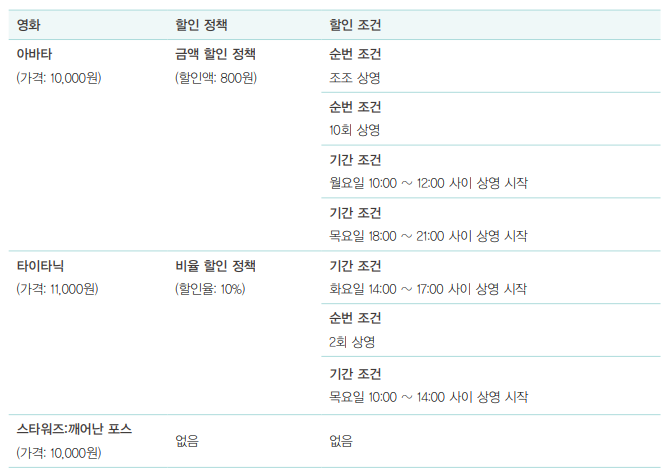
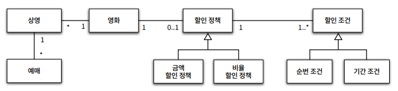
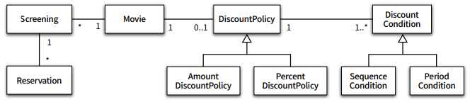
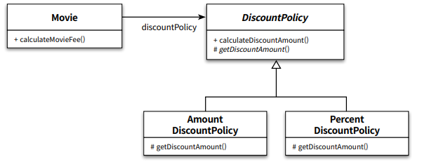
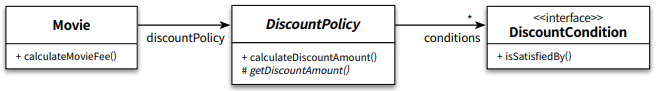
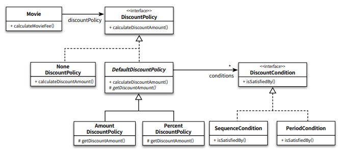

## 객체지향 Chap2

본 글은 오브젝트(조영호) 를 읽고 정리한 글이다. 객체지향이 무엇인가? 에 대해
자세히 알고싶어서 책을 읽고 기억하기 위해 기록한다. 이번 글에서는 Chapter2- 객체지향 프로그래밍를
읽고 정리해보았다.

## 캡슐화와 접근제어

```
데이터와 기능을 객체 내부로 함께 묶는 것
```

캡슐화와 함께 객체를 좀 더 자율적인 존재로 만들기위해
외부에서의 접근을 통제하는 **접근제어** 메커니즘을 제공한다. 접근제어를
위해 **접근수정자**(ex : private, public protected) 를 제공한다.
접근제어를 통해 객체에대한 외부의 간섭을 최소화하여 객체는 자율적인 존재가 된다.

이렇게 캡슐화와 접근제어를 통해 객체를 외부에서 접근가능한 부분(public interface)
와 내부에서만 접근가능한 부분(implementation) 으로 나누어진다. 두 부분으로
나눔으로써 implementation 부분은 외부에 영향을 끼치지 않음으로 자유롭게 구현이 가능하다.

## 코드 예제

### 요구사항

1. 특정시간에 상영되는 영화를 예매한다.
2. 요금을 할인 받을 수 있으며, 할인을 결정하는 할인조건이 있다.
3. 할인 조건에는 상영 순번을 이용해 할인 여부를 결정하는 순번조건, 상영 시작 시간을 이용해 할인 여부를 결정하는 기간조건이 있다.
4. 할인을 받을때 할인 정책에 따라 할인을 받는다.
5. 할인정책에는 절대적인 금액을 할인해주는 금액 할인 정책, 퍼센트만큼 금액을 할인해주는 비율 할인 정책이 있다. 



### 영화 예매 도메인에서 타입 구조



### 클래스 구조



## 컴파일 시간 의존성과 실행 시간 의존성

```java
public class Movie {
    private String title;
    private Duration runningTime;
    private Money fee;
    private DiscountPolicy discountPolicy;
    
    public Movie(String title, Duration runningTime, Money fee, DiscountPolicy discountPolicy) {
        this.title = title;
        this.runningTime = runningTime;
        this.fee = fee;
        this.discountPolicy = discountPolicy;
    }
    
    public Money getFee() {
        return fee;
    }
    
    public Money calculateMovieFee(Screening screening) {
        return fee.minus(discountPolicy.calculateDiscountAmount(screening));
    }
}
```

```java
public abstract class DiscountPolicy {
    private List<DiscountCondition> conditions = new ArrayList<>();
        public DiscountPolicy(DiscountCondition ... conditions) {
        this.conditions = Arrays.asList(conditions);
    }
    
    public Money calculateDiscountAmount(Screening screening) {
        for(DiscountCondition each : conditions) {
            if (each.isSatisfiedBy(screening)) {
                return getDiscountAmount(screening);
            }
        }
        
        return Money.ZERO;
    }
    
    abstract protected Money getDiscountAmount(Screening Screening);
}
```

```java
public class AmountDiscountPolicy extends DiscountPolicy {
    private Money discountAmount;
    
    public AmountDiscountPolicy(Money discountAmount, DiscountCondition ... conditions) {
        super(conditions);
        this.discountAmount = discountAmount;
    }
    
    @Override
    protected Money getDiscountAmount(Screening screening) {
        return discountAmount;
    }
}

public class PercentDiscountPolicy extends DiscountPolicy {
    private double percent;
    public PercentDiscountPolicy(double percent, DiscountCondition ... conditions) {
        super(conditions);
        this.percent = percent;
    }
    
    @Override
    protected Money getDiscountAmount(Screening screening) {
        return screening.getMovieFee().times(percent);
    }
}
```

여기서 `Movie` 클래스는 할인 정책이 금액 할인 정책인지, 비율 할인 정책인지 판단하지 않는다.
그 판단은 DiscountPolicy 가 하는데 이는 상속과 다형성을 가지기에 할 수 있는일이다.



`Movie` 는 오직 `DiscountPolicy` 하고만 연결되어있으며 `AmountDiscountPolicy`
와 `PercentDiscountPolicy` 는 연결되어 있지 않다. 

현재 컴파일 시간에서 의존성은 `Movie -> DiscountPolicy` 이다. 하지만 여러분이
`Movie` 객체를 만들려고 한다면 다음과 같은 코드를 짜야될것이다.

```java
Movie titanic = new Movie("타이타닉",
    Duration.ofMinutes(180),
    Money.wons(11000),
    new PercentDiscountPolicy(0.1,
    new PeriodCondition(DayOfWeek.TUESDAY, LocalTime.of(14, 0), LocalTime.of(16, 59)),
    new SequenceCondition(2),
    new PeriodCondition(DayOfWeek.THURSDAY, LocalTime.of(10, 0), LocalTime.of(13, 59))))
```

`Movie` 객체를 만들기위해서 이름, 시간, 가격, 할인정책을 넣어준다. 그리고
할인정책을 무엇을 선택하냐에 따라 `PercentDiscountPolicy` 또는 `AmountDiscountPolicy` 를 넣어준다.
그리고 실행을 하고나서야 선택한 할인정책이 생성된다.
그렇다! 실행시점이 되서야 `Movie` 가 구체적으로 무슨 할인정책을 의존할지 결정이 되는것이다.

컴파일시간에서의 의존성과 실행시간에서의 의존성이 서로 다르다.

### Trade-off

컴파일시간 의존성과 실행 시간 의존성이 다르면 코드를 유연하고 확장성 있게 작성할 수 있다.
컴파일에서는 오직 `Movie` 는 `DiscountPolicy` 만 의존했지만, 
실행시간에서는 `Movie` 는 `AmountDiscountPolicy`, `PercentDiscountPolicy` 둘 다 의존이
가능했다. 

하지만 반드시 좋다는게 아니다. 시점에 따라 의존성이 다르다는것은 혼란을 야기하고 이는 곧
이해하기 어려운 코드가 된다는 뜻이다. 이해뿐만 아니라 디버깅도 힘들어진다.
그러니 유연성과 가독성 중 무엇을 선택할지는 Trade-off 로 남는것이다.


## 메시지와 메서드

메시지와 메서드는 다르다!
객체는 다른 객체에게 어떤 행동을 수행하도록 메시지를 전송한다. 메시지를 수신한 객체는
응답을 해주기위하여 메시지를 메서드로 처리한다! 

위에서 `Movie`는 금액을 계산하기위해 `calculateDiscountAmount` 메시지를 `DiscountPolicy`
에게 보냈다. 메시지를 받은 `DiscountPolicy` 가 이것을 `AmountDiscountPolicy` 의
메서드로 처리할지 `PercentDiscountPolicy` 의 메서드로 처리할지는 실행시점에
결정된다. 

### 다형성

메시지를 클래스가 받아서 어떤 메서드로 처리할지는 수신하는 객체의 클래스가 다른것은 **다형성**
이라고 한다. 다형성을 구현한다는것은, 응답해줄 메서드가 실행 시점에 결정된다. 메시지와
메서드가 실행시점에 바인딩하는것을 동적바인딩이라고 부른다.

### 추상화

`AmountDiscountPolicy` 와 `PercentDiscountPolicy` 는 구체적인 할인 정책이지만,
`DiscountPolicy` 는 구체적인 할인 정책을 가지고 있지 않는다. 그래서 `DiscountPolicy` 를
추상적이라고 표현한다. 추상화해서 구조를 표현할수록 문제를 큰 단위로 표현할 수 있고,
설계가 더 유연해진다.



위 구조는 자식클래스를 다 없애고 추상화의 계층만 그렸다. 세부적인 내용을 적지 않았기에
훨씬 간결해보인다. 세부적인 내용만 적지않았을뿐 중요한 상위개념은 존재하므로 충분히 구조에대한
설명이 가능하다.

## 상속과 인터페이스 Trade-off

이 책에서는 `Movie` 의 할인정책이 없을경우에 대한 설명도 나온다. 할인정책이 없을경우
`DiscountPolicy` 를 상속받는 `NoneDiscountPolicy` 를 만드는것이다. 하지만
`DiscountPolicy` 의 코드를 보면 할인 조건이 없는 경우에 애초에 `calculateMovieFee` 를
호출하지 않고 `Money.ZERO` 를 반환하기에 `NoneDiscountPolicy` 의 `getDiscountAmount()` 를
호출할 일이 없다. 그래서 이를 해결하기위해 `DiscountPolicy` 를 인터페이스로 바꿔서 이 문제를
해결하였다.



```java
public interface DiscountPolicy {
    Money calculateDiscountAmount(Screening screening);
}
```

`DiscountPolicy` 가 인터페이스로 변경되고 이를 상속받는 `NoneDiscountPolicy` 와 `DefaultDiscountPolicy` 를 만들어서
할인조건이 없을경우 `NoneDiscountPolicy` 인스턴스생성된 경우에는 `calculateMovieFee` 함수를 호출안하고 바로 `NoneDiscountPolicy`
가 호출되도록 했다.

하지만 오히려 구조가 더 복잡해지고, 변경전의 `NoneDisocuntPolicy` 클래스도 할인금액이 0원이라는
사실을 효과적으로 전달했다. 그렇기에 이 또한 Trade-off 가 된다고 설명을 하였다.

## 합성

합성은 `Movie` 가 `DiscountPolicy` 의 코드를 사용하는것처럼, DiscountPolicy 가 제공하는
메서드만 이용하는 것이다. 이는 상속의 가지는 두 가지 문제점을 해결한다. 첫째는 인터페이스에
정의된 메시지를 통해서만 재사용이 가능하기 때문에 구현을 효과적으로 캡슐화할 수 있다. 둘째는
상속은 클래스를 통해 강하게 결합되지만 합성은 메시지를 통해 느슨하게 결합된다.

하지만 상속이 안좋다는게 아니다. 상속을 사용하면 다형성의 혜택을 누릴 수 있다.
그러니 합성과 상속이 적절히 사용하는게 좋다.

## 후기

이번 챕터에서는 추상화, 다형성, 상속을 중심으로 다루었다. 그리고 상속은 컴파일 시간 의존성과 실행 시간 의존성이
다르고 이로인하여 Trade-off 를 고려해야한다. 서로 다른 의존성은 유연함을 주지만, 가독성이 떨어지기 때문이다.
그리고 자바에서의 상속과 인터페이스간에 Trade-off 도 존재하였다.

## 스터디 결과


