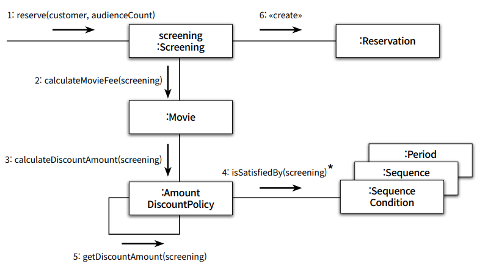

## 객체지향 Chap3

본 글은 오브젝트(조영호) 를 읽고 정리한 글이다. 객체지향이 무엇인가? 에 대해
자세히 알고싶어서 책을 읽고 기억하기 위해 기록한다. 이번 글에서는 Chapter3 역찰, 책임, 협력를
읽고 정리해보았다.

## 역할, 책임, 협력

객체지향 패러다임 관점에서 가장 중요한것은 역할, 책임, 협력이다.
지금까지 배운 클래스, 상속, 지연바이딩은 구역측면일뿐, 객체지향 패러다임은 아니다.

객체지향 설계의 핵심은 협력을 구성하기 위해 적절한 객체를 찾고 적절한 책임을
할당하는 과정에서 나온다.



Chapter 2 에서한 영화예매 시스템을 보면 애플리케이션의 제어흐름이 하나의 객체에의해
통제도지 않고 다양한 객체들 사이에 균형있게 분배되어있다. 이는 객체지향 원칙을
잘 따른다고 할 수 있다.

## 협력

```
객체들이 애플리케이션 기능을 구현하기 위해 수행하는 상호작용
```

객체지향 시스템은 자율적인 객체들의 공동체이다. 그래서 객체하나로써 기능을 수행할 수 없다면,
다른 객체와의 협력을 통해 기능을 수행할 수 있다. 그리고 협력의 수단이 메시지 전송이다.

객체 스스로가 요청한 기능을 수행할 수 없다고 그 객체가 해당 기능을 다 할 수 있게 만드는게 아니다. 
다른객체에 메시지를 보내서 협력을 요청하면 되는것이다. 협력을 보내서 해결할 수 있는
구조를 만들기위해서 객체들의 자율성을 높이고, 객체들 자율적으로 만드는 구현 방법이
캡슐화이다.

**협력이 행동을 결정하고 행동은 상태를 결정한다.**
이전에 `Movie` 라는 객체는 영화를 상영하는 로직은 어디에도 없다.
`Movie` 는 영화요금을 계산하는 로직을 가졌다. 그 이유는 
영화를 예매하기위해서 `Movie` 에게 요청된 협력은 요금을 계산하는 책임이기 때문이다.
객체가 무슨 행동을 할지는 어떤 협력을 하고있는지이다. 그리고 객체가
행동할 때 필요한 정보(상태)가 무엇인지로 결정된다. 
협력이 결과적으로 행동을 정하고, 행동을 상태를 정하게 된다.
그래서 객체를 설계할때 협력은 문맥(Context) 를 제공한다.

### 메시지가 객체를 결정한다

협력은 행동을 결정한다. 그리고 협력은 메시지로 이루고지고, 메시지는 객체를 결정한다.
메시지가 객체를 선택해야하는 이유는 두 가지가 있다.
- 객체가 최소한의 인터페이스를 가질 수 있다.
- 객체는 충분히 추상적인 인터페이스를 가질 수 있다.

객체의 구체적인 부분을 구현하지않고, 추상적으로 봄으로써 최소한의 인터페이스만으로
설계할 수 있다.

### 행동이 상태를 결정한다

객체는 협력에 참여하기위해 존재한다. 그리고 협력하기위해 객체는 행동한다.
그리고 행동하기위해 상태가 결정되어야 한다. 상태는 단순히 객체가 행동을
정상적으로 수행할 수 있게 하기위한 재료일 뿐이다.

## 책임 

```
객체가 협력에 참여하기 위해 수행하는 행동
```

객체의 책임은 크게 하는것(doing) 과 아는것(knowing) 으로 나눈다.
하는것은 객체 스스로 기능 할 수 있는것, 아는 것은 그 기능을 수행하기위해 알아야 되는것이다.
예를 들어 `Movie` 객체는 예매 가격을 계산할 책임(하는 것)을 가졌다. 그리고 가격과
어떤 할인 정책이 적용됐는지 알고있어야(아는 것) 한다.

객체는 무엇을 알아야 되는가?
- 객체는 자신이 맡은 책임을 수행하는데 있어 필요한 정보를 알고있어야 한다. 
- 만약 자신이 할 수 없는 작업이라면 그 작업을 협력해줄 객체를 알고 있어야 한다.

### 책임할당

자율적인 객체를 만든 가장 기본적인 방법은 책임을 수행하는데 필요한 정보를
가장 잘 알고있는 전문가에게 그 책임을 할당한다. 이를 정보전문가 패턴이라고 한다.

책임할당을 위해서 먼저 협력을 위한 메시지를 정의하고 이를 출발점으로, 협력에 필요한 정보를
잘 알고있는 정보전문가(객체)를 정하고,
해당 객체가 또 협력이 필요하다면 협력을 위한 메시지를 정의하고를 반복한다. 이처럼
협력을 위한 메시지 정의 -> 객체 선정을 반복하는 과정으로 책임할당이 이루어진다.

물론 이게 전부는 아니며, 응집도와 결합도의 관점에서 다른 객체에게 책임을 할당할 수 도 있다.

위의 책임할당 방식으로 설계하는 방법을 책임주도설계(Responsibility-Driven Design, RDD)
라고 한다.
- 시스템이 사용자에게 제공해야 하는 기능인 시스템 책임을 파악한다.
- 시스템 책임을 더 작은 책임으로 분할한다.
- 분할된 책임을 수행할 수 있는 적절한 객체 또는 역할을 찾아 책임을 할당한다.
- 객체가 책임을 수행하는 도중 다른 객체의 도움이 필요한 경우 이를 책임질 적절한 객체 또는 역할을 찾는다.
- 해당 객체 또는 여갈에게 책임을 할당함으로써 두 객체가 협력하게 된다.

## 역할 

```
객체들이 협력안에서 수행하는 책임들이 모여 객체가 수행하는 역할
```

사실 `Screening` 객체가 `Movie` 에게 "가격을 계산하라" 라는 메시지로 협력을
요청할때, 바로 `Movie` 인스턴스를 고르는것이 아니라 역할에 관해 먼저
고민하고 역할을 수행할 객체로 `Movie` 를 고른 것이다.
이 차이가 무엇을 말하는가?

`Movie` 객체는 이후 할인 정책을 적용하기위해 "할인 요금을 계산하라" 라는 메시지를
보낸다. 그리고 해당 메시지에 협력할 객체로 바로 `AmountDiscountPolicy` 나
`PercentDisocuntPolicy` 로 객체를 고른다면 코드의 중복이 일어난다.
그러니 객체가 아닌 책임에 초점을 맞추는것이다. 책임을 초점으로 "할인 요금 계산" 에
대해서 수행할 **객체가 아닌 역할**을 찾는것이다. 그래서 역할을 찾고,
해당 역할을 수행할 `DiscountPolicy` 를
둘 수 있는것이다.

그런데, 처음에 `Screening` 에 협력할 객체를 찾을 후보는 `Movie` 단
한 개 였다. 그럼 후보가 하나일때는 역할을 고려할 필요가 없는게 아닌가?

맞다! 사실 후보가 하나면 그 후보는 객체가 된다. 후보가 둘 이상이라면 객체가
아닌 역할이라고 부르는 것이다.

### 실제 설계

설계 초반에는 대부분 어떤게 역할이고 어떤게 객체일지 결정을 내리는건 쉽지 않다.
이럴때는 적절한 책임과 협력의 큰 그림을 탐색하는 것이 가장 중요한 목표여야하고,
역할과 객체를 명확히 구분하는게 중요하지 않다는것이다. 그러니 애매하면 단순히
객체로 시작해 반복적으로 책임과 협력을 정제해가면서 필요한 순간에 객체로부터
역할을 분리해나가면 된다. 설계 초반에 중요한것은 협력을 위해 어떤 책임이
필요한지 아는게 더 중요하다.

### 역할의 추상화

역할은 객체의 종류를 숨기고 추상화된 관점에서 볼 수 있게한다. 추상화의 장점은
상위 수준의 정책을 쉽고 간단하게 표현할 수 있다. 그리고 세부사항을 숨기고 핵심적인
개념만 강조한다.

### 객체는 다양한 역할을 가진다

객체는 다양한 역할을 가질 수 있다. 하지면 협력에 참여할 때는 협력 안에서
하나의 역할로 보여진다. 예를 들어 `Movie` 는 `Screening` 에서 "요금 계산"
을 하기위한 역할로써 선정되어 "요금 계산" 책임을 가졌다.
하지만 `Review` 라는 객체가 "평점 계산" 이라는 협력을 할 역할을 찾을 때
`Movie` 가 그 역할을 수행할 행동이 있다면 `Movie` 가 그 책임을 맡음으로써
"요금 계산" 이외에도 "평점 계산" 역할을 수행할 수 있는것이다.
그렇지만 "요금 계산" 은 `Screening` 협력에서의 하나의 역할로 보여지고,
"평점 계산" 은 `Review` 협력에서의 하나의 역할로 보여진다.