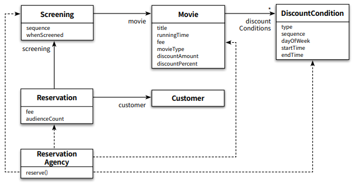
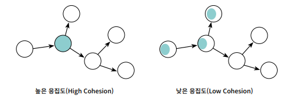
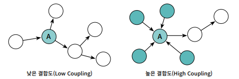
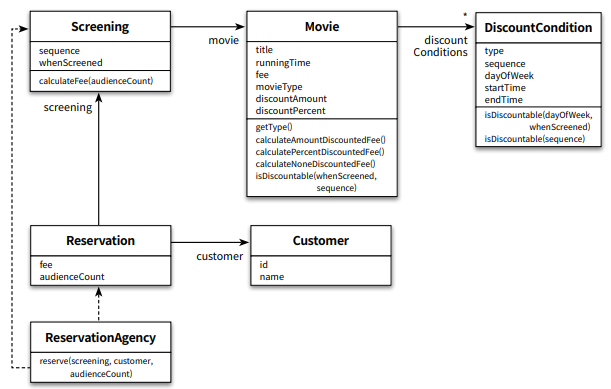

## 객체지향 Chap4

본 글은 오브젝트(조영호) 를 읽고 정리한 글이다. 객체지향이 무엇인가? 에 대해
자세히 알고싶어서 책을 읽고 기억하기 위해 기록한다. 이번 글에서는 Chapter4 설계 품질과 트레이드오프를
읽고 정리해보았다.

## 설계

책임 주도 설계를 할 때, 가장 중요한 것은 책임이다. 책임은 응집도와 결합도하고 깊이 연관되어있다. 
책임을 중심으로 설계를 하기위해선, 객체의 상태가 아닌 객체의 행동에 초점을 맞추어야 한다.
해당 챕터에서는 좋은예시와 나쁜예시 비교를 통해 이해를 쉽게 하고자 한다. 그래서 나쁜예시로
객체의 상태를 초점으로 맞춘 설계는 어떤지 살펴보겠다.

## 상태의 초점을 맞춘 설계

데이터 중심 설계로 데이터를 먼저 준비해보자.

```java
public class Movie {
    
    private String title;
    private Duration runningTime;
    private Money fee;
    private List<DiscountCondition> discountConditions;
    
    private MovieType movieType; // AMOUNT_DISCOUNT, PERCENT_DISCOUNT, NONE_DISCOUNT
    private Money discountAmount;
    private double discountPercent;
    
}
```

`Movie` 에 대해 데이터를 먼저 준비해보니 전과 다른점이 있다. 할인조건인 `discountConditions` 가 인스턴스 변수로 `Movie` 안에
포함되어있다. 그리고 할인정책이 금액 할인 정책 `discountAmount` 와 비율 할인 정책 `discountPercent` 가 포함되어있다. 그리고
영화에 사용될 할인 정책 종류를 결정하기위해 `movieType` 도 추가되었다. 데이터 중심 설계에서는 객체가 포함해야 하는 데이터에 집중하기 때문이다.
그렇기에 `Movie` 에서 요금을 계산하기위해서는 해당 필드들이 전부 있어야 계산이 가능하다.

이 외에도 `Screening` `DiscountCondition` `Reservation` `Customer` 각 클래스가
상태를 포함해서 구현되어있다. 그리고 각 상태에대해 접근할 수 있도록 `get` `set` 메소드가 있다.

그리고 최종적으로 `ReservationAgency` 클래스를 통해 영화예매를 한다.

```java
public class ReservationAgency {
    
    public Reservation reserve(Screening screening, Customer customer, int audienceCount) {
        
        Movie movie = screening.getMovie();
        boolean discountable = false;
        
        for(DiscountCondition condition : movie.getDiscountConditions()) {
            if (condition.getType() == DiscountConditionType.PERIOD) {
                discountable = screening.getWhenScreened().getDayOfWeek().equals(condition.getDayOfWeek()) &&
                condition.getStartTime().compareTo(screening.getWhenScreened().toLocalTime()) <= 0 &&
                condition.getEndTime().compareTo(screening.getWhenScreened().toLocalTime()) >= 0;
            } else {
                discountable = condition.getSequence() == screening.getSequence();
            }
            if (discountable) {
                break;
            }
        }
        
        Money fee;
        if (discountable) {
            Money discountAmount = Money.ZERO;
            switch(movie.getMovieType()) {
                
                case AMOUNT_DISCOUNT:
                    discountAmount = movie.getDiscountAmount();
                    break;
                case PERCENT_DISCOUNT:
                    discountAmount = movie.getFee().times(movie.getDiscountPercent());
                    break;
                case NONE_DISCOUNT:
                    discountAmount = Money.ZERO;
                    break;
            }
            fee = movie.getFee().minus(discountAmount);
        } else {
            fee = movie.getFee();
        }
        return new Reservation(customer, screening, fee, audienceCount);
    }
}
```



`ReservationAgency` 클래스와 클래스다이어그램을 보면 1챕터의 예제가 생각나지 않는가?
객체의 상태의 초점을 맞추다보니, 객체의 자율성을 배제하고 객체는 스스로 하는것없이 단순히 데이터만 가지고있다.
그리고 `ReservationAgency` 에서 각 객체에 필요한 데이터에 접근해서 가져와 영화예매에 필요한 로직을 수행하고있다.

이렇게하는게 별로인가? 에 대해 설계관점에서 분석을 해보겠다. 좋은 설계인지 판단하기 위한 기준으로 캡슐화, 응집도, 결합도를
사용한다.

## 캡슐화

> 캡슐화란 변경 가능성이 높은 부분을 객체 내부로 숨기는 추상화 기법

객체지향에서는 캡슐화를 이용해 변경에 대한 파급효과를 조절할 수 있다. 변경가능성이 높은 부분(구현)은 내부에 숨기고,
외부에는 안정적인 부분(인터페이스)만 공개한다. 이렇게 변경될 수 있는것을 캡슐화하면 유지보수성이 올라간다. 
캡슐화가 잘되어있다면 다른 시스템에서 변경으로인해 아무런 영향이 없기때문에 마음편히 수정해도되기 때문이다.
캡슐화를 잘 지키면 자연스럽게 응집도는 높아지고 결합도는 낮아진다.

## 응집도와 결합도

> 응집도는 모뮬에 포함된 내부 요소들이 연관돼 있는 정도

모듈 내의 요소들이 하나의 목적을 위해 긴밀하게 협력한다면 그 모듈은 높은 응집도를 가진다.
반대로 모듈 내의 요소들이 서로 다른 목적을 추구한다면 그 모듈은 낮은 응집도를 가진다.

응집도는 변경이 발생할 때 모듈 내부에서 발생하는 변경의 정도로 측정할 수 있다.
높은 응집도를 가지는 모듈일수록, 수정 사항이 발생하면 **해당 모듈** 만 변경하고 다른 모듈을 수정하지 않는다.
따라서 응집도가 높으면 변경 대상과 범위가 명확해지기에 코드를 변경하기쉽다.



> 결합도는 의존성의 정도를 나타내며 다른 모듈에 대해 얼마나 많은 지식을 갖고 있는지 나타내는 척도

어떤 모듈이 다른 모듈에 대해 너무 자세한 부분까지 알고있다면 두 모듈은 높은 결합도를 가진다. 반대로
어떤 모듈이 다른 모듈에 대해 필요한 지식만 알고있다면 두 모듈은 낮은 결합도를 가진다.

결합도는 한 모듈이 변경되기 위해서 다른 모듈의 변경을 요구하는 정도롤 측정할 수 있다.
높은 결합도를 가지는 모듈일수록, 수정 사항이 발생해서 해당 모듈을 변경했을때 추가로 변경해야하는
모듈이 적다. 



영향을 받는 모듈의 수뿐만 아니라 변경의 원인또한 결합도의 개념에 포함된다.
내부 구현을 변경했을 때 이것이 다른 모듈에 영향을 미치는 경우에는 두 모듈 사이의 결합도가 높다.
하지만 퍼블릭 인터페이스를 수정했을 때만 다른 모듈에 영향을 미치는 경우에는 결합도가 낮다.
따라서 클래스 구현이 아닌 인터페이스에 의존하도록 코드를 작성해야 한다.

하지만 결합도가 높아도 상관없는 모듈이있다. 변경될 확률이 거의없는 경우이다. 
표준 라이브러러리 또는 성숙 단계에 접어든 프레임워크에 의존하는 경우가 여기에 속한다.
예로는 JAVA 에서 `String`, `ArrayList` 가 있다.

## 문제점

데이터 중심 설계는 캡슐화 위반, 높은 결합도, 낮은 응집도를 가진다는 문제가 있다.

### 캡슐화 위반

```java
public class Movie {
    private Money fee;
    public Money getFee() {
        return fee;
    }
    public void setFee(Money fee) {
        this.fee = fee;
    }
}
```

데이터 중심 설계에서는 각 객체에 대해 `get` `set` 메소드를 이용해 내부상태를 접근할 수 있도록 했다.
하지만 `getFee` 와 `setFee` 는 `Movie` 객체 내부에 `fee` 라는 인스턴스 변수가 존재한다는 사실을
들어낸다. 내부구현을 인터페이스로 만들었기 때문이다.

근본적으로 캡슐화를 어기게 된 원인은 설계를할 때, 객체가 `Movie` 가 수행할 책임이 아닌 내부의 저장할
데이터에 초점을 맞추었기 때문이다. 구현을 캡슐화할려면 협력이라는 문맥을 고려할 때만 얻을 수 있다.
협력을 고려하지 않고 설계를 하면 캡슐화를 위반하는 과도한 접근자와 수정자를 가지게 된다.

### 높은 결합도

내부구현을 인터페이스로 만들면 클라이언트가 구현에 강하게 결합이된다. 따라서
객체의 내부 구현을 변경했는데, 이 인터페이스에 의존하는 모든 클라이언트들도 변경해야된다.

`ReservationAgency` 에서는 예매요금 계산을 위해 `Movie`의 `getFee` 메소르를 호출해 계산된 결과를
`Money` 타입의 `fee` 에 저장한다. 여기서 `Movie` 의 `fee` 의 타입을 변경한다면 `getFee` 메소드의
반환타입도 수정하고 `Reservation` 의 `fee` 도 수정되야한다.
`getFee` 나 `setFee` 를 사용한다면 `fee` 는 private 가닌 public 이나 다름없다.

현재 `ReservationAgency` 은 `Screening` `Movie` `Reservation` `DiscountCondition`
클래스의 변수에 대해 접근하고 있다. 해당 객체에서 변경이 발생하면 `ReservationAgency`
도 변경을 해야한다.

### 낮은 응집도

현재 `ReservationAgency` 는 다음과 같은 수정사항이 발생하면 수정이 필요하다.
- 할인 정책이 추가될 경우 => `ReservationAgency` 안에는 할인정책을 선택하는 코드와
할인 조건을 판단하는 코드가 함께 존재하기 때문에 새로운 할인정책을 추가하는 작업이
할인조건에도 영향을 미칠 수 있다. 현재 새로운 할인 정책을 추가하기위해선
`MovieType` `ReservationAgency` `Movie` 를 수정해야한다.
- 할인 정책별로 할인 요금을 계산하는 방법이 변경될 경우 => `ReservationAgency` 에서 계산 방법을 수정해야한다.
- 할인 조건이 추가되는 경우 => `DiscountConditionType` `ReservationAgency` 수정이 필요해진다.
- 할인 조건별로 할인 여부를 판단하는 방법이 변경될 경우 => `ReservationAgency` 에서 판단 방법이 수정되야한다.

낮은 응집도를 가졌기에 하나의 모듈을 수정하면 다른 모듈도 추가로 수정을 해야한다.
이는 SOLID 의 단일책임원칙(Single Responsibility Principle) 도 위배한다.
SRP 를 지킬려면 클래스는 단 한가지의 변경 이유만 가져야 한다. 지금 `ReservationAgency`
는 변경 이유를 너무나도 많이 가지고있다. 다른 객체의 수정이 일어나면 변경해야되니 말이다.

## 자율적인 객체를 향해

### 캡슐화

캡슐화를 지키지 않으면 코드의 중복이 발생하고, 변경에 취약하다. 그리고 이는
낮은 응집도와 높은 결합도로 이어진다.
캡슐화를 잘 지킨다면 높은 응집도와 낮은 결합도를 가질 수 있다. 그러기 위해선
다음과 같은 질문을 던져야 한다.

- 객체가 어떤 데이터를 포함해야 하는가?
- 객체가 데이터에 대해 수행해야 하는 오퍼레이션은 무엇인가?

포함해야할 데이터와 수행해야할 오퍼레이션을 생각해서 클래스를 바꿔보자

#### DiscountCondition

```java
public class DiscountCondition {

    private DiscountConditionType type;
    private int sequence;
    private DayOfWeek dayOfWeek;
    private LocalTime startTime;
    private LocalTime endTime;
    
    public DiscountConditionType getType() {
        return type;
    }
    
    public boolean isDiscountable(DayOfWeek dayOfWeek, LocalTime time) {
        if (type != DiscountConditionType.PERIOD) {
            throw new IllegalArgumentException();
        }
        return this.dayOfWeek.equals(dayOfWeek) &&
            this.startTime.compareTo(time) <= 0 &&
            this.endTime.compareTo(time) >= 0;
    }
    
    public boolean isDiscountable(int sequence) {
        
        if (type != DiscountConditionType.SEQUENCE) {
            throw new IllegalArgumentException();
        }
        
        return this.sequence == sequence;
    }
}
```

`DiscountCondition` 는 본인이 가진 데이터를 활용하여 할인여부를 판단할 수 있는
행동 `isDiscountable` 이 추가되었다.

<details>
<summary>캡슐화 위반</summary>

기간 조건을 판단하는 `isDiscountable(DayOfWeek dayOfWeek, LocalTime time)` 메서드의 시그니처를
보면 `DayOfWeek` 타입의 요일정보와 `LocalTime` 타입의 시간정보를 파라미터로 받는다.
이는 해당 메서드가 요일정보의 타입과 시간정보의 타입을 인터페이스를 통해 외부에 노출하고 있는것이다.
마찬가지로 `isDiscountable(int sequence)` 도 순번 정보의 타입을 노출하고 있다.

이럴 경우 `DiscountCondition` 의 속성(요일정보, 시간정보, 순번정보)이 변경된다면 `isDisocuntable` 메소드가 변경되고
이를 사용하고 클라이언트도 함께 수정되어야 한다. 이는 캡슐화가 실패한것이다.

</details>

#### Movie

```java

public class Movie {

    private String title;
    private Duration runningTime;
    private Money fee;
    private List<DiscountCondition> discountConditions;
    private MovieType movieType;
    private Money discountAmount;
    private double discountPercent;
    
    public MovieType getMovieType() {
        return movieType;
    }
    
    public Money calculateAmountDiscountedFee() {
        
        if (movieType != MovieType.AMOUNT_DISCOUNT) {
            throw new IllegalArgumentException();
        }
        return fee.minus(discountAmount);
    }
    
    public Money calculatePercentDiscountedFee() {
        
        if (movieType != MovieType.PERCENT_DISCOUNT) {
            throw new IllegalArgumentException();
        }
        return fee.minus(fee.times(discountPercent));
    }
    
    public Money calculateNoneDiscountedFee() {
        
        if (movieType != MovieType.NONE_DISCOUNT) {
            throw new IllegalArgumentException();
        }
        return fee;
    }

    public boolean isDiscountable(LocalDateTime whenScreened, int sequence) {
        for(DiscountCondition condition : discountConditions) {
            if (condition.getType() == DiscountConditionType.PERIOD) {
                if (condition.isDiscountable(whenScreened.getDayOfWeek(), whenScreened.toLocalTime())) {
                    return true;
                }
            } else {
                if (condition.isDiscountable(sequence)) {
                    return true;
                }
            }
        }
        return false;
    }
}
}
```

`Movie` 는 본인이 가진 데이터를 활용하여 할인정책에 따라 영화 요금을 계산하는 행동
`calculateAmountDiscountedFee` `calculatePercentDiscountedFee` `calculateNoneDiscountedFee`
과 할인 여부를 판단하는 행동 `isDiscountable` 이 추가되었다.

<details>
<summary>캡슐화 위반</summary>

`calculateAmountDiscountedFee` `calculatePercentDiscountedFee` `calculateNoneDiscountedFee`
는 캡슐화를 위반하고있다. 해당 메소드들은 할인정책이 금액할인정책, 비율할인정책, 미적용 이 세가지가
존재하다는것을 다른 클래스들에게 알려준다. 새로운 할인정책이 추가되거나 제거된다면 해당
메소드를 사용하는 모든 클라이언트가 영향을 받는다. 캡슐화는 데이터뿐만 아니라 변할 수 있는
어떤것이라도 감추는 것이다.

</details>

<details>
<summary>높은 결합도</summary>

`Movie` 에서 `isDiscountable` 메소드에 대해 `DiscountCondition` 의 내부 구현이 노출됐다.
- `DiscountCondition` 의 `DiscountConditionType.PERIOD` 를 사용함으로써 `PERIOD` 타입이 변경될시 `Movie` 도 수정해야된다.
- `DiscountCondition` 의 종류가 추가되거나 삭제되면 `Movie` 에서 `if ~ else` 구문을 수정해야 한다.
- `DiscountCondition` 의 만족여부를 판단하는데 필요한 정보에 변경이 생기면 `Movie`
에서 `condition.isDiscountable` 메서드 시그니처도 함께 변경이 된다. 추가로
`Movie` 의 `Discountable` 를 호출하는 `Screening` 도 변경이 된다.


</details>

#### Screening

```java

public class Screening {
    
    private Movie movie;
    private int sequence;
    private LocalDateTime whenScreened;
    
    public Screening(Movie movie, int sequence, LocalDateTime whenScreened) {
        this.movie = movie;
        this.sequence = sequence;
        this.whenScreened = whenScreened;
    }
    
    public Money calculateFee(int audienceCount) {
        switch (movie.getMovieType()) {
            case AMOUNT_DISCOUNT:
                if (movie.isDiscountable(whenScreened, sequence)) {
                    return movie.calculateAmountDiscountedFee().times(audienceCount);
                }
                break;
            case PERCENT_DISCOUNT:
                if (movie.isDiscountable(whenScreened, sequence)) {
                    return movie.calculatePercentDiscountedFee().times(audienceCount);
                }
            case NONE_DISCOUNT:
                return movie.calculateNoneDiscountedFee().times(audienceCount);
        }
        return movie.calculateNoneDiscountedFee().times(audienceCount);
    }
}
```

`Screening` 의 경우 할인 정책에 따라 할인금액을 계산해주는 행동 `calculateFee` 이 추가되었다.

<details>
<summary>낮은 응집도</summary>

앞서 `Movie` 의 높은 결합도에서도 설명했지만,
할인 조건의 종류를 변경할려면 `DiscountCondition` `Movie` `Screening` 을
함께 수정해야 한다. 하나의 변경을 하기위해 여러 클래스를 변경한다는것은
설계의 응집도가 낮다는 뜻이다. 이는 `DiscountCondition` 과 `Movie` 의 구현이
인터페이스로 노출되서 캡슐화를 위반해서다.

</details>

```java
public class ReservationAgency {
    public Reservation reserve(Screening screening, Customer customer, int audienceCount) {
        Money fee = screening.calculateFee(audienceCount);
        return new Reservation(customer, screening, fee, audienceCount);
    }
}
```

`ReservationAgency` 는 이제 `Reservation`, `Screening` 클래스만 이용한다. 클래스 다이어그램은
다음과 같다. 클래스 다이어그램만 보면 `ReservationAgency` 에 대해 결합도가 개선되었다.



하지만 여전히 부족하다. 무엇이 구체적으로 부족한지는 각 코드별로 캡슐화, 응집도, 결합도를 클릭해 보길 바란다.
이번 개선으로 `ReservationAgency` 이 가지던 많은 책임을 다른 곳으로
옮겼지만, **완전히 옮기지는 못했다.**

### 데이터 중심 설계의 문제

메서드를 추가해서 자율적으로 변경했지만, 책임을 완전히 옮기지 못한 이유는 데이터 중심 설계의 문제이기도 하다.
- 데이터 중심 설계는 본질적으로 너무 이른 시기에 데이터에 관해 결정하도록 강요한다.
=> 처음부터 데이터를 결정하도록 하게하면 내부구현에 초점을 맞추게 된다.
- 데이터 중심설계에서는 협력이라는 문맥을 고려하지않고 객체를 고립시킨 채 
오퍼레이션을 결정한다. => 데이터를 결정하고 오퍼레이션을 작성하면, 해당
오퍼레이션에 고스란히 내부 구현이 들어난다. 내부구현이 인터페이스에 들어나면
캡슐화는 실패하게 된다.

## 스터티 결과

## Reference

> 오브젝트 : 코드로 이해하는 객체지향 설계(조영호)