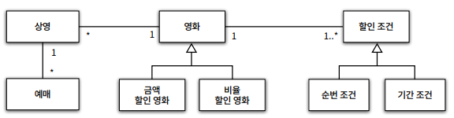
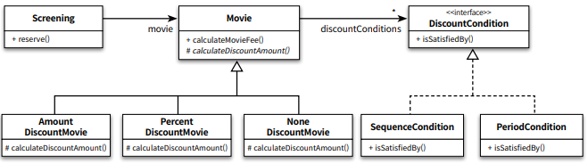
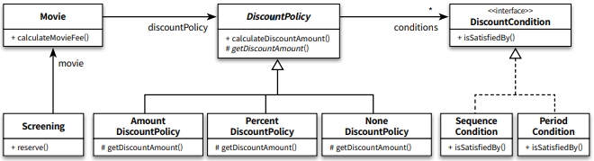

## 객체지향 Chap4

본 글은 오브젝트(조영호) 를 읽고 정리한 글이다. 객체지향이 무엇인가? 에 대해
자세히 알고싶어서 책을 읽고 기억하기 위해 기록한다. 이번 글에서는 Chapter5 책임 할당하기를
읽고 정리해보았다.

## 책임 중심 설계

이전 데이터 중심 설계로 객체의 자율성이 없으며 캡슐화, 응집도, 결합도가 떨어진
설계를 하기 쉽다는걸 알았다. 책임 중심 설계에서는 데이터보다 행동을 먼저 결정한다.
그리고 객체에게 적절한 책임을 할당하기 위해선 협력을 생각해야 한다.

협력은 메시지를 수신자가 아닌 메시지 전송자하는 클라이언트의 의도에 적합한 책임을 할당해야한다.
그렇게 할려면 메시지를 결정한 후 객체를 선택해야 한다. 메시지가 존재하기 때문에
그 메시지를 처리할 객체가 필요한것이다.
3장에서도 이에 관한 내용이 나왔다.

1. 시스템이 사용자에게 제공해야 하는 기능인 시스템 책임을 파악한다.
2. 시스템 책임을 더 작은 책임으로 분할한다.
3. 분할된 책임을 수행할 수 있는 적절한 객체 또는 역할을 찾아 책임을 할당한다.
4. 객체가 책임을 수행하는 도중 다른 객체의 도움이 필요한 경우 이를 책임질 적절한 객체/역할을 찾는다.
5. 해당 객체 또는 역할에게 책임을 할당함으로써 두 객체가 협력하게 한다.

이 과정을 통해 메시지와 객체를 결정한다. 그리고 책임이 어느정도 정리될 때까지는 객체의
내부 상태에 관심을 갖지 않는다.

## GRASP 패턴

> General Responsibility Assignment Software Pattern

책임 할당 기법으로 고안된 패턴이다.

가장 첫번째를 설계를 시작하기 전에 **도메인의 개략적인 모습을 그린다.**
도메인 개념들을 책임 할당의 대상으로 사용하면 코드에 도메인의 모습을 투영하기 좀 더 수월하다.
영화예매 도메인은 다음과 같이 그린다.



도메인을 통해 도메인 간에 관계(ex : 상영은 여러번 예약된다, 하나의 영화는 여러번 상영된다),
할인 종류가 2가지, 할인 조건이 2가지 있고 할인 조건은 하나만 적용되는것을 알 수 있다.
해당 단계에서는 도메인의 의미와 관계가 정확하지 않을 수 있다. 단지 출발점이 필요해서 만든것이다.

그 다음 **시작메시지를 선택한다**. 사용자가 제공해야 하는 기능은 영화를 "예매하라" 이다.
그 다음 이 메시지를 수신할 객체/역할을 찾는다. 여기서 책임을 수행하는 데 필요한 정보를
가지고 있는 객체에게 할당한다. 이를 정보전문가 패턴이라 한다. 여기서 "정보" 를 라고
표현한것을 주의하자. 해당 객체는 책임 수행에 필요한 "정보" 만 가지고있으면 되는데
이것은 "정보" 를 저장하고 있다는 뜻은 아니다. 필요한 정보를 다른 객체가 알고있는걸
가져오거나 필요한 정보를 계산해서 제공할 수도 있다.

"예매하라" 메시지 수진자로 정보전문가 패턴을 사용해 도메인중에는 `Screening` 이 적합하다.
여기서 `Screening` 에서 메시지를 처리하기위한 절차와 구현을 고민한다.
세세한 고민까지는 할 필요없고 스스로 처리할 수 있는지 없는지 작업을 구분할정도면 된다.
`Screening` 은 아마 가격을 스스로 계산하지 못할테니 다른 객체에게 협력 메시지 "가격을 계산하라"
를 보낸다. 

위와 같은 과정을 통해 메시지선택 -> 객체/역할 선택 -> 메시지 선택 과정을 계속 반복하며
책임을 할당한다. **정보전문가 패턴**을 통하면 적절한 객체를 고를 수 있는지 항상 최고의 결과를
가져다 주는건 아니다. 응집도와 결합도를 고려했을때 정보전문가 패턴보다 더 좋은 설계가
있을 수 있다. 이를 위해 **Low Coupling 패턴**, **High Cohesion 패턴**이 존재한다. 전자는 더 낮은
결합도를 가지는 객체를 선택하는것이고, 후자는 더 높은 응집도를 가지는 객체를 선택하는 패턴이다.

**마지막으로 창조자에게 객체 생성 책임을 할당해야 한다.**
영화 예매 협력의 최종 결과물은 `Reservation` 인스턴스를 생성한다.
여기서는 **창조자패턴**을 사용한다.

객체 A를 생성할때 아래 조건을 최대한 만족하는 B에게 객체 생성 책임을 할당한다.
 - B가 A 객체를 포함하거나 참조한다.
 - B가 A 객체를 기록한다.
 - B가 A 객체를 긴밀하게 사용한다.
 - B가 A 객체를 초기화하는 데 필요한 데이터를 가지고 있다.(B는 A에 대한 정보전문가다)

`Reservation` 의 경우 이에 해당하는건 `Screening` 이다. 따라서 `Screening` 은
`Resevation` 을 만들 수 있다.

## 구현

설계를 했으면 구현을 할 차례다.

```java
public class Screening {
    private Movie movie;
    private int sequence;
    private LocalDateTime screeningTime;

    public Reservation reserve(Customer customer, int audienceCount) {
        return new Reservation(customer, this, calculateReservationFee(audienceCount), audienceCount);
    }

    private Money calculateReservationFee(int audienceCount) {
        return movie.calculateMovieFee(this).times(audienceCount);
    }
}

public class Movie {
    private Money calculateDiscountAmount() {
        switch (movieType) {
            case AMOUNT_DISCOUNT:
                return calculateAmountDiscountAmount();
            case PERCENT_DISCOUNT:
                return calculatePercentDiscountAmount();
            case NONE_DISCOUNT:
                return calculateNoneDiscountAmount();
        }
        throw new IllegalStateException();
    }

    private Money calculateAmountDiscountAmount() {
        return discountAmount;
    }

    private Money calculatePercentDiscountAmount() {
        return fee.times(discountPercent);
    }

    private Money calculateNoneDiscountAmount() {
        return Money.ZERO;
    }

    public LocalDateTime getWhenScreened() {
        return whenScreened;
    }
    public int getSequence() {
        return sequence;
    }
}

public enum MovieType {
    AMOUNT_DISCOUNT, // 금액 할인 정책
    PERCENT_DISCOUNT, // 비율 할인 정책
    NONE_DISCOUNT // 미적용
}

public class DiscountCondition {
    private DiscountConditionType type;
    private int sequence;
    private DayOfWeek dayOfWeek;
    private LocalTime startTime;
    private LocalTime endTime;

    public boolean isSatisfiedBy(Screening screening) {
        if (type == DiscountConditionType.PERIOD) {
            return isSatisfiedByPeriod(screening);
        }
        return isSatisfiedBySequence(screening);
    }

    private boolean isSatisfiedByPeriod(Screening screening) {
        return dayOfWeek.equals(screening.getWhenScreened().getDayOfWeek())
                && startTime.compareTo(screening.getWhenScreened().toLocalTime()) <= 0
                && endTime.compareTo(screening.getWhenScreened().toLocalTime()) >= 0;
    }

    private boolean isSatisfiedBySequence(Screening screening) {
        return sequence == screening.getSequence();
    }
}

public enum DiscountConditionType {
    SEQUENCE, // 순번 조건
    PERIOD // 기간 조건
}
```

코드를 작성했지만 아쉽다. 

첫째, `DiscountCondition` 은 응집도 낮으며 변경에 취약하다. 변경되는 이유가 한 가지
이상이기 때문이다(새로운 할인 조건 추가, 순번 조건 판단 로직 변경, 기간 조건 판단 로직 변경)
이렇게 변경 이유를 잘 못찾겠다면 다음과 같은 방법을 사용한다.
- 초기화되는 속성 기준 : 순번조건의 경우 `sequence` 만 초기화하고 `dayOfWeek` `startTime` `endTime`
은 초기화하지 않는다. 반대의 기간조건만 표현하는경우도 마찬가지다.
- 메서드들이 인스턴스 변수를 사용하는 방식 : 순번조건에서는 `isSatisfiedBySequence` 를 사용하는데
`sequence` 변수만 사용한다.

기간조건에서는 `isSatisfiedByPeriod` 를 사용하는데 `dayOfWeek` `startTime` `endTime` 변수만 사용한다.
위의 세 가지 경우에 해당되는 부분이 있다면 일반적으로 응집도가 낮다.
이는 클리스를 분리해야될 때다! `PeriodCondition` `SequenceCondition` 으로 분리한다.
하지만 분리했을때 `Movie` 에서 같은 책임에 대해 두 가지 객체를 가져야되지 않게
**다형성패턴**을 이용한다.

```java
public interface DiscountCondition { 
    boolean isSatisfiedBy(Screening screening);
}

public class PeriodCondition implements DiscountCondition {
    private DayOfWeek dayOfWeek;
    private LocalTime startTime;
    private LocalTime endTime;
    public PeriodCondition(DayOfWeek dayOfWeek, LocalTime startTime, LocalTime endTime) {
        this.dayOfWeek = dayOfWeek;
        this.startTime = startTime;
        this.endTime = endTime;
    }
    public boolean isSatisfiedBy(Screening screening) {
        return dayOfWeek.equals(screening.getWhenScreened().getDayOfWeek()) &&
                startTime.compareTo(screening.getWhenScreened().toLocalTime()) <= 0 &&
                endTime.compareTo(screening.getWhenScreened().toLocalTime() >= 0);
    }
}

public class SequenceCondition implements DiscountCondition {
    private int sequence;
    public SequenceCondition(int sequence) {
        this.sequence = sequence;
    }
    public boolean isSatisfiedBy(Screening screening) {
        return sequence == screening.getSequence();
    }
}
```


둘째, `Movie` 도 마찬가지로 금액 할인 정책 영화와 비율 할인 정책 영화 두 가지 타입을 하나의 클래스에 구현되어있다.
그리고 4장의 데이터 주도 설계 처럼 변수를(구현부분) 인터페이스로 들어내진 않지만,
`Movie` 는 `calculateAmountDiscountAmount` 처럼 어떤 정책이 있는지 시그니처로 구현부분을 들어내고 있다.
이는 캡슐화가 되지않았고 응집도가 낮음을 의미한다.

해결방법으로는 `Movie` 를 상속해서 정책별로 Movie 클래스를 만드는 것이다. 하지만 
상속을 사용하면 정책이 바뀔때마다 `Movie` 인스턴스를 새로 할당해야하는 번거로움이 있다.
이는 구현상에서 관리하기 불편하다. "할인 정책이 변경될 수 있다" 는 요구사항이 있다면
좀 더 유연한 코드를 가지는 합성을 사용한다.

#### 상속관계시



#### 합성관계시 



```java
Movie movie = new Movie("타이타닉",
    Duration.ofMinutes(120),
    Money.wons(10000),
    new AmountDiscountPolicy(...));

movie.changeDiscountPolicy(new PercentDiscountPolicy(...));
```

상속 관계라면 `Movie` 객체를 새로만들어서 정책을 변경해야 하겠지만,
합성 관계를 사용하면 정책변경을 `Movie` 를 새로 안만들고도 할 수 있다.

## 스터티 결과

## Reference

> 오브젝트 : 코드로 이해하는 객체지향 설계(조영호)