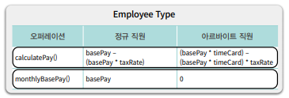
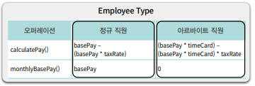

## 객체지향 Chap7

본 글은 오브젝트(조영호) 를 읽고 정리한 글이다. 객체지향이 무엇인가? 에 대해
자세히 알고싶어서 책을 읽고 기억하기 위해 기록한다. 이번 글에서는 Chapter7 객체 분해를
읽고 정리해보았다. 

## 하향식 기능 분해

기능 분해 관점에서 추상화의 단위는 프로시저이며 시스템은 프로시저 단위로 분해된다.
가장 전통적인 분해방법은 하향식 접근법(Tow-Down Approach)을 따른다. 하향식 접근법은
최상위 기능으로부터 더 작은 단계의 하위기능으로 분해해 나가는 방법이다.

### 문제점

하향식 접근법은 단 하나의 최상위 기능을 정의한다. 그렇기에 하위시스템의 변경으로인해
최상위시스템의 변경도 필요해진다. 이것은 변경에 매우 취약한 시스템이 된다.

- 기능 추가나 요구사항 변경으로 인해 메인함수를 빈번히 수정한다 : 새로운 기능이 추가되면 이를 실행하기위해 메인함수도 변경을 해야된다.
- 비즈니스 로직이 사용자 인터페이스와 강하게 결합된다 : 비즈니스 로직에 비해 사용자 인터페이스는 자주 변경이 일어나는데 이는 비즈니스 로직까지 영향을 받게된다.
- 하향식 분해는 너무 이른 시기에 함수들의 실행순서를 고정해 유연성과 재사용성이 저하된다 : 만들어진 함수는 실행순서와 함께 의미를 가지므로 순수 함수의 기능만으로 재사용이 어렵다.
- 데이터 형식이 변경될 경우 파급효과를 예측할 수 없다 : 어떤 데이터가 어떤 함수를 사용하는지 추적이 어렵다.

## 모듈

하향식 접근법은 기능분해를 통해 설계를 했다. 하지만 모듈은 변경이 많은 구현을 단위로 묶고 퍼블릭 인터페이스를 통해 접근한다.
기능이 아닌 변경을 단위로 시스템을 분해한다. 모듈은 다음 두 가지를 감춘다.

- 복잡성 : 모듈이 복잡할시 이해하기 어렵다. 외부에 모듈을 추상화할 수 있는 간단한 인터페이스를 제공해 모듈의 복잡도를 낮춘다.
- 변경 가능성 : 변경 발생 시 하나의 모듈만 수정하도록 변경 가능한 설계 결정을 모듈 내부로 감추고 외부에는 쉽게 변경되지 않을 인터페이스를 제공한다.

### 장점

- 모듈 내부의 변수가 변경되도 모듈 내부에만 영향을 끼친다 : 다른 모듈에서 찾을필요없이 영향받는 모듈만 수정하면된다.
- 비즈니스 로직과 사용자 인터페이스에 대한 관심사를 분리한다 : 관심사를 분리함으로써 서로 변경에 대해 영향을 끼치지 않는다.

모듈 내부는 높은 응집도를 가지고, 모듈과 모듈은 낮은 결합도를 가진다.

### 단점

모듈에는 인스턴스의 개념이 없다. 구조체와 같은 새로운 데이터타입을 만드는 개념이 없었다. 그래서 이를
위해 추상 데이터 타입이 나왔다.

## 추상 데이터 타입

추상데이터 타입은 데이터 추상화를 기반으로 소프트웨어를 개발하게 했다. 내부에 캡슐화할 데이터를 결정하고,
추상 데이터 타입에 적용할 수 있는 오퍼레이션을 결정하여 추가한다. 이는 데이터를 좀 더 현실에 가깝게해
데이터에 대한 관점을 설계의 표면으로 끌어올렸다. 하지만
여전히 데이터와 기능을 분리해서 바라봄으로써 절차적인 설계의 틀에 갇혀있다.

## 클래스

클래스와 추상 데이터 타입 모두 데이터 추상화를 기반으로 시스템을 분해한다. 둘 다 외부에서는 객체의 내부 속성에
직접 접근이 불가하며, 퍼블릭 인터페이스를 통해서만 외부와 의사소통한다.

클래스는 상속과 다형성을 지원하는 반면 추상데이터 타입은 이를 지원하지 않는다.
예를 들어 `Employee` 는 실제로 정규직과 아르바이트 직원 두 개의 타입이 공존한다. 여기서
추상데이터 타입은 오페이션을 기준으로 타입을 묶는다, 하지만 객체지향은 타입을 기준으로 오퍼레이션을 묶는다.
즉 객체지향은 정규직과 아르바이트 직원 각각의 클래스를 만들고 공통로직을 상속을 통해 해결한다. 그리고
클라이언트는 메시지를 전송하면 그에 맞는 적절한 클래스가 선택되는데 이는 다형성이다.

클라이언트 관점에서 두 클래스의 인스턴스(정규직, 아르바이트직원) 은 동일하다. 실제로 내부에서
수행되는 절차는 다르지만 클래스를 이용한 다형성은 절차에 대한 차이를 감춘다. 다시 말해 객체지향은
절차 추상화다.

추상데이터 타입을 오퍼레이션을 기준으로 타입을 추상화하며, 클래스는 타입을 기준으로 절차를 추상화한다.

## 결론

객체지향은 절차를 추상화는 것이다. 그러니 단순히 클래스를 사용한다고 객체지향이 아니다. 타입을 기준으로
절차를 추상화를 해야지 객체지향이다.

그러니 클래스안에 메서드내에서 타입을 명시적으로 구분하는 방식(조건문)이 있다는것은 객체지향을 위반하는것이다.
객체지향에서는 구분하는 방식(조건문)을 다형성을 대체하기 때문이다. 조건문은 변경에 취약하기
때문이다. 다형성을 이용하면 기존코드에 영향을 끼치지 않고 새로운 객체를 추가할 수 있는데 이를
개방-폐쇄 원칙(OCP, Open-Closed Principle) 이라고 한다.

하지만 항상 옳은것은 없다. 타입이 변경이 자주일어난다면 객체지향이 맞지만,
만약 오퍼레이션 변경이 자주일어난다면 추상데이터타입 방식이 더 좋다.

## 스터티 결과

## Reference

> 오브젝트 : 코드로 이해하는 객체지향 설계(조영호)
