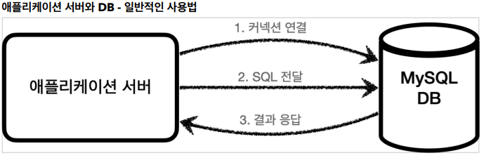
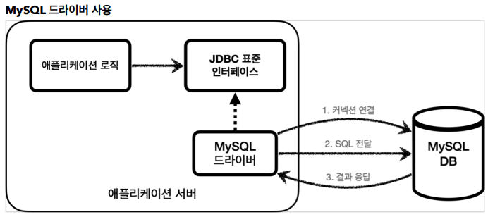
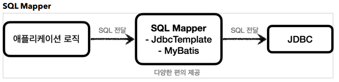
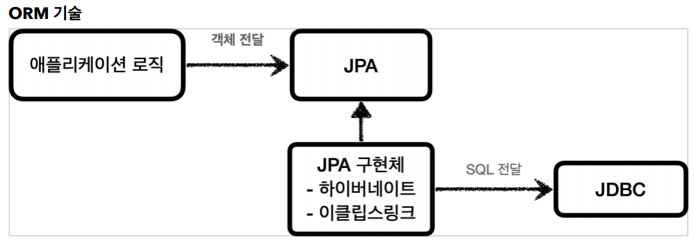
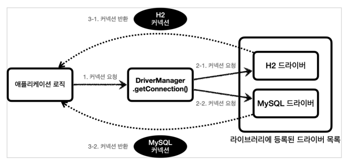

# JDBC

## 과거의 서버와 DB 연결방식



TCP/IP 로 커넥션을 연결해서 DB에 접근했다.
과거에는 DB 가 여러종류가 있어서 코드를 DB에 따라 다르게 구현해야 했다.
이것을 해결하기 위해 JDBC 가 등장했다.

## JDBC 배경
JDBC 에서 연결, SQL 내용, SQL 응답 방식에 대한 표준 인터페이스를 정해서 개발했다.
그리고 DB 에서(MySQL, Oracle) 에서 JDBC 인터페이스에 맞게 구현해서 라이브러리로 제공하는
데 이것을 JDBC 드라이버(MySQLDriver, OracleDriver)라고 부른다.



JDBC 의 등장으로 다른 데이터베이스를 사용해도 애플리케이션서버 코드는 동일하다.
JDBC 를 등장으로 많이 편해졌지만, 각각의 데이터베이스 마다 SQL, 데이터타입 등 일부
사용법(페이징 등)이 다르다. 데이터베이스를 바꾸면 JDBC 코드는 변경하지않아도 되지만
SQL은 해당 데이터베이스에 맞도록 변경해야한다. (JPA 쓰면 이런문제도 없어진다.)

JDBC 는 상당히 로우레벨이라 코드가 복잡해서 이를 간편하게 해결하기위해 여러 기술이 등장했다.
SQL Mapper 를 이용하거나 ORM 기술을 사용한다.

SQL Mapper : JdbcTemplate, MyBatis 가 있다. JDBC 코드를 좀 더 편하게 작성할 수 있다.



ORM : JPA 가 있다. 객체를 관계형 데이터베이스 테이블과 매핑하는 기술이다. 반복적인 SQL 를 사용하지
않아도 되고, 다른 데이터베이스마다 다른 SQL 를 작성하는 문제도 해결해 준다. 실무에서 사용할려면
깊이 있는 학습이 필요하다.



## JDBC 구현

#### connection/ConnectionConst.java
```java
// DB 정보(주소, 이름, 비번) 에 대한 정보를 저장하는 상수클래스, abstract 선언으로 객체 못만들게 함
public abstract class ConnectionConst {
    public static final String URL = "jdbc:h2:tcp://localhost/~/testdb";
    public static final String USERNAME = "sa";
    public static final String PASSWORD = "123";
}
```

#### connection/DBConnectionUtil.java
```java
public class DBConnectionUtil {

    public static Connection getConnection() {
        try {
            // DriverManager 를 이용해 DB 연결
            Connection connection = DriverManager.getConnection(URL, USERNAME, PASSWORD);
            // log.info("get connection={}, class={}", connection, connection.getClass());
            // 사용다했으면 connection 리소스 반환
            return connection;
        } catch (SQLException e) {
            throw new IllegalStateException(e);
        }

    }
}
```
`connection` 은 해당 데이터베이스(지금은 H2)가 가지고있는 (JDBC 표준 인터페이스에 맞춰서 구현된) `JdbcConeection`
을 반환한다. 즉 `H2 Connection` 은 `Jdbc Connection` 인터페이스를 상속받아 구현하고
반환하는것, 그래서 데이터베이스가 바뀌어도 JDBC 코드가 안바뀐다!



`DriverManger` 는 라이브러리에 등록된 데이터베이스를 인식하고, 드라이버목록에 데이터베이스를
관리한다. `DriverManager` 는 인자로 받은 URL 정보를 처리할 수 있는 데이터베이스를
드라이버목록에서 찾고 처리할 수 있는 데이터베이스에 커넥션을 얻어서 반환한다.

## JDBC Insert

요즘은 아무도 순수 JDBC 로 안짜지만 로우레벨에 대한 이해를 가지기 위해 작성해봤다. 무진장 길다..

#### repository/MemberRepositoryV0.java
```java
public class MemberRepositoryV0 {

    public Member save(Member member) {
        String sql = "insert into member(member_id, money) values (?, ?)";

        Connection conn = null;
        PreparedStatement pstmt = null; // PreparedStatement 쓰면 SQLInjection 막을 수 있음

        try {
            conn = getConnection();
            pstmt = conn.prepareStatement(sql); // 데이터베이스에 전달할 SQL 과 파미터로 전달할 데이터를 준비한다.
            pstmt.setString(1, member.getMemberId()); // memberId 바인딩
            pstmt.setInt(2, member.getMoney()); // money 바인딩
            pstmt.executeUpdate(); // 쿼리실행, 해당 쿼리로 영향을 받은 row 의 갯수를 반환
            return member;
        } catch (SQLException e) {
            e.printStackTrace();
        } finally {
            close(conn, pstmt, null);
        }
    }

    private void close(Connection conn, Statement stmt, ResultSet rs) {

        // ResultSet 은 데이터베이스에서 반환하는 값을 담고있다(조회할때 사용한다)
        if (rs != null) {
            try {
                rs.close();
            } catch (SQLException e) {

            }
        }

        if (stmt != null) {
            try {
                stmt.close();
            } catch (SQLException e) {

            }
        }

        if (conn != null) {
            try {
                conn.close();
            } catch (SQLException e) {

            }
        }
    }
    private static Connection getConnection() {
        return DBConnectionUtil.getConnection();
    }
}
```

JDBC 에서 리소스를 사용했다면 `pstmt.close()`, `conn.close()` 를 사용한 역순으로 꼭 해줘야한다. 
실제로 TCP/IP 통신을 하는것이기 때문에 안닫으면 자원이 계속 누수된다.

## JDBC Select

#### repository/MemberRepositoryV0.java
```java
public Member findById(String memberId) {
        String sql = "select * from member where member_id = ?";

        Connection conn = null;
        PreparedStatement pstmt = null;
        ResultSet rs = null;

        try {
            conn = getConnection();
            pstmt = conn.prepareStatement(sql);
            pstmt.setString(1, memberId); // memberId 바인딩

            rs = pstmt.executeQuery(); // select 쿼리 실행 후 DB 에서 반환값을 ResultSet 에 저장
            if (rs.next()) { // 데이터 있을시 실행
                Member member = new Member();
                member.setMemberId(rs.getString("member_id"));
                member.setMoney(rs.getInt("money"));
                return member;
            } else {
                // 데이터 없음
            }
        } catch (SQLException e) {

        } finally {
            close(conn, pstmt, rs);
        }
        
        return null;
    }
```

`ResultSet` 은 내부의 `cursor` 를 이용해 데이터를 조회한다. `rs.next()` 를 사용할때마다 `cursor` 를 이동시켜서 다음 테이블 데이터를 조회한다.

## Reference

[https://www.inflearn.com/course/%EC%8A%A4%ED%94%84%EB%A7%81-db-1](https://www.inflearn.com/course/%EC%8A%A4%ED%94%84%EB%A7%81-db-1)  
