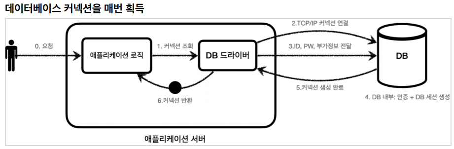

# 커넥션 풀과 데이터소스

## 커넥션 풀



데이터베이스 커넥션 흭득 과정

1. 애플리케이션 로직은 DB 드라이버를 통해 커넥션을 조회한다.
2. DB 드라이버는 DB와 TCP/IP 로 커넥션을 연결한다.
3. DB 드라이버는 TCP/IP 커넥션이 연결되면 ID, PW 등 정보를 DB 에 전달한다
4. DB는 ID, PW 로 내부인증 완료하고, 내부에 DB 세션을 생성한다
5. DB는 커넥션생성이 완료되었다는 응답을 보낸다.
6. DB 드라이버는 커넥션 객체를 생성해서 클라이언트에 반환한다.

새로운 커넥션을 만드는 과정을 복잡하고 시간이 오래 걸린다. 이것을 해결하기위해 커넥션을 미리 생성하고 사용하는 방법이
커넥션 풀이다.


기본값으로 대부분 커넥션 10개를 만들어 두도록 설정 되어있다. 해당 커넥션풀에 있는 커넥션은 모두 DB에 TCP/IP 로 연결되어 있다. 
맨처음 커넥션풀을 초기화할때 DB 드라이버를 사용하고 그 이후에는 사용하지 않는다.


애플리케이션은 더 이상 DB 드라이버를 이용해 커넥션을 얻는게 아닌 커넥션풀에게 커넥션을 바로 요청한다.
애플리케이션은 커넥션을 다 사용하고나면 커넥션풀에 반환한다. 

커넥션풀은 실무에 기본적으로 사용된다. 대표적인 오픈소스로 'HikariCP' 를 사용하고 스트링부트2.0 이후에는 'HikariCP' 를
기본으로 제공된다.

## DataSource

DB 드라이버와 커넥션 풀(HikariCP, DBCP2) 를 애플리케이션에 적용할려고 하면 DB 드라이버, 커넥션풀 종류마다 애플리케이션
코드가 다르게 적용된다. 이런 커넥션 흭득하는 방법을 추상화해서 통합해서 관리하기 위한것이 DataSource 이다.
자바에서 `javax.sql.DataSource` 기본으로 제공한다.


### 데이터소스와 드라이버

#### 드라이버 직접 사용
```java
@Test
void driverManager() throws SQLException {
    Connection con1 = DriverManager.getConnection(URL, USERNAME, PASSWORD);
    Connection con2 = DriverManager.getConnection(URL, USERNAME, PASSWORD);
    
    log.info("connection={}, class={}", con1, con1.getClass());
    log.info("connection={}, class={}", con2, con2.getClass());
}
```

#### 데이터소스 사용
```java
@Test
void dataSourceDriverManager() throws SQLException {
    DriverManagerDataSource dataSource = new DriverManagerDataSource(URL, USERNAME, PASSWORD); 
    useDataSource(dataSource);
}

private void useDataSource(DataSource dataSource) throws SQLException {
    Connection con1 = dataSource.getConnection();
    Connection con2 = dataSource.getConnection();
    
    log.info("connection={}, class={}", con1, con1.getClass());
    log.info("connection={}, class={}", con2, con2.getClass());
}
```

`DataSource` 를 이용한 첫번째 장점이다. `DataSource` 를 사용하면 설정(`URL`, `USERNAME`, `PASSWORD`)과 사용(`getConnection()`)을 분리할 수 있다. 
맨 처음에 드라이버를 직접 사용하면 DB 연결할때마다 설정정보를 넘겨 줘야하지만
`DataSource` 를 사용하면 설정 정보를 `DataSource` 가 만들어지는 시점에만 넘겨주고
커넥션을 흭득할때 `dataSource.getConnection()` 를 호출해주면 된다.
설정에 의존하지 않는 큰 장점이 된다. 이것을 활용하면 `Repository` 는 설정정보를 알 필요없이 `DataSource` 만 의존하면 된다.

### 데이터소스와 커넥션 풀

#### 커넥션풀 히카리 사용
```java
@Test
void dataSourceConnectionPool() throws SQLException, InterruptedException {
    //커넥션 풀링: HikariProxyConnection(Proxy) -> JdbcConnection(Target)
    HikariDataSource dataSource = new HikariDataSource();
    dataSource.setJdbcUrl(URL);
    dataSource.setUsername(USERNAME);
    dataSource.setPassword(PASSWORD);
    dataSource.setMaximumPoolSize(10); // 커넥션 풀 최대 개수
    dataSource.setPoolName("MyPool"); // 커넥션 풀 이름 지정
        
    useDataSource(dataSource); // 실행
    Thread.sleep(1000); //커넥션 풀에서 커넥션 생성 시간 대기, 안정적인 로그찍기 위해 슬립걸음
}

private void useDataSource(DataSource dataSource) throws SQLException {
    Connection con1 = dataSource.getConnection();
    Connection con2 = dataSource.getConnection();
    log.info("connection={}, class={}", con1, con1.getClass());
    log.info("connection={}, class={}", con2, con2.getClass());
}
```
커넥션 풀에 커넥션을 별도의 쓰레드를 이용해서 멈춘다. 커넥션 풀 채우는 작업을 시간이 걸려서 바로 로그를 찍으면 출력이 안될 수 있어서다.
커넥션풀이 커넥션을 흭득하기전에 커넥션 연결요청이 들어온경우 내부에서 사용할 수 있는 커넥션이 만들어질때까지 기다린뒤에 흭득한다.
만약 커넥션풀의 크기를 넘어가는 요청이 들어오면 사용중인 커넥션이 반환될 때까지 대기상태가된다. (몇초 넘어가면 연결을 끊는 등
설정을 해줄 수 있다)

## 마무리

커넥션 풀을 이용하는 방법과 데이터소스에 대해 알아봤다. 커넥션풀은 애플리케이션에서 요청이 발생할때마다 DB 드라이버를 이용해서
DB 커넥션을 얻는 과정을 반복할 필요없어 매우 유용하다. 데이터소스의 경우 이전에 DB 드라이버를 추상화했던것처럼 커넥션풀을 추상화해서
만들어진것이다. 그 외에도 설정정보를 관리해 의존성을 낮추는 장점이 있다! 커넥션 풀은 실무에서 기본으로 사용하니 잘 알아두자!

## Reference

[https://www.inflearn.com/course/%EC%8A%A4%ED%94%84%EB%A7%81-db-1](https://www.inflearn.com/course/%EC%8A%A4%ED%94%84%EB%A7%81-db-1)  
