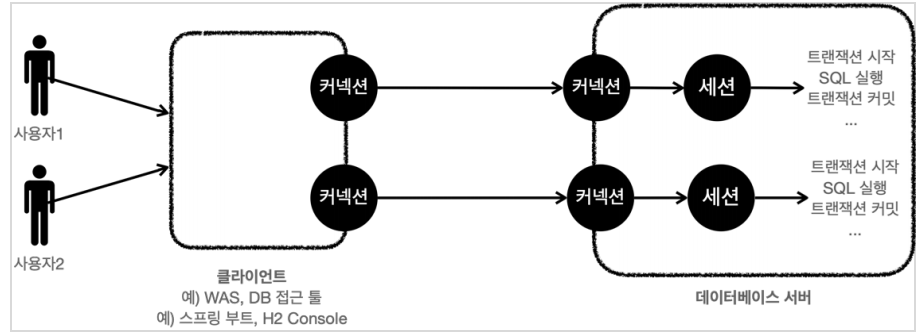
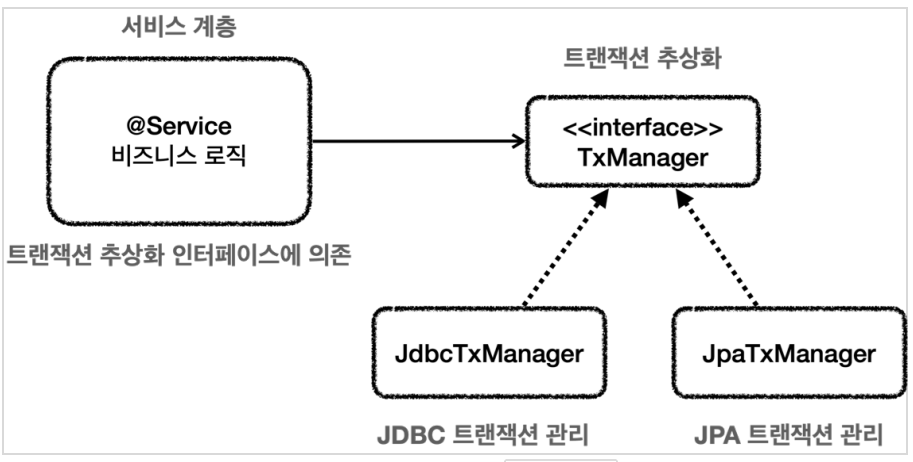
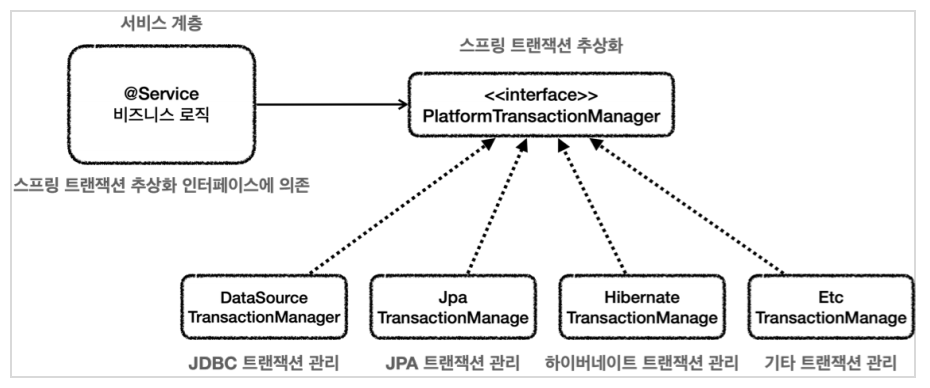
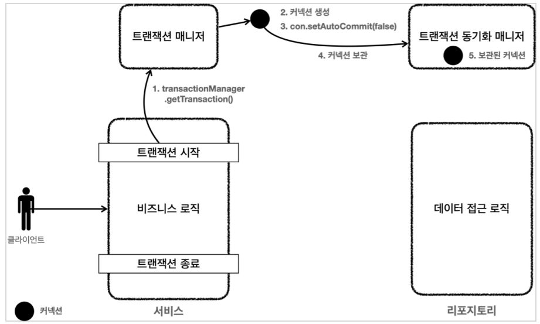
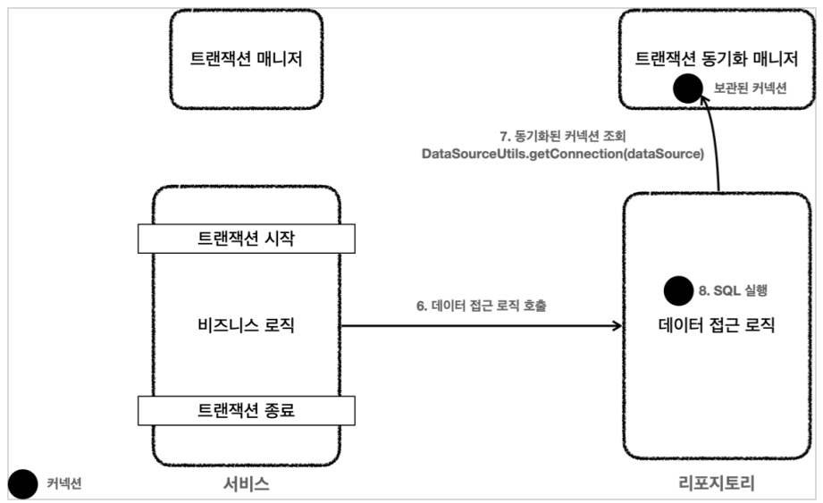
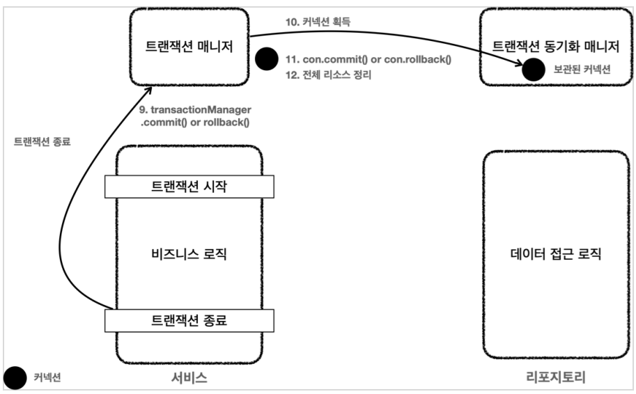
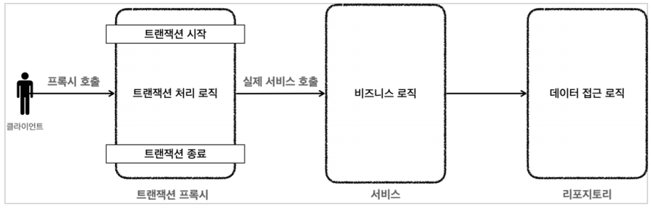
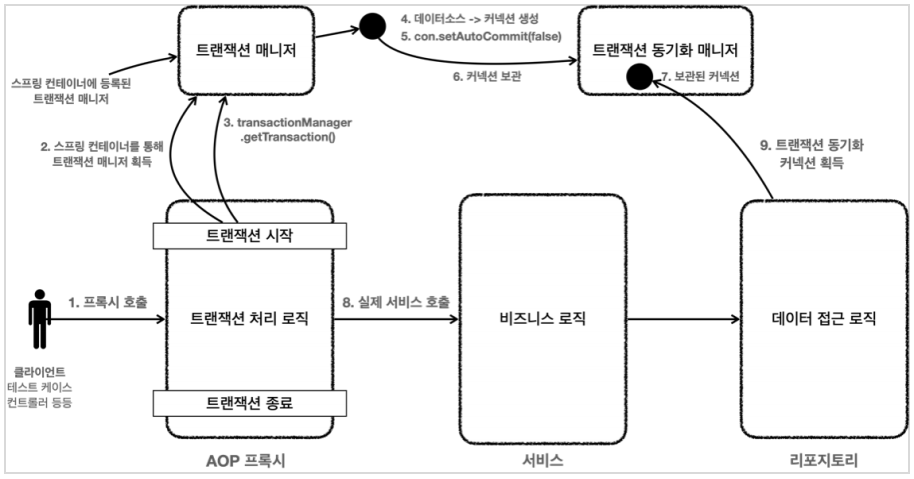

# 트랜잭션

데이터를 파일이 아닌 데이터베이스에 저장하는 가장 큰 이유가 트랜잭션이다.

트랜잭션의 ACID
- 원자정(Atomicity) : 트랜잭션 내에서 실행한 작업들은 마치 하나의 작업처럼 모두 성공 하거나 모두 실패해야 한다.
- 일관성(Consistency) : 모든 트랜잭션은 일관성있는 데이터베이스 상태 유지해야한다, 무결성제약조건 만족 등
- 격리성(Isolation) : 동시에 실행되는 트랜잭션들이 서로에게 영향을 미치지 않도록 격리한다, 성능 이슈에 따른 트랜잭션 격리 수준을 선택한다.
- 지속성(Durability) : 트랜잭션을 성공적으로 끝내면 그 결과가 항상 기록된다.

격리성은 성능을 생각하면 완벽하게 보장하기 힘들다. 그래서 격리수준을 4단계로 나뉘었다.

트랜잭션 격리 수준 - Isolation level
- READ UNCOMMITTED : 커밋되지 않은 읽기
- READ COMMITTED : 커밋된 읽기
- REPEATABLE READ : 반복 가능한 읽기
- SERIALIZABLE : 직렬화 가능



데이터베이스는 커넥션이 확립되면 세션을 만들고, 세션이 SQL(트랜잭션) 을 실행한다. 세션은 커밋 또는 롤백을 통해 트랜잭션을
종료한다. 커밋을 하면 정상적으로 데이터베이스에 반영이되고, 롤백을 하면 트랜잭셕이 시작하기전 상태로 돌아간다.

## 자동 커밋과 수동 커밋

### 자동 커밋
```sql
set autocommit true; //자동 커밋 모드 설정
insert into member(member_id, money) values ('data1',10000); //자동 커밋
insert into member(member_id, money) values ('data2',10000); //자동 커밋
```
기본으로 데이터베이스는 자동커밋이다. 
SQL이 실행될때마다 자동커밋은 쿼리 하나하나에 한번씩 커밋이 되서 내가 원하는 트랜잭션 단위를 설정하지 못한다는
단점이 있다.

### 수동 커밋

```sql
set autocommit false; //수동 커밋 모드 설정
insert into member(member_id, money) values ('data3',10000);
insert into member(member_id, money) values ('data4',10000);
commit; //수동 커밋
```

수동 커밋을 하면 무조건 `commit` 이나 `rollack` 을 호출해줘야 한다.

## DB 락

세션1 이 트랜잭션을 시작하고 데이터를 수정하는 동안 커밋을 수행하지않았는데 세션2에서 동시에 같은 데이터를 수정하게 되면
원자성이 깨지는 문제가 발생한다. 세션이 트랜잭션을 시작하면 커밋이나 롤백전까지 데이터에 LOCK 을 걸어
다른 세션에서 데이터를 수정할 수 없게 한다. 다른 세션은 TIMEOUT 이 될때까지 또는 락이 반납될때까지 대기한다.

조회를 할때는 기본적으로 락을 가져가진않지만, `select for update` 를 사용하면 락을 가져가서 조회하는 동안 다른 세션이
접근못하게 할 수 있다.

참고로 DB 트랜잭션을 사용하려면, 트랜잭션을 사용하는 동안 같은 커넥션을 유지해야 같은 세션을 사용할 수 있다.
같은 커넥션을 유지할려면 커넥션을 파라미터로 전달해서 같해서 같은 커넥션을 쓰는것이다.(새로운 커넥션을 만들거나 로직 종료까지
커넥션을 닫으면 안된다)

애플리케이션 코드로 DB 트랜잭션을 적용할려면 트랜잭션 처리코드가 너무 많아지고 복잡해진다.. 스프링을 이용해 해결해보자.
스프링을 사용하면 서비스계층을 유지하면서 문제를 다 해결할 수 있다.

## 트랜잭션 추상화

서비스계층이 Repository(데이터접근기술, JDBC, JPA 등) 을 이용해서 DB에 접근한다. Repository 가 변경되도
서비스계층이 변하지 않기위해서 트랜잭션을 추상화한다.



스프링은 이 모든것을 다 지원하고, 이미 구현도 해놨다.



## 스프링에서의 트랜잭션

스프링은 트랜잭션 동기화 매니저를 제공한다

트랜잭션 동기화 매니저를 사용하는데, 멀티쓰레드 상황에서도 커넥션 안전하게 잘 보관해준다. 커넥션 필요시 트랜잭션 동기화매니저를
이용한다. 이전처럼 파라미터로 커넥션을 전달하지 않아도된다.

동작순서



1. 서비스 계층에서 transactionManager.getTransaction() 을 호출해서 트랜잭션을 시작한다.
2. 트랜잭션을 시작하려면 먼저 데이터베이스 커넥션이 필요하다. 트랜잭션 매니저는 내부에서 데이터소스를
   사용해서 커넥션을 생성한다.
3. 커넥션을 수동 커밋 모드로 변경해서 실제 데이터베이스 트랜잭션을 시작한다.
4. 커넥션을 트랜잭션 동기화 매니저에 보관한다.
5. 트랜잭션 동기화 매니저는 쓰레드 로컬에 커넥션을 보관한다. 따라서 멀티 쓰레드 환경에 안전하게
   커넥션을 보관할 수 있다



6. 서비스는 비즈니스 로직을 실행하면서 리포지토리의 메서드들을 호출한다. 이때 커넥션을 파라미터로
   전달하지 않는다.
7. 리포지토리 메서드들은 트랜잭션이 시작된 커넥션이 필요하다. 리포지토리는
   DataSourceUtils.getConnection() 을 사용해서 트랜잭션 동기화 매니저에 보관된 커넥션을 꺼내서
   사용한다. 이 과정을 통해서 자연스럽게 같은 커넥션을 사용하고, 트랜잭션도 유지된다.
8. 획득한 커넥션을 사용해서 SQL을 데이터베이스에 전달해서 실행한다.



9. 비즈니스 로직이 끝나고 트랜잭션을 종료한다. 트랜잭션은 커밋하거나 롤백하면 종료된다.
10. 트랜잭션을 종료하려면 동기화된 커넥션이 필요하다. 트랜잭션 동기화 매니저를 통해 동기화된 커넥션을
    획득한다.
11. 획득한 커넥션을 통해 데이터베이스에 트랜잭션을 커밋하거나 롤백한다.
12. 전체 리소스를 정리한다.
    트랜잭션 동기화 매니저를 정리한다. 쓰레드 로컬은 사용후 꼭 정리해야 한다.
    con.setAutoCommit(true) 로 되돌린다. 커넥션 풀을 고려해야 한다.
    con.close() 를 호출해셔 커넥션을 종료한다. 커넥션 풀을 사용하는 경우 con.close() 를
    호출하면 커넥션 풀에 반환된다.

## 트랜잭션 템플릿

트랜잭션 성공시 커밋, 실패시 롤백해주는 코드를 대신 작성(중복된 코드 작성)을 피하고 비즈니스 로직만 짜면되기 위함

기존코드
```java
public void accountTransfer(String fromId, String toId, int money) throws SQLException {
    //트랜잭션 시작
    TransactionStatus status = transactionManager.getTransaction(new DefaultTransactionDefinition());
    try {
        //비즈니스 로직
        bizLogic(fromId, toId, money);
        transactionManager.commit(status); //성공시 커밋
    } catch (Exception e) {
        transactionManager.rollback(status); //실패시 롤백
        throw new IllegalStateException(e);
    }
}
```

트랜잭션 템플릿 적용 코드(실행 턴 어라운드 패턴 이용)
```java
public void accountTransfer(String fromId, String toId, int money) throws SQLException {
    txTemplate.executeWithoutResult((status) -> {
        try {
            //비즈니스 로직
            bizLogic(fromId, toId, money);
        } catch (SQLException e) {
            throw new IllegalStateException(e);
        }
    });
}
```

코드는 줄었지만 서비스로직에 여전히 트랜잭션 처리로직이 존재한다.

## 트랜잭션 AOP

스프링 AOP 와 프록시를 통해 서비스로직에 순수 비즈니스 로직만 남길 수 있다.

트랜잭션 템플릿 사용한 코드
```java
public void accountTransfer(String fromId, String toId, int money) throws SQLException {
    txTemplate.executeWithoutResult((status) -> {
        try {
            //비즈니스 로직
            bizLogic(fromId, toId, money);
        } catch (SQLException e) {
            throw new IllegalStateException(e);
        }
    });
}
```

트랜잭션 프록시 적용 코드
```java
public class Service {
    public void logic() {
        //트랜잭션 관련 코드 제거, 순수 비즈니스 로직만 남음
        bizLogic(fromId, toId, money);
    }
}
```



바로 비즈니스로직을 호출하는게 아닌 프록시객체인 트랜잭션 처리로직을 호출한다. 프록시객체는 스프링이 알아서 만들어준다.
개발자는 트랜잭션 처리가필요한곳에 `@Transactional` 을 붙여주면 스프링의 트랜잭션 AOP 가 인식하고 트랜잭션 프록시를 적용해준다.

스프링 AOP 에 적용할려면 스프링 컨네이너에 스프링 빈으로 등록을해야 스프링이 처리를 해준다. 
레포지터리, 서비스, 데이터소스, 트랜잭션 매니저를 스프링 빈으로 등록 한다. 그리고 레포지터리와 서비스는 `@Autowired` 로
의존관계를 주입해줘야 스프링에서 사용할 수 있다.



선언적 트랜잭션 방식 : 간편하게 트랜잭션을 적용할 수 있다. 실무에서 이걸로 사용한다.

반대로 프로그래밍 트랜잭션 방식이 있는데 직접 코드를 작성하는것 이다. 테스트할 때 가끔 사용될 수 있다.

## 스프링 부트의 자동 리소스 등록

스프링 부트를 이용하면 데이터소스와 트랜잭션 매니저를 직접 `@Bean` 으로 등록해 줄 필요가 없다. 
데이터소스의 빈이름은 `dataSource`, 개발자가 직접 등록해주면
충돌이 나므로 자동으로 데이터소스를 등록해주지 않는다. 등록해주는 데이터소스는 `HikariDataSource` 이다.

트랜잭션의 빈이름은 `transactionManager`, 개발자가 직접 등록해주면 자동으로 등록해주지 않는다. 어떤 트랜잭션 매니저를 사용할지는
등록된 라이브러리를 보고 판단한다. JDBC 기술사용시 `DataSourceTransactionManager` 등록, JPA 사용하면 `JpaTransactionManager`
를 등록한다. 둘다 사용하면 `JpaTransactionManager` 를 등록(JDBC 기능이 포함되어있어서) 해준다.