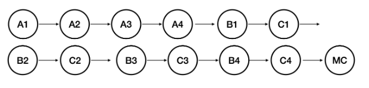
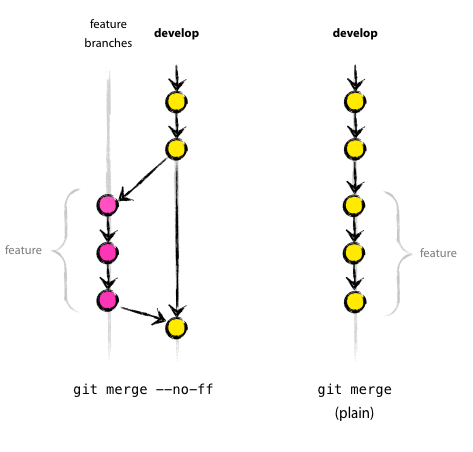
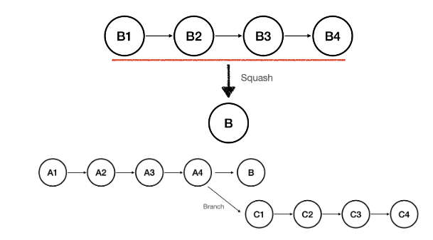
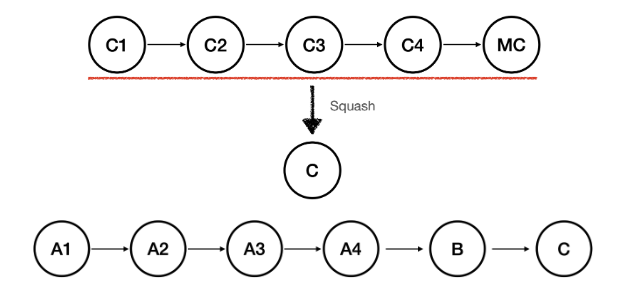
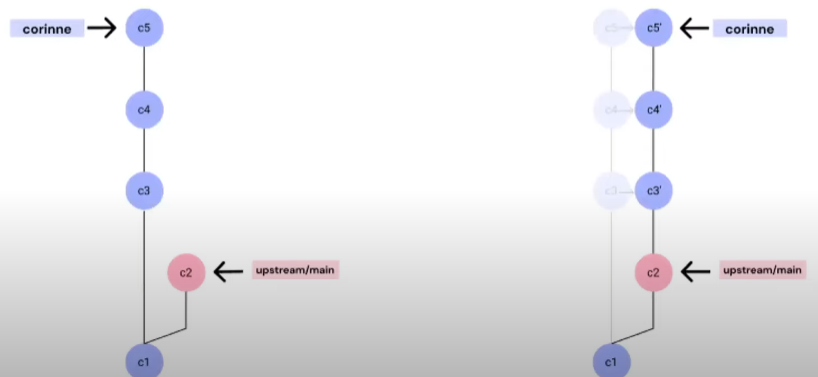
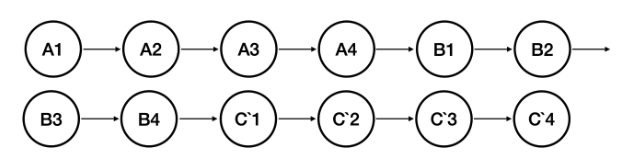

# 깃허브

## 기본 개념

### upstream, origin ?
- 깃허브는 [remote upstream] - [remote origin] - [local] 로 이루어져있다.
- 예를 들면 remote upstream 은 A원격저장소라면, remote origin은 내가 A를 포크해서 만든 깃허브 원격저장소, local은 내 컴퓨터 이다.
- upstream 은 상대적인 개념으로 정해지는것> local 기준으로 A는 upstream이 된다.

### 로컬 저장소
- git init 을 하면, .git 파일 만들어지고 이것이 로컬저장소이다.

### git의 객체
- blob, **commit**, tree, tage 등등

### commit
- 작업 디렉토리 스냅샷
- 파일(blob객체) 정보를 담고있는 tree객체들의 정보를 저장
- 변경사항만 저장하지않고 파일전체를 저장한다.(되돌아갈때 추적용이성)

## 명령어

### Merge
- fast-forward
- 3-way-merge
- conflict 발생시 MC커밋 들어감
- 커밋 시간순서대로 합쳐져서 가독성이 떨어짐
- **Merge 할 때 base가 같은 fast-forward를 사용하고 다르다면 merge commit를 생성해 auto merge 한다.**

### Non fast forward
- create merge commit : **git merge --no-ff feature**
  - base branch가 같아도 fast-forward 진행이 아닌 하나의 머지커밋을 생성해서 진행
  - 기능구현할때 사용했던 커밋이 다 살아있어 수정할여지남김
  - 머지한곳에서 분기점이 생겨 가독성이 좋음
  - 기존의 이력도 남긴채 새로운 머지 커밋 생성
  - ff:fash forward
    
- squash and merge : **git merge --squash feature**
  - 여러개의 커밋을 하나로 합친다음에 추가.
  - conflict 발생이 MC커밋이후에 합친다음 추가.

### Rebase
- Merge와 마찬가지로 브랜치를 합친다
- Merge보다 깔끔한 log가 남는다.(history가 지워지기때문)
- base가 바뀔 커밋들을 복사해서 이어붙인다(base이후 커밋아이디가 바뀜)
  
  
- rebase는 commit history가 merge와 다르게 선형적으로 이어진다
- 커밋의 시간에 관계없이 마지막 merge되는 branch의 commit을 가장뒤에 붙임
  1. C1~C4와 B1의 충돌을 없앤다
  2. B1과 충돌을 제거한 C1~C4와 B2의 충돌을 제거한다
  3. B2과 충돌을 제거한 C1~C4와 B3의 충돌을 제거한다
  4. B3과 충돌을 제거한 C1~C4와 B4의 충돌을 제거한다
  5. B4과 충돌을 제거한 C1~C4를 B4 뒤에붙인다
- 충돌 제거과정이 최대 커밋수만큼 나올 수 있다. C1..C4가 C'1..C'4로 변경되면서 force push 하는게 일반적이다.

### Cherry-pick
- **git cherry-pick e19c319 d1f30c2..d1f32c3**
- 다른 브랜치에 있는 커밋을 선택적으로 내 브랜치에 적용
- cherry-pick이 된 커밋들은 복사된다.
- 보통 적용할브랜치에서 **새로운 브랜치**를 판뒤 체리픽으로 선택해 푸쉬해준다
- cherry-pick confiict
  1. conflict 해결을 위한 코드수정
  2. git add 로 수정된코드 add
  3. git cherry-pick --continue 명령을수행

### Branch
- git branch feature
  - feature 브랜치 생성
- git check out -b feature
  - feature 브랜치 생성과 동시에 이동
- git checkout feature / git switch feature
  - feature 브랜치로 이동
- git branch -d feature
  - feature 브랜치 삭제

### HEAD
- 현재 작업중인 커밋위치를 뜻함, 상대참조에 활용
- git switch HEAD^ : 한번 전
- git switch HEAD^^ : 두번 전
- git branch -f step2 step1~2 : step1 2번전

### Reset
- git reset HEAD~1 : 한번전으로 되돌리기
  - 혼자 작업할때 사용, history를 완전히 지워버리기 때문

### Revert
- git revert HEAD 
  - 변경 이력이 남음

### 복구하기
- git reflog 로 복구할 커밋 해쉬값 확인
- commit 복구 : git reset --hard 커밋Hash
- 브랜치 복구 : git switch -c 브랜치이름 커밋Hash