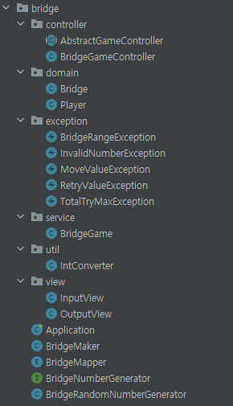
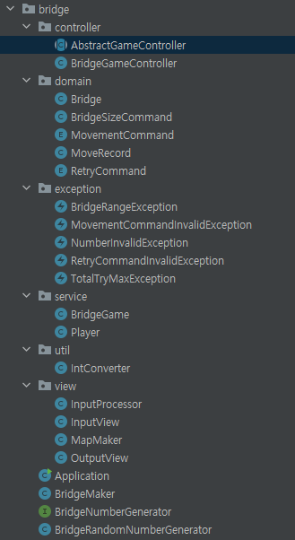
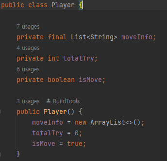
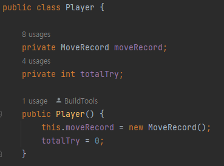
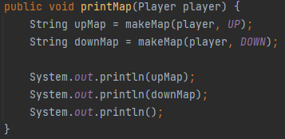
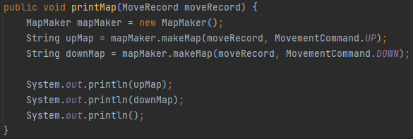
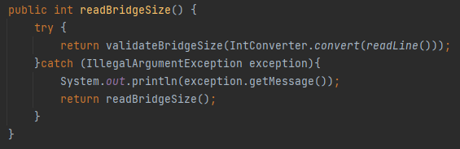
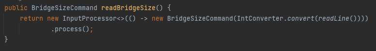
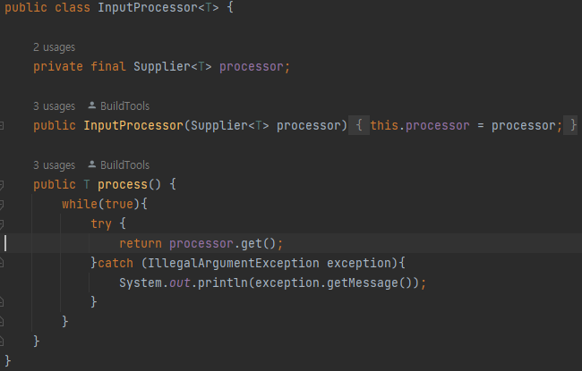
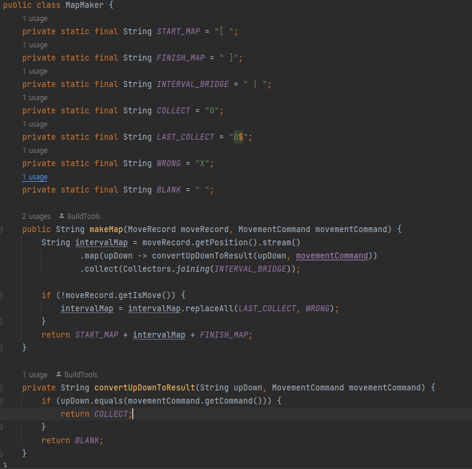

## 5주차 회고
우테코 프리코스는 끝났지만, 결과발표까지 활동한 회고를 작성해본다.

### BridgeGame Refactoring
먼저 BridgeGame 리팩토링을 했다. 다른사람 코드리뷰를 하고, 리뷰 받으면서 얻은 생각들을 정리하고 리팩토링을
해봤다. 먼저 내가 4주차 회고해 작성했던 클래스설계 방식은 대부분 이어갔다.

#### 1. 클래스 구조 변경   

   
첫번째 사진이 4주차이고, 2번째 사진이 리팩토링을 한 5주차 사진이다.
앞으로 나올 사진순서도 마찬가지로 처음이 4주차, 다음이 5주차 이다.

#### 2. domain
크게 달라진점은 domain 이다.
domain 의 경우 Command 클래스가 생겼다. Command 클래스는 InputView 에서 입력받는값 들을
저장해주는 클래스이다. 모든 입력값을 유의미한 자료형으로 반환하기 위해 Command 클래스를 따로
만들었다.

**BridgeSizeCommand, MovementCommand, RetryCommand**   
  

`MovementCommand` 클래스 구조는 다음과 같다. 해당 게임에서 `U`, `1` 은 게임에서 위`UP` 를
뜻하기에 같은 의미로 묶어준다. `DOWN` 또한 마찬가지다.  

그리고 `InputView` 에서 `commandOf` 를 사용해 `String` 입력값이
들어오면 그에맞는 `MovementCommand` 로 반환함과 동시에 잘못된 입력값이면 예외를 던져준다.

입력값을 객체로 컨트롤러에 반환함으로써, 예외처리를 자연스럽게 할 수 있고 `InputView`
에서도 유의미한 이름을 가진 자료형으로 반환할 수 있다. 그리고 enum 으로 선언하여 해당 자료형을 필요로
하는 객체가 다양하더라도, 그에맞게 변환하여 줄 수 있다.

**MoveRecord**   
domain 에서 MoveRecord 클래스가 생겼는데 해당 클래스는 연관 있는 변수를 묶기위함이다.   

   

4주차 플레이어에서는 플레이어가 이동한 정보를 저장하는 `moveInfo` 와 
플레이어가 실제로 이동했는지 확인하는 `isMove` 데이터 구조가 있었다.
두 변수들은 이동과 관련되어 서로 연관있어 하나의 `MoveRecord` 클래스 구조로 묶어주었다.
안묶어도 크게 상관없지만 묶어야겠다고 결정적으로 생각한 이유는 출력할때 넘겨주는 매개변수이다.  

   

4주차에서는 `player` 전체를 받아서 출력을했다. 하지만 `player` 에는 맵출력과 상관없는
`totalTry` 변수도 포함되어있다. 그렇다고 필요한것만 보내면 `moveInfo` 와 `isMove` 2개를
매개변수로 받아야된다. 2개까지야 괜찮지만 3개, 4개... 가 된다면? 상당히 어지러울 것이다.
그래서 5주차에서는 맵출력에 필요한 MoveRecord 객체를 따로 만들어서 보냈다.

#### 2. Service
**Player**   
4주차에 domain 에있는 `Player` 가 5주차에 service 로 이동했다. Spring MVC 패턴에 따라
domain 에는 데이터구조만 저장하고, 비즈니스 로직이 있는 경우는 service 에 넣었다.

#### 3. View
**InputView**   

   

4주차 `readBridgeSize` 의 경우 `InputView` 에서 `validateBridgeSize` 를 통해 값을 확인하고 
`int` 형으로 반환해준다. 그리고 잘못된값일시 다시 `readBridgeSize` 를 호출해 올바른 값이 나올때까지
반복한다.

5주차 `readBrdigeSize` 의 경우 `InputProcessor` 를 통해 올바른 값이 나올때까지 반복을 시킨다.
그리고 따로 `validateBridgeSize` 를 통한 값 확인이 없는데, 그 이유는 아까 Command 클래스에서
말했듯이 `BridgeSizeCommand` 클래스 내부에서 값이 맞는지 확인을 하고 해당 객체로 반환한다.

    

`InputProcessor` 클래스를 따로 만든 이유는 실행 턴어라운드 패턴을 사용하기 위해서다.
**올바른 값이 나올때까지 반복**과
**실행할 함수**를 분리해서 관리할 수 있다.

**OutputView**

    

5주차에 `MapMaker` 클래스 새로 생겼는데 원래 `OutputView` 있던 메소드를 클래스로 분리한것 뿐이다.
분리한 이유는 `OutputView` 가 복잡해보여서 분리했다.   
그리고 해당 맵을 만드는 로직을
domain 이나 service 에 구현할 사람들도 많았는데 나는 View 에 구현했다. 그 이유는 맵을 어떻게
보여줄지는 비즈니스로직이 아니라 판단했고, controller 에서 받은 데이터로 어떻게 보여줄지는
View 가 결정하는거라고 생각했기 때문이다.

#### 소감
리팩토링을 하기전에는 코드를 갈아엎을 생각을했는데 막상 해보고나니 할게적었다. 그 이유는 내가
설계한 클래스구조가 내 맘에 들었기 때문에 크게 변경하지 않아서라고 생각한다. 해당 클래스 구조가 
제일 낫은지는 지금의 나는 모른다.. 미래의 나는 더 좋은 클래스 구조로 리팩토링 할 수 있길 바란다.

#### refactoring code
[코드 링크](https://github.com/jinhoon227/java-bridge/tree/refactor)