## 6주차 회고  
refactoring 과정을 글로 끄적여 봤습니다.

### 숫자 야구 리팩토링
#### 1. 클래스 구조 변경
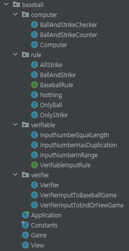
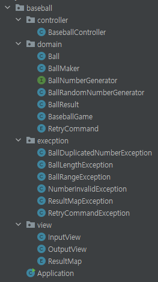   

먼저 기존 숫자야구는 딱히 어떤 패턴을 적용한것은 아니다. 그래서 리팩토링하면서 MVC 패턴으로 바꿨다.

#### 2. 예외 처리
기존 숫자야구는 `verifiable`, `verifier` 패키지가 있다. `verifiable` 패키지는 예외처리를
해야하는 요소들을 클래스로 만들어두고, verifier 패키지에서 `verifiable` 패키지에 있는 예외처리
요소들을 조합해서 검증기를 만든다. 이렇게 만들면 중복해서 코드를 짤 필요가없어 재사용성이 증가한다.   

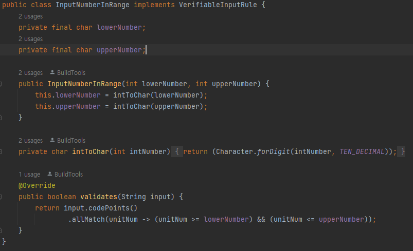
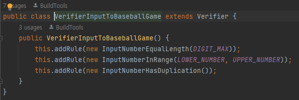  

그림을 보면 첫번째 사진은 입력받은값의 범위를 확인해주는 클래스, 두번째 사진은 첫번째 클래스 종류의
여러 예외처리를 조합해서 숫자야구에서 입력받은 공에 대한 검증기를 만드는 것이다. 이렇게 작성하면
코드의 재사용성은 늘어나지만 문제가있다. 모든 객체 해당 검증기를 적용할려하다보면 객체를
객체스럽게 사용하지 못한다. 예를들어 사용자가 입력한 공을 저장하는 `Ball` 객체가 있다.
그런데 `Ball` 객체에대해 위의 검증기로 예외를 처리를 해줄려면 `Ball` 을 해당 검증기의 자료형에
맞게 변환해줘야 한다.(`Ball` 자료형을 위한 검증기를 만든다면 재사용성이 의미가없다) 검증기때문에
일일이 자료형을 변환해줘야 하는것은 객체스럽지 못하다.   
그리고 `Ball` 에 대한 예외 확인을 `Ball` 내에서 처리하지 못하는것도 응집도가 떨어진다. 그래서
리팩토링을 하면서 객체 내에서 예외 확인을 하도록 처리해주었다.

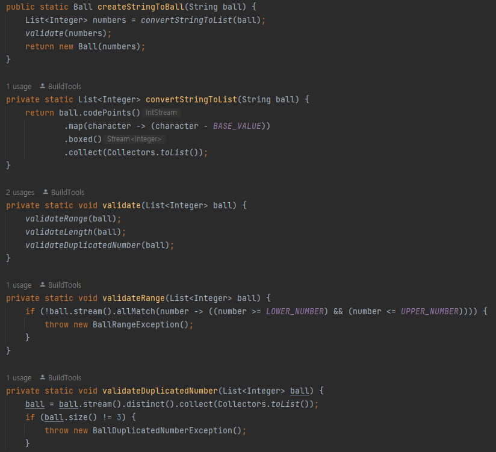  

그림을 보면 `Ball` 객체 생성시에 validate 로 값을 확인해준다. 객체내에 걸맞은 예외 확인을 하는것이
응집도도 높고, 객체를 객체답게 사용할 수 있다.

#### BallMaker
리팩토링한 코드에서는 `BallMaker`, `BallRandomNumberGenerator`, `BallNumberGenerator` 클래스를
사용한다. `BallNumberGenerator` 인터페이스를 `BallRandomNumberGenerator` 가 상속해서 여러타입의
볼생성 클래스를 만들 수 있다. 그리고 `BallMaker` 에서 원하는 Generator 를 받아서 공을 만든다.
이렇게 분리함으로써의 장점은 테스트할때 편한다. 랜덤함수지만 내가 원하는 수를 입력해서 테스트를 할 수 있다.   

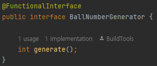   
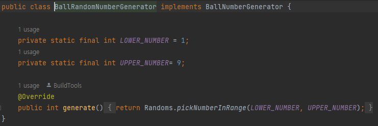   
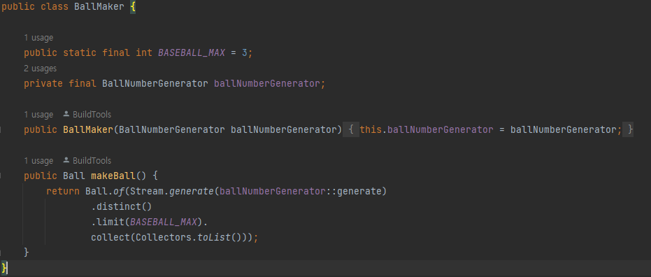    

해당 클래스는 다음 사진과 같다. 더 자세한 내용을 알고싶다면 아래링크를 참고    
[랜덤 함수 테스트1](https://tecoble.techcourse.co.kr/post/2020-05-07-appropriate_method_for_test_by_parameter/)   
[랜덤 함수 테스트2](https://tecoble.techcourse.co.kr/post/2020-05-17-appropriate_method_for_test_by_interface/)   

#### BallResult, ResultMap
기존 코드에서는 `rule` 패키지에서 있는 클래스요소들을 `BallAndStrikeChecker` 클래스에서 찾아내서
값을 반환했다.   

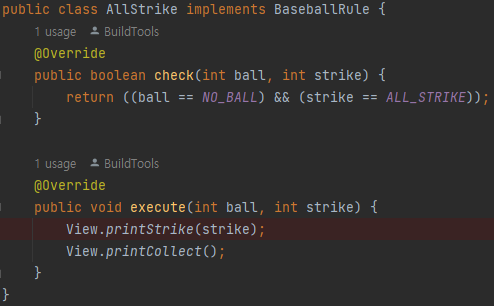   
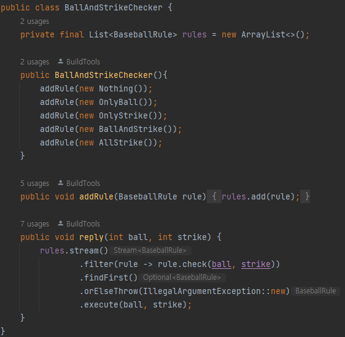   

그림을 보면 `AllStrike` 의 경우 모든 공이 스트라이크일때의 경우의 클래스이다. 그리고
`BallAndStrikeChecker` 에서 이런 경우들을 룰에추가해서 `ball` 의 개수와 `strike` 의 개수가
주어지면 원하는 결과값을 실행한다. 이런 방식도 나쁘지않지만 중복되는 클래스 내용의 경우 Enum
클래스를 사용하면 더 적은 클래스로 표현이 가능하다.

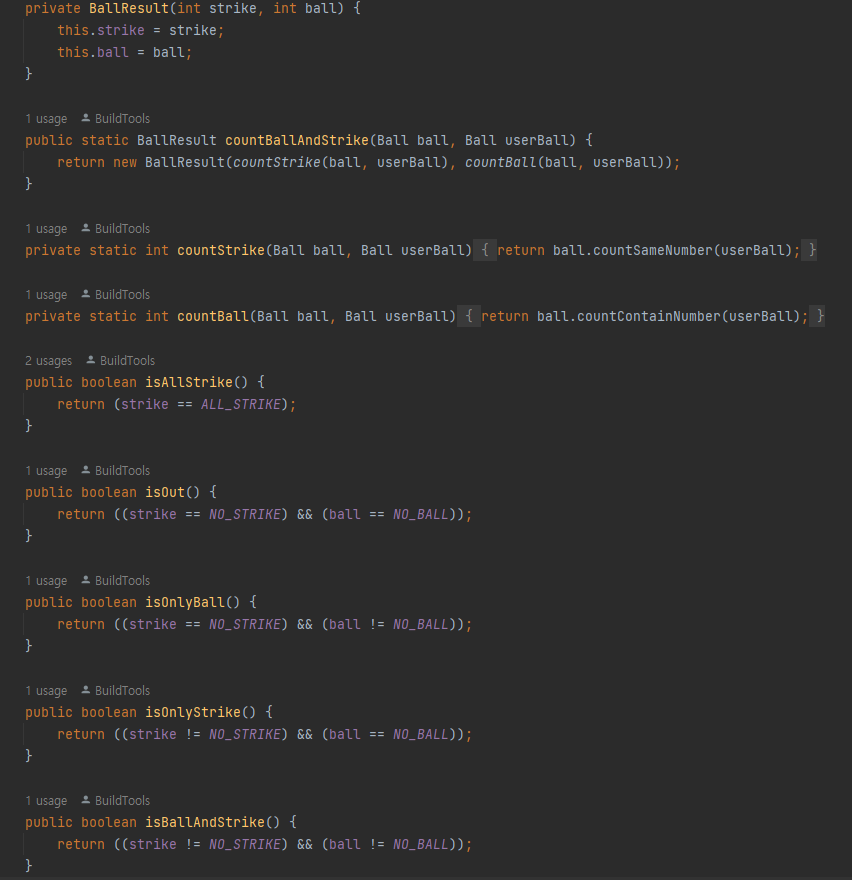   
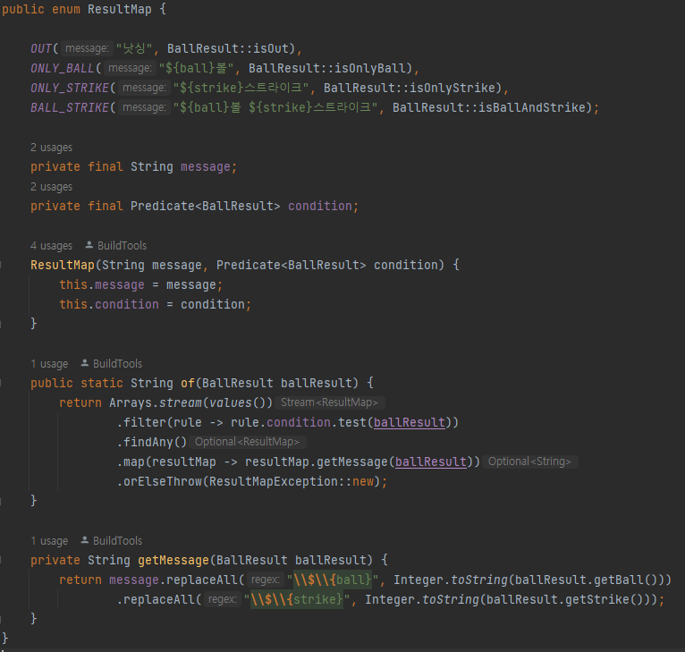   

그림을 보면 `BallResult` 클래스 내부에 어떤 공인지 판단하는 함수들 `isOut`, `isOnlyBall`,
`isOnlyStrike`, `isBallAndStrike` 가 있다. 그리고 `ResultMap` 클래스에서 함수형 인터페이스
`Predicate<BallResult>` 로 받아서 볼과 스트라이크 개수에 해당하는 값을 찾고 문자열을 완성할 수 있다.
Enum 을 이용하여 더 적은 클래스로, 깔끔하게 기능을 완성시킬 수 있다.   

그리고 리팩토링전 `AllStrike` 클래스 에서는 내부에 `execute` 함수에 출력함수를 실행했었는데 리팩토링 후에는
`BallResult` 는 판단하는 함수만 제공하고, View 에 해당되는 `ResultMap` 이 출력메시지를 완성해서
반환해준다.

#### 소감
두번째 미션으로 받은 숫자야구게임이라 리팩토링 할게 정말 많았다. MVC패턴 적용부터 시작해서, 객체로 뷰와
컨트롤러가 데이터를 주고받기, 예외처리에대한것, Enum 통한 간결하게 하는것 등 여러가지로 할게많았다.  
두번째 미션때에는 Enum 을 사용하고 싶었는데 도저히 사용방법이 생각이안났는데 이번 리팩토링을 하면서
Enum 을 적용하면서 본인이 성장했음을 느낄 수 있었다.

#### refactoring code
[코드 링크](https://github.com/jinhoon227/java-baseball/tree/refactor)