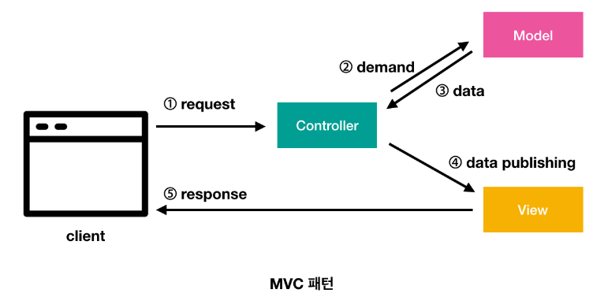
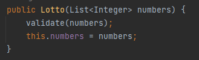
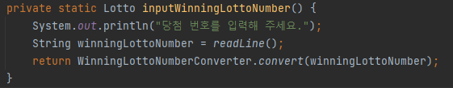
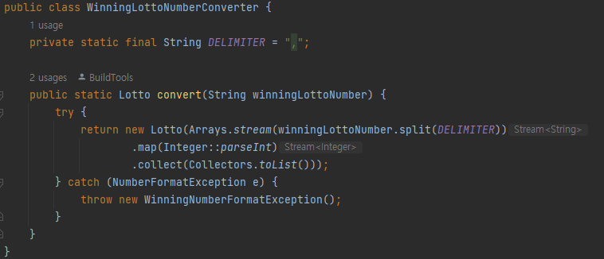
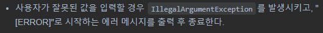
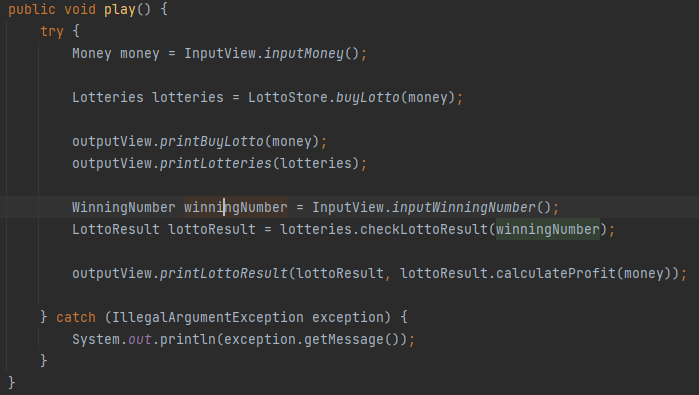

## 우테코 3주차 회고

3주차가 끝났다. 이번 주차는 클래스분리와 예외처리를 생각하는데 시간을 다 쓴것같다. 
도메인 로직과 UI로직을 분리하라는데, 처음에는 무슨뜻인가 싶었다. 그래서 가장 대표적인 패턴인 MVC패턴을 흉내내봤다.
사실 흉내는 내봤는데 아직도 맞는지는 확신이 서질않는다..

### 1. MVC 패턴

#### MODEL
모델은 도메인이 포함되며, 비즈니스 로직을 담당한다. 비즈니스 로직은 현실 세상의 문제를 해결하는 코드를 의미한다.
(도메인로직과 비즈니스로직은 같은 의미로 쓰이는것같다.)

모델의 규칙 : 뷰나 컨트롤러에 대해 어떤 정보도 알지 못한다. 모델은 모델의 역할만 가져야된다.

#### View
뷰는 여기서 UI로직을 뜻하는것 같다. 
사용자에게 보여지는 UI적 부분이고 이번미션에서는 printf, readLine 등 콘솔관렴 함수를 뜻하는거라 생각했다.

뷰의 규칙 : 모델의 정보를 '저장' 하고 있으면 안된다. 모델의 정보를 받고 입출력만 한다.

#### Controller
모델과 뷰는 서로의 정보를 모르기에 이를 전달해주는 역할. 
출력할꺼를 모델에서 들고와 뷰에넘겨주고, 뷰에서 받은 입력값을 들고와 모델에게 넘겨주는 역할이라 생각했다.

컨트롤러의 규칙 : 모델과 뷰를 알고있다.

### 2. 예외처리
MVC패턴은 알겠는데, 예외처리문제가 정말 힘들었다. 그래서 예외처리는 View 에서하는거야?
아니면 Model에서 하는거야? 그것도아니면 Controller 에서해? 이 문제가 제일 고통스러웠다..

#### View 에서 예외처리
처음에는 모든 예외처리를 View 에서 했다. 입력값 종류별로 클래스를 만들어서 검증한뒤 값을 넘겨줬다.
예를 들면 이번 로또 구매 금액을 입력받을때, MoneyInput 클래스에서 값을 받아,
해당클래스 내부에있는 validateInteger, validateNumberRange 등등 입력값 검증을 마치고
Controller 에게 값을 반환해 주었다. 

처음에는 이렇게 설계하고 굉장히 만족스러웠는데.. 이번 미션에서 제공한 Lotto 클래스를 보고 충격이었다.  
   
(이미 Lotto 클래스에 validate가 있다..)

#### Model(Domain) 에서 예외처리
이미 기본제공된 도메인클래스에서 예외처리가 되어있었다. 그래서 맨처음 View 에서 예외처리한걸 싹다 갈아엎었다.
View 에서는 그냥 값만 입력받아서 String 그대로 Controller 에 넘기고 
해당 String 값을 Domain 으로 넘겨 Domain 내부에서 예외처리를 하는 방식으로 변경했다.
이렇게 변경하고 '아 이게 MVC패턴 예외처리방식 이구나..' 라고 생각했는데 코딩을 할 수 록 맘에 안들었다.

이번 미션에서 사용자에게 당첨번호를 받는 과정이 있는데 `1,2,3,4,5,6` 이런식으로 입력값을 받는다.
그래서 이걸 WinningNumber 도메인에서 `split` 으로 쪼갠뒤 인트형으로 바꾸고 리스트로 바꾼뒤 Lotto 자료형
으로 최종적으로 바꿔서 활용한다. 이걸 보고있자니 마음에 들지않았다. 
Domain 에게 필요한 자료형은 정해져있는데 모두 String 으로 가져와서 가공한다..? 
이거는 매우, 엄청, 상당히 마음에 들지않았다. 이게 싫어서 내가 처음에 View 에서 예외처리를 했었는데 막상
직접 이렇게 짜보니 너무 싫었다. 그래서 좀 더 구글링을 해봤다.

#### View 와 Model(Domain) 두 곳에서 예외처리
Domain 은 해당 역할에서 필요한 예외처리가 있다.   
예를 들면 Lotto 도메인의 경우 로또번호끼리 중복되는게있는지? 로또번호가 6자리가맞는지?
로또라는 **'역할'** 이 처리해야할 예외처리다. 

하지만 입력받은 String 값을 Lotto 도메인에게 맞게 가공하는것은 Lotto 역할을 가진 도메인이 할일이 아니다.
그래서 입력값을 도메인이 필요한 자료형으로 바꾸는데 필요한 검증은 View 에서 처리하도록 다시 설계했다.

그리고 View 에서 검증하면 테스트하기 힘드므로, Converter 클래스를 새로 만들어서 해당 클래스에서
도메인이 필요한 자료형에 맞게 검증을 해준다.

`inputWinningLottoNumber` 함수를 보면 입력값을 받은 뒤 `WinningLottoNumberConverter` 함수가
`winningLottoNumber` 인 String 자료형을 도메인에 필요한 자료형으로 변환해준다.

String 으로 받은값을 split 으로 쪼개고 인트형으로바꾸고 리스트바꾸로 Lotto 자료형으로(도메인자료형)
으로 바꿔준다. 새롭게 도메인 자료형을 만들면서 도메인 내부에 있는 예외처리도 하게된다.

### 예외 처리 정상 종료
이번 미션을 진행하면서 머리를 아프게했던 테스트코드가 있다.  
   
이 녀석인데, runException 함수의 경우 main함수를 실행시키고 1000j 를 콘솔 입력값으로 넣어준다.  
그리고 미션은 다음과같다.
   
기존에 함수에서 `throw IllegalArgumentException` 을 하면 해당함수에서 예외를 던지고 종료를한다.
여기서 문제가 발생한다. 예외를 던진시점에서 프로그램이 종료가 되서 `runException("1000j)` 
다음 함수인 `assertThat(output()).contains(ERROR_MESSAGE)` 가 실행이 안된다.

원인을 계속찾다가 함수에서 던진 예외를 다시 받아서 처리하면 된다는 결론이 나왔다.  
  
`try ~ catch` 문으로 감싸 try 안에서 던져주는 예외를 받아 에러코드를 출력하고, 해당 `play` 함수가
끝나면서 `application` 이 정상종료되면서 테스트의 다음 코드를 실행할 수 있었다.

아직 이 테스트의 의도를 잘모르겠으나, 내가 추측하기엔 여러 application 을 실행했을때, 하나의 application
내부 함수에 던진 예외때문에 프로그램이 종료되면서 모든 application 종료되는걸 막기 위함이 아닐까..?
라고 추측해본다..

### 요구 사항에 없는 예외처리
요구사항은 실제로 정말 모호한것들이 많이 들어온다고한다. 그래서 본인 스스로 판단해서 예외처리를 생각할 수
있어야 한다고 들었던것 같다.

이번 미션에서도 명확하지 않은 요구사항이 있었다. 로또를 구매하는데 최대 구매 금액이 없었다.
그래서 나는 이 문제에대해 현실과 연관지어 실제 최대금액을 10만원으로 설정해놨다.   

어차피 로또게임인데 굳이 설정할 필요가 있나? 라고 생각이 들 수 있지만 어찌되든간에 최대구매금액을 정해야했다.
왜냐하면 컴퓨터 자료형도 한계가 있기때문이다. int의 최대값은 21억 정도인데, 21억장 모두 1등에 당첨된다면
당첨금액 계산을 위해 21억X20억 값을 int로 받으면 오버플로가 발생한다. 또한 int 입력값을 넘어가는 22억장
구매입력이 들어오면 오버플로가 발생한다. 제일 큰 long 자료형도 한계는 있기때문에 마찬가지다. 어떻든간에
최댓값은 정해야하므로, 현실에서는 10만원이 최대라는것을 가져와 설정했다.

그리고 돈을 입력받을때 01000 원을 어떻게 처리하는가?   
현실에는 이렇게 낼리없지만 컴퓨터로 입력을받기에 01000원을 낼 수 있다. 
나같은 경우에는 현실에는 01000원 따위 없기때문에 예외처리를 해두었다. 
하지만 어디까지나 로또게임이라 01000 원도 허용이 된다면 될 수 있다고 생각한다. 
이런 애매한 요구사항에 제시되지않은 예외처리에대해 고민할 수 있는 시간이었고, 이런것은 소통을 통해
좀 더 확실히 정해야 되지않나 생각한다.

reference  
https://kong-dev.tistory.com/187   
https://velog.io/@eddy_song/domain-logic