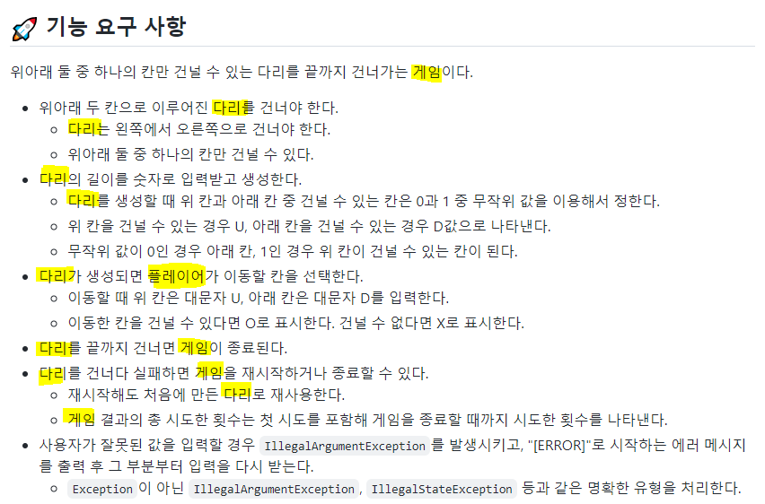
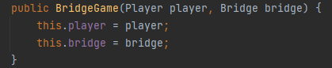
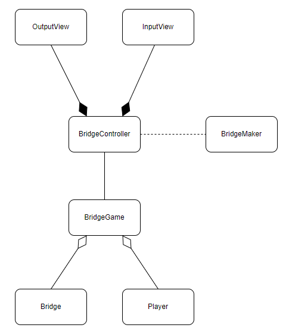

## 우테코 3주차 회고

우테코 4주차가 드디어 끝났다. 원래 끝나고 바로 회고를 작성하려고 했으나, 다른사람 코드를 리뷰하다보니
내가 잘 설계한건지 모르게되었어서 자료를 찾다보니 늦어지게 되었다. 아직도 내 설계가 좋은지는 모르겠지만
내가 어떤생각을 가지고 설계한건지 남겨보고, 다른사람의 설계관점을 보면 비교를 더 잘할 수 있을것 같아서
작성해본다.

### 1. 객체 찾기
먼저 주어진 문제에서 객체를 찾기로했다.  
  
주어진 기능에서 등장하는 명사를 기준으로 객체를 찾을 수 있었다.
그리고 동사는 해당 객체 가질 수 있는 기능(메소드)가 될 수 있다. 그래서 명사와 동사를 기준으로 요구사항을
정리해봤다.

**게임** : 종료, 재시작  
**다리** : 생성  
**플레이어** : 이동  

### 2. MVC 패턴 결합
이번 프로젝트는 MVC 패턴을 이용하므로 domain, service, controller, view 4가지로 분리하려고 했다.  

**게임** -> service  
**다리, 플레이어** -> domain  

게임을 service 에 넣은이유는 기본으로 제공해주는 `BridgeGame` 클래스에 `move` 와 `retry` 함수가 이미
작성되어있었다. 해당 기능은 게임에서의 중요한 기능이고, 비즈니스로직이기에 service 가 맞다고 생각했다.  
다리와 플레이어를 domain 에 넣은이유는 `BridgeGame` 이 비즈니스로직을 담당하고, 다리와 플레이어는
데이터만 구조만 가지면되었기에 domain 에 가깝다고 생각해서 넣었다.  

그리고 다리, 플레이어와 게임의 관계를 생각하면, 다리와 플레이어가 게임에 포함되는 관계라고 생각했다.  
BridgeGame has a bridge  
BridgeGame has a player  
Bridge 와 Player 는 BridgeGame 의 일부라고 생각해서, 
`BridgeGame` 이 `Bridge`와 `Player`를 포함하는 **집약(집합)** 관계로 설계하기로 생각했다.  
  
  

집약 관계는 위와같이 `BridgeGame` 이 생성될때 `Player`, `Bridge` 에 대한 객체를 외부에서 받아서
내부에 저장한다.  

### 3. 도메인 관계
그 다음 도메인 간의 관계를 표시했다.  
   
먼저 MVC 패턴이기에 `BridgeController` 와 `OutputView`, `InputView` 가 추가되었다. 
Controller 와 View 관계는 합성관계로 설계했다. 이유는 게임이 종료되면 View 또한 존재할 필요가 없기
때문에 라이크사이클을 같이 가지는 합성관계로 설계했다.  

그리고 `Bridge` 가 다리를 생성하는게 아닌 `BridgeMaker` 가 다리를 생성한다.
기능 요구사항에서는 생성이 동사로 기능으로 생각했지만, 기본으로 제공해주는 클래스에 BridgeMaker 가 있었다. 
**다리 제작자** 라는 객체가 이미 주어졌기에, 다리가 생성하는게 아닌 다리제작자가 생성하는게 맞다고 생각했다.  

`BridgeController` 와 `BridgeMaker` 는 의존관계를 가지는데, 게임 내에서 다리는 단 한번만 생성하므로
BridgeMaker 는 다리만 생성해주면 더 이상 필요없는 객체라고 생각했다. 그래서 한번만 쓰고 버리는 의존관계로
설계했다.

`BridgeController` 와 `BridgeGame` 은 연관관계로 설계했다. Controller 는 Model 을 잘아야하기때문에
의존관계는 적절하지않고, 그렇다고 Controller 에 BridgeGame 이 포함되는건 아니어서 합성이나 집약관계도
아니다. 그래서 연관관계가 적절하다고 생각했다.

`BridgeGame` 과 `Bridge`, `Player` 는 집약관계로 설계했다. 합성관계도 고민했지만, BridgeGame 
이 정해주는(파라미터로 받아오는) Bridge 와 Player 로 설정하는게 좀 더 유연한 구조라고 생각했다.

### 소감
상당히 어려운 시간이었다. 지금 글을 작성하면서도 많이 부족했다고 생각된다. 
클래스를 분리하는 방식은 너무많고, 정확한 정답 또한 상황에 따라 다르기에 정답을 찾아서 배워온 사람에겐 너무 어려운거 같다. 
정말 생각을 많이하게 되는 주차였는데 확실하게 성장한 느낌이 들지 않아 아쉽다. 
그래도 다른사람 코드리뷰를 하면서 많은 인사이트를 얻었으니, 그걸 기반으로 다시한번
설계를 하고 코딩해볼려고 한다.

#### BridgeGame Github Address
[코드링크](https://github.com/woowacourse-precourse/java-bridge/pull/688#discussion_r1031303113)

#### reference
https://techblog.woowahan.com/2502/